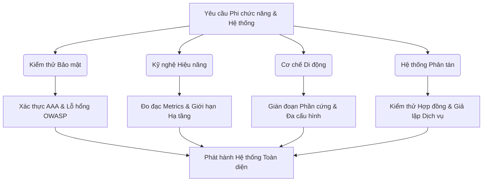
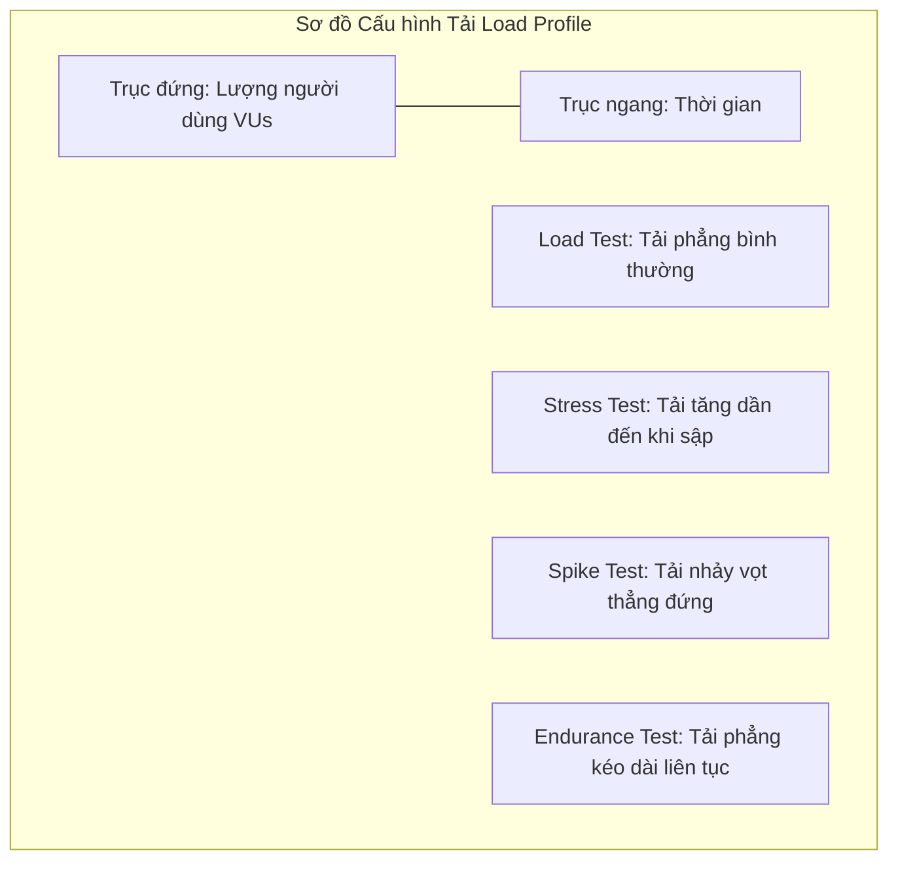
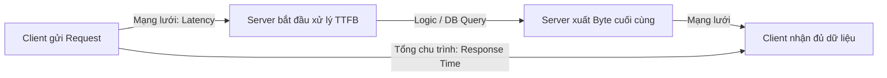
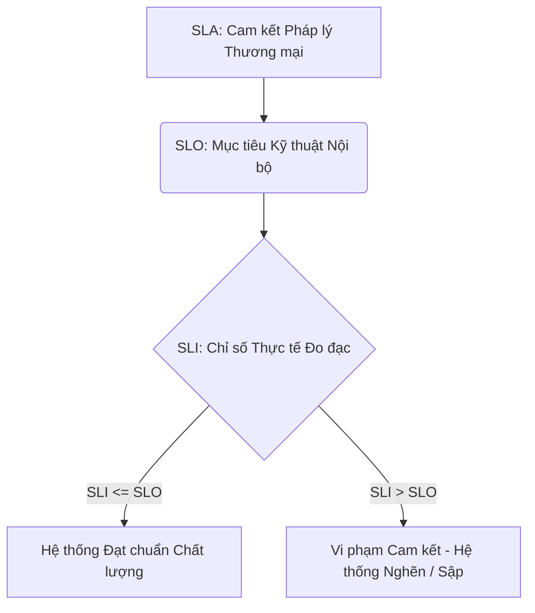
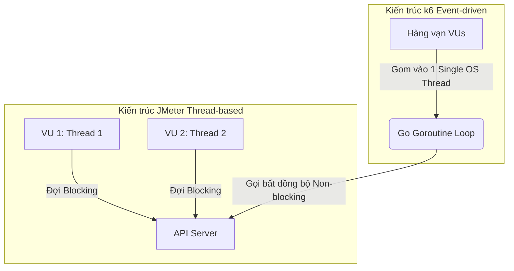
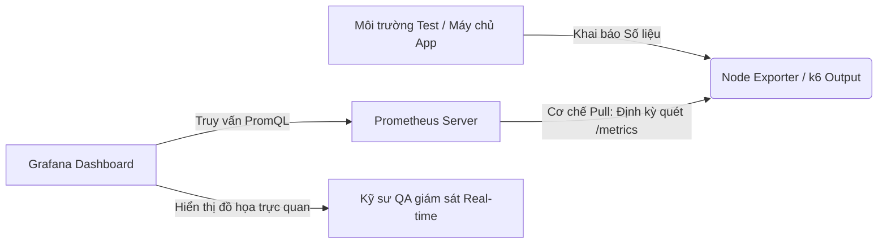

# 📁 11. Advanced Testing

*Mục tiêu: Mở rộng năng lực chuyên môn từ kiểm thử chức năng thông thường sang các mảng kỹ thuật chuyên sâu cao cấp bao gồm Kiểm thử Bảo mật (Security), Kỹ nghệ Hiệu năng (Performance), Cơ chế vận hành Di động (Mobile Mechanics) và Kiểm thử Hệ thống phân tán/Điện toán đám mây nhằm toàn diện hóa tư duy của một QA Expert thực chiến.*

# **11.2. Performance Testing Engineering**

## 📌 Mục lục nội bộ (Chặng 11)

- [ ] [**11.1. Security Testing Fundamentals**](./1_SecurityTesting.md)
- [ ] [**11.2. Performance Testing Engineering**](./2_PerformanceTesting.md)
  - [ ] [11.2.1. Testing Types: Load, Stress, Spike, Endurance, Scalability](#1121-testing-types-load-stress-spike-endurance-scalability)
  - [ ] [11.2.2. Metrics: Throughput, Latency, Error Rate, Percentiles (P90/P95/P99)](#1122-metrics-throughput-latency-error-rate-percentiles-p90p95p99)
  - [ ] [11.2.3. Infrastructure Monitoring: CPU/RAM Baseline & SLA/SLO](#1123-infrastructure-monitoring-cpuram-baseline--slaslo)
  - [ ] [11.2.4. Performance Scripting via Apache JMeter & k6 Framework](#1124-performance-scripting-via-apache-jmeter--k6-framework)
  - [ ] [11.2.5. Dashboard Visualization: Grafana & Prometheus](#1125-dashboard-visualization-grafana--prometheus)
- [ ] [**11.3. Mobile Testing Mechanics**](./3_MobileTesting.md)
- [ ] [**11.4. Distributed Systems, Contract & Cloud Testing**](./4_DistributedSystems.md)


---

## 🗺️ Bản đồ Tiến trình Phân rã Các Tầng Kiểm thử Nâng cao

Sơ đồ đơn sắc dưới đây mô tả lộ trình tiếp cận kiểm thử phi chức năng và hệ thống phân tán, giúp QA định vị chính xác khu vực cần cô lập và đánh giá rủi ro từ hạ tầng đến ứng dụng:



---

# 11.2.1. Testing Types: Load, Stress, Spike, Endurance, Scalability

Kỹ nghệ kiểm thử hiệu năng (Performance Testing Engineering) không đơn thuần là việc sử dụng công cụ để giả lập lượng truy cập lớn, mà là một quy trình kỹ thuật chuyên sâu nhằm đánh giá tốc độ phản hồi, độ ổn định, khả năng co giãn và giới hạn chịu tải của hệ thống. Việc phân biệt rõ ràng bản chất kỹ thuật của các loại hình kiểm thử hiệu năng giúp Kỹ sư QA thiết kế chính xác cấu hình tải (Load Profile), xác định các điểm nghẽn cổ chai (Bottlenecks) và cô lập rủi ro sập hệ thống trước khi sản phẩm tiếp cận người dùng thật.

## ⚙️ Bản chất chuyên sâu về Cơ chế Hoạt động của các Loại hình Hiệu năng

Mỗi loại hình kiểm thử hiệu năng được định nghĩa dựa trên các mô hình toán học điều phối lượng người dùng ảo song song (Virtual Users - VUs) theo trục thời gian, nhằm kích hoạt và đánh giá các ngưỡng chịu tải khác nhau của hạ tầng:

1. **Load Testing (Kiểm thử tải):** Đánh giá hành vi của hệ thống dưới mức tải dự kiến trong điều kiện vận hành bình thường (Expected Production Load). Mục tiêu là xác minh hệ thống có đạt các chỉ số cam kết chất lượng (SLA/SLO) về thời gian phản hồi hay không.
2. **Stress Testing (Kiểm thử giới hạn):** Đẩy lượng tải vượt quá mức kỳ vọng bình thường cho đến khi hệ thống bị sập hoàn toàn (Breaking Point). Mục tiêu là tìm ra giới hạn tối đa mà hạ tầng chịu đựng được và quan sát cách hệ thống tự phục hồi (Recoverability).
3. **Spike Testing (Kiểm thử đột biến):** Giả lập tình huống lượng người dùng tăng đột ngột theo phương thẳng đứng trong một khoảng thời gian cực ngắn (ví dụ: sự kiện Flash Sale, mở cổng đăng ký tín chỉ). Đánh giá xem hệ thống có bị nghẽn cổ chai hoặc crash do không kịp co giãn tài nguyên hay không.
4. **Endurance / Soak Testing (Kiểm thử sức bền):** Duy trì một mức tải liên tục ở ngưỡng bình thường hoặc cận cao trong một khoảng thời gian dài (24 giờ, 48 giờ hoặc hàng tuần). Mục tiêu là phát hiện các lỗi ngầm như rò rỉ bộ nhớ (Memory Leaks) hoặc tràn tài nguyên lưu trữ.
5. **Scalability Testing (Kiểm thử khả năng co giãn):** Thực hiện đo đạc hiệu năng tại các mức cấu hình phần cứng khác nhau (hoặc khi bật cơ chế Auto-scaling). Mục tiêu là xác định mối quan hệ tuyến tính giữa việc tăng trưởng người dùng và dung lượng tài nguyên cần bổ sung.



---

## 📊 Ma trận Thiết lập Cấu hình Tải & Mô hình Cô lập Lỗi Hiệu năng cho QA

Dưới đây là bảng phân rã chi tiết về mục tiêu thiết lập, trọng tâm QA Focus thực chiến và các lỗi hệ thống đặc thù (Performance Defects) phát sinh trong từng loại hình kiểm thử:

| Loại hình Kiểm thử | Chiến lược Cấu hình Tải (Load Profile) | QA Focus (Trọng tâm thực chiến) | Defect thực tế (Lỗi hiệu năng & Cách sửa) |
| :--- | :--- | :--- | :--- |
| **Load Testing** | Tăng dần VUs đến mức tải thiết kế ($100\%$), duy trì ổn định trong 1-2 giờ rồi hạ tải (Ramp-down). | Đo đạc thời gian phản hồi trung bình (Average Response Time) của các API cốt lõi và tỷ lệ lỗi (Error Rate) phải bằng $0\%$. | **Lỗi chậm xử lý logic:** Thời gian phản hồi API thanh toán vượt quá 3 giây dù tải bình thường. <br>*Cách sửa:* Tối ưu hóa các câu lệnh SQL, thêm chỉ mục (Index) vào bảng dữ liệu. |
| **Stress Testing** | Tăng tải liên tục theo mô hình bậc thang ($150\% \rightarrow 200\% \rightarrow 300\%$) cho đến khi hệ thống báo lỗi HTTP 5xx diện rộng. | Xác định chính xác điểm gãy (Breaking Point). Kiểm tra xem hệ thống có đưa ra thông báo lỗi thân thiện thay vì làm sập toàn bộ máy chủ API không. | **Lỗi sập dây chuyền (Cascading Failure):** Khi máy chủ DB bị nghẽn, các máy chủ Web App cũng bị treo cứng theo. <br>*Cách sửa:* Tích hợp cơ chế ngắt mạch tự động (`Circuit Breaker Pattern`). |
| **Spike Testing** | VUs nhảy vọt từ $0$ lên $500\%$ chỉ trong vòng 1-2 phút, duy trì ngắn rồi tụt nhanh về $0$. | Đánh giá độ trễ của cơ chế Auto-scaling (bật thêm server mới) và khả năng xử lý hàng đợi (Message Queue) của hệ thống. | **Lỗi tràn hàng đợi (Queue Overflow):** Server từ chối kết nối lập tức, trả về mã lỗi HTTP 5box do hàng đợi kết nối bị đầy. <br>*Cách sửa:* Tăng dung lượng bộ đệm kết nối hoặc sử dụng bộ tải ngược dòng (`Load Balancer Rate Limiting`). |
| **Endurance Testing** | Duy trì mức tải ổn định ở khoảng $70-80\%$ công suất thiết kế, chạy liên tục từ 24 đến 72 giờ. | Giám sát biểu đồ tiêu thụ RAM của các tiến trình hệ thống để tìm ra độ dốc đi lên bất thường. | **Lỗi rò rỉ bộ nhớ (Memory Leak Defect):** Dung lượng RAM bị chiếm dụng tăng dần theo thời gian và không được giải phóng, gây sập server sau 12 giờ chạy liên tục. <br>*Cách sửa:* Sử dụng công cụ Profiler để tìm các biến toàn cục hoặc các kết nối DB chưa đóng trong mã nguồn. |
| **Scalability Testing** | Chạy cùng một kịch bản test trên các cụm cấu hình phần cứng: 1 Node, 2 Nodes, 4 Nodes. | Tính toán hiệu suất kinh tế kỹ thuật. Xác nhận xem khi tăng gấp đôi tài nguyên phần cứng thì năng lực xử lý (Throughput - RPS) có tăng xấp xỉ gấp đôi không. | **Nghẽn cổ chai phi tuyến tính (Scalability Ceiling):** Tăng gấp 4 lần số lượng Server Web nhưng tốc độ hệ thống không tăng do dính nghẽn tại duy nhất 1 Server DB. <br>*Cách sửa:* Thực hiện phân tách DB (Read/Write Splitting) hoặc Sharding dữ liệu. |

---

## 💡 Ví dụ thực tế liên hoàn: Luồng Thiết kế Kịch bản Tải cho Ngày Flash Sale của QA

Hãy tưởng tượng bạn là QA Lead chịu trách nhiệm bảo vệ hiệu năng cho một hệ thống E-commerce trước ngày hội mua sắm lớn. Bạn cần thiết lập một chuỗi kịch bản kiểm thử toàn diện:

1. **Giai đoạn chạy kịch bản Spike Test (Giả lập thời điểm mở bán):**
   * Bạn cấu hình công cụ (như k6 hoặc JMeter) để tạo ra một lượng tải đột biến: Kịch activate 10,000 VUs cùng nhảy vào bấm nút "Mua Ngay" đúng vào giây đầu tiên của khung giờ Flash Sale.
   * *Phát hiện Defect:* Hệ thống gặp lỗi khóa chết dữ liệu (Database Deadlock) do hàng vạn request cùng cố gắng cập nhật số lượng tồn kho của duy nhất một mã sản phẩm giảm giá tại cùng một thời điểm. Hệ thống trả về lỗi HTTP 500 cho $80\%$ người dùng.
   * *Giải pháp cô lập & Khắc phục:* Bạn báo cáo lỗi logic xử lý concurrency cho đội ngũ Kiến trúc sư phần mềm. Đội ngũ quyết định chuyển cơ chế trừ kho trực tiếp trong DB sang xử lý bất đồng bộ qua bộ nhớ đệm Redis và hàng đợi Kafka.

2. **Giai đoạn chạy kịch bản Endurance Test (Giả lập duy trì ngày hội):**
   * Sau khi sửa xong lỗi Spike Test, bạn cấu hình kịch bản giữ mức tải 2,000 VUs liên tục lướt xem sản phẩm và thêm vào giỏ hàng trong vòng 24 giờ liên tục trên môi trường Staging.
   * *Kết quả giám sát:* Qua giờ thứ 18, hệ thống tự động cảnh báo máy chủ API bị cạn kiệt dung lượng ổ đĩa cứng tự do do file log ghi nhận quá dày đặc. Bạn yêu cầu DevOps cấu hình lại cơ chế tự động nén và xoay vòng log (`Log Rotation`) để bảo vệ tài nguyên hạ tầng.

---

> ⚠️ **NGUYÊN LÝ BẤT BIẾN:** Tuyệt đối không bao giờ được phép thực hiện các bài kiểm thử hiệu năng (Performance, Load, Stress Testing) khi hệ thống chưa vượt qua toàn bộ các bài kiểm thử chức năng (Functional Testing) cốt lõi ở trạng thái PASSED. Nếu hệ thống vẫn còn dính các lỗi logic chức năng cơ bản, kết quả đo đạc chỉ số thời gian phản hồi hoặc năng lực xử lý (Throughput) thu được từ bộ công cụ test hiệu năng hoàn toàn bị sai lệch, vô giá trị và không phản ánh đúng năng lực thực tế của hạ tầng.

---

📚 **References**
* *ISTQB® Certified Tester Advanced Level (CTAL) Technical Test Analyst Syllabus* - Section 4.2.2: *Performance Testing (Load, Stress, Endurance, Spike, Scalability Testing)*.
* *Molyneaux, I. (2014). The Art of Application Performance Testing: From Strategy to Tools.* O'Reilly Media.
* *ISO/IEC/IEEE 29119-4:2021 Standard* - *Software and systems engineering — Software testing — Part 4: Test techniques (Performance Testing Profiles)*.


# 11.2.2. Metrics: Throughput, Latency, Error Rate, Percentiles (P90/P95/P99)

Việc phân tích các số liệu đo đạc hiệu năng (Performance Metrics) là kỹ năng tối quan trọng để Kỹ sư QA dịch thông tin thô từ công cụ kiểm thử thành dữ liệu giá trị cao, giúp định vị chính xác vị trí hệ thống bị thắt nút cổ chai. Nếu không làm chủ bản chất toán học của các chỉ số như Throughput, Latency, Error Rate và các phân vị (Percentiles), QA sẽ dễ dàng bị đánh lừa bởi các giá trị trung bình cộng tuyến tính sai lệch.

## ⚙️ Bản chất chuyên sâu về Cơ chế Xử lý Toán học của Metrics

Trong kiểm thử hiệu năng, các giá trị thu được không phân phối theo đồ thị hình chuông chuẩn (Normal Distribution) mà phân phối lệch (Skewed Distribution). Do đó, cơ chế tính toán được phân rã thành 4 chỉ số cốt lõi:

1. **Throughput (Năng lực xử lý):** Số lượng yêu cầu (Requests Per Second - RPS) hoặc khối lượng dữ liệu (Bytes/sec) mà hệ thống xử lý thành công trong một đơn vị thời gian. Chỉ số này đại diện cho băng thông nghiệp vụ của hệ thống.
2. **Latency vs Response Time (Độ trễ mạng vs Thời gian phản hồi):** 
   * *Latency:* Thời gian gói tin di chuyển từ Client tới Server để bắt đầu xử lý byte đầu tiên (Time to First Byte - TTFB).
   * *Response Time:* Tổng thời gian từ lúc Client gửi request cho đến khi nhận được trọn vẹn byte cuối cùng của phản hồi (bao gồm cả thời gian xử lý logic của Server).
3. **Error Rate (Tỷ lệ lỗi):** Tỷ lệ phần trăm giữa số lượng request bị thất bại (trả về lỗi HTTP 5xx, kết nối bị Timeout) trên tổng số lượng request gửi đi. 
4. **Percentiles (Các giá trị phân vị - P90, P95, P99):** Chỉ số cắt phân vị dữ liệu sau khi đã sắp xếp chuỗi thời gian phản hồi theo thứ tự tăng dần. 
   * *Ví dụ P95 = 200ms:* Nghĩa là $95\%$ số lượng người dùng có thời gian phản hồi nhanh hơn hoặc bằng 200ms, và chỉ có $5\%$ người dùng chịu trải nghiệm chậm hơn 200ms.



---

## 📊 Ma trận Metrics Hiệu năng & Quy luật Phân tách Lỗi Hạ tầng cho QA

Dưới đây là bảng phân rã chi tiết về ý nghĩa toán học, trọng tâm QA thực chiến và các cạm bẫy lỗi hệ thống liên quan trực tiếp đến số liệu:

| Chỉ số Hiệu năng | Đơn vị & Cơ chế Toán học | QA Focus (Trọng tâm thực chiến) | Defect thực tế (Cạm bẫy Metrics & Cách sửa) |
| :--- | :--- | :--- | :--- |
| **Throughput (RPS)** | Số lượng requests / giây. Phụ thuộc vào năng lực xử lý Concurrency của Server. | Giám sát điểm bão hòa (Saturation Point). Khi tăng VUs mà Throughput đi ngang hoặc tụt dốc, hệ thống đã chạm giới hạn phần cứng. | **Lỗi nghẽn luồng xử lý (Thread Pool Exhaustion):** Throughput đứng im không thể tăng quá 500 RPS dù CPU còn trống. <br>*Cách sửa:* Tăng số lượng luồng tối đa (`maxThreads`) trong tệp cấu hình của Web Server (như Tomcat/Nginx). |
| **Response Time (Average)** | Mili-giây (ms). Công thức trung bình cộng: $\sum(RT) / Total$. | **Cấm sử dụng làm chỉ số quyết định.** Giá trị trung bình sẽ che giấu hoàn toàn các đỉnh nhọn chậm trễ của nhóm người dùng chịu trải nghiệm tệ. | **Cạm bẫy giá trị trung bình (The Tyranny of the Average):** Hệ thống có RT trung bình là 100ms (Rất đẹp), nhưng thực tế $10\%$ người dùng bị chậm tới 10 giây. <br>*Cách sửa:* Chuyển sang giám sát chặt chẽ các chỉ số phân vị cao (`P95`, `P99`). |
| **Percentiles (P95 / P99)** | Mili-giây (ms). Giá trị tại vị trí $95\%$ và $99\%$ của chuỗi dữ liệu. | Đây là thước đo chuẩn mực cho cam kết chất lượng (SLA). QA cấu hình điều kiện chặn (Threshold) trên CI: Nếu `P99 > 2000ms`, đóng băng Pipeline. | **Lỗi chậm cục bộ hệ thống (Tail Latency Bug):** Chỉ số P99 nhảy vọt lên cao do cơ chế dọn rác của ngôn ngữ lập trình hoạt động. <br>*Cách sửa:* Tối ưu hóa cơ chế giải phóng bộ nhớ (`Garbage Collection Optimization`) hoặc cấu hình lại kích thước vùng đệm. |
| **Error Rate (%)** | Phân trăm ($0\% - 100\%$). Số lỗi / Tổng số request. | Bắt buộc phải duy trì ở mức $0\%$ trong điều kiện tải thường. Khi Error Rate tăng vọt, các chỉ số Response Time không còn ý nghĩa. | **Đánh giá sai hiệu năng do lỗi trả về nhanh:** Chỉ số RT bỗng nhiên giảm xuống cực nhanh khi tải cao do server trả về lỗi `HTTP 502` lập tức. <br>*Cách sửa:* Đối chiếu biểu đồ Error Rate song song với RT để loại trừ các gói tin lỗi ra khỏi chuỗi tính toán toán học. |

---

## 💡 Ví dụ thực tế liên hoàn: Luồng Điều tra Điểm nghẽn Hệ thống bằng Metrics của QA

Hãy tưởng tượng bạn vừa thực hiện một bài test giới hạn (Stress Test) cho một dịch vụ API Tìm kiếm sản phẩm (`GET /api/v1/search`) với mức tải tăng dần từ 0 lên 2,000 người dùng ảo (VUs):

1. **Phân tích Số liệu thô từ Báo cáo (Metrics Inspection):**
   * Tổng số lượng request gửi đi: 500,000 requests.
   * Thời gian phản hồi trung bình (Average RT): 150 ms (Kết quả có vẻ tốt).
   * Giá trị phân vị P90: 200 ms.
   * Giá trị phân vị P99: 4,500 ms (Phát hiện bất thường nghiêm trọng).
   * Error Rate: $1.2\%$.

2. **Quy trình cô lập lỗi và truy tìm điểm nghẽn (Root Cause Analysis):**
   * *Phân tích của QA Expert:* Mặc dù thời gian phản hồi trung bình và P90 rất nhanh, chỉ số **P99 lên tới 4.5 giây** chứng minh rằng có $1\%$ người dùng (tương đương 5,000 requests) đang gặp trải nghiệm cực kỳ tệ, bị đơ màn hình.
   * Bạn tiến hành lọc riêng danh sách $1\%$ các request chậm này ra và đối chiếu với Log của hệ thống cơ sở dữ liệu.
   * *Phát hiện lỗi kỹ thuật (Defect):* Trùng hợp vào những thời điểm kịch bản kiểm thử gửi các từ khóa tìm kiếm có độ dài vượt quá 50 ký tự (Kịch bản biên của QA), Database phải thực hiện quét toàn bộ bảng (`Full Table Scan`) vì câu lệnh SQL không sử dụng được Index. Điều này làm nghẽn luồng xử lý và đẩy thời gian phản hồi của các request đó lên cao độc biến. 
   * Bạn Log Bug kèm số liệu chứng minh P99, yêu cầu Dev cấu hình lại Full-Text Search để kéo chỉ số P99 xuống dưới mức 500ms đạt chuẩn SLA.

---

> ⚠️ **NGUYÊN LÝ BẤT BIẾN:** Tuyệt đối không bao giờ được phép tính toán hoặc gộp chung các giá trị thời gian phản hồi trung bình (Average Response Time) từ nhiều máy ảo (Runner) khác nhau bằng phương pháp lấy trung bình cộng của các số trung bình (Average of Averages). Hành vi này hoàn toàn sai lệch về mặt toán học thống kê và sẽ làm triệt tiêu các giá trị biên cực đại, dẫn đến việc đưa ra các báo cáo hiệu năng sai sự thật về năng lực chịu tải của hệ thống. Bạn bắt buộc phải gộp toàn bộ dữ liệu thô (Raw Data Logs) lại rồi mới thực hiện tính toán cắt phân vị trên tổng thể.

---

📚 **References**
* *ISTQB® Certified Tester Advanced Level (CTAL) Technical Test Analyst Syllabus* - Section 4.2.2: *Performance Testing Metrics*.
* *Newman, S. (2015). Building Microservices: Designing Fine-Grained Systems.* O'Reilly Media - Chapter 8: *Monitoring and Metrics (Tail Latency and Percentiles)*.
* *Enterprise Performance Engineering Standard* - *W3C Navigation Timing API Specifications for Web Metrics*.

# 11.2.3. Infrastructure Monitoring: CPU/RAM Baseline & SLA/SLO

Giám sát hạ tầng (Infrastructure Monitoring) trong kiểm thử hiệu năng là hoạt động phân tích các chỉ số phần cứng của hệ thống máy chủ nhằm liên kết và tìm ra mối quan hệ nhân quả với các chỉ số hiệu năng đầu ra. Việc thiết lập đường cơ sở (Baseline) cho CPU/RAM và đối chiếu nghiêm ngặt với các cam kết mức độ dịch vụ (SLA/SLO) giúp Kỹ sư QA xác định chính xác nguyên nhân gốc rễ gây sụt giảm hiệu năng là do thuật toán phần mềm hay do giới hạn phần cứng hạ tầng.

## ⚙️ Bản chất chuyên sâu về Cơ chế Giám sát Hạ tầng và Các Chỉ số Thỏa thuận

Hệ thống giám sát hạ tầng hoạt động theo cơ chế thu thập dữ liệu liên tục từ các đại lý giám sát (Agents) cài đặt trực tiếp trên hệ điều hành máy chủ, phân rã thành hai khu vực quản lý kỹ thuật:

1. **Infrastructure Resource Metrics (Chỉ số tài nguyên hạ tầng):** Đo đạc mức độ chiếm dụng phần cứng thực tế:
   * *CPU Utilization (%):* Tỷ lệ phần trăm thời gian mà các lõi vi xử lý đang bận xử lý luồng mã lệnh. Nếu CPU chạm $100\%$, hệ thống sẽ rơi vào trạng thái nghẽn hàng đợi tính toán.
   * *Memory Usage (RAM - % hoặc GB):* Dung lượng bộ nhớ truy cập ngẫu nhiên đang bị chiếm giữ bởi ứng dụng. RAM cạn kiệt sẽ kích hoạt cơ chế tự động xóa tiến trình của hệ điều hành (Out-Of-Memory Killer).
   * *Disk I/O & Network Bandwidth:* Tốc độ đọc/ghi dữ liệu lên ổ cứng và băng thông truyền tải dữ liệu qua card mạng.
2. **SLA vs SLO vs SLI (Ma trận thỏa thuận chất lượng):**
   * *SLA (Service Level Agreement):* Cam kết pháp lý mang tính thương mại giữa nhà cung cấp dịch vụ và khách hàng cuối (Ví dụ: "Hệ thống phải hoạt động ổn định $99.9\%$ thời gian trong năm").
   * *SLO (Service Level Objective):* Mục tiêu kỹ thuật nội bộ cụ thể cần đạt được để đáp ứng SLA (Ví dụ: "Thời gian phản hồi P95 của API phải dưới 500ms, CPU tiêu thụ không quá $80\%$").
   * *SLI (Service Level Indicator):* Chỉ số thực tế đo đạc được theo thời gian thực để đối chiếu với SLO (Ví dụ: "Kết quả đo đạc thực tế tại thời điểm tải cao là P95 = 450ms").



---

## 📊 Ma trận Giám sát Phần cứng & Mô hình Cảnh báo Rủi ro Hạ tầng cho QA

Dưới đây là bảng phân rã chi tiết về các ngưỡng đo đạc tài nguyên phần cứng, trọng tâm kiểm tra của QA thực chiến và các lỗi hạ tầng (Infrastructure Defects) đặc thù phát sinh:

| Chỉ số Hạ tầng | Ngưỡng Đường cơ sở (Baseline Target) | QA Focus (Trọng tâm thực chiến) | Defect thực tế (Lỗi hạ tầng & Cách sửa) |
| :--- | :--- | :--- | :--- |
| **CPU Utilization** | Chạy tải nền không quá $10-15\%$. Chạy tải đỉnh (Peak Load) không vượt quá $75-80\%$. | Theo dõi tỷ lệ phân bổ CPU giữa các lõi (Core Distribution). Đảm bảo luồng xử lý được chia đều, tránh hiện tượng một lõi gánh $100\%$ trong khi các lõi khác rảnh rỗi. | **Lỗi nghẽn CPU do thắt nút (Context Switching Bug):** CPU chạm ngưỡng $100\%$ nhưng Throughput hệ thống tụt giảm nghiêm trọng do các luồng (Threads) liên tục tranh chấp tài nguyên. <br>*Cách sửa:* Tối ưu hóa các câu lệnh SQL, tăng cấu hình CPU theo chiều dọc (Vertical Scaling). |
| **Memory Usage (RAM)** | Giữ ổn định ở mức dưới $70\%$. Đồ thị tiêu thụ phải có hình răng cưa (Tăng lên rồi tụt xuống sau chu kỳ dọn rác). | Theo dõi đồ thị RAM ở giai đoạn Ramp-down (giảm tải về 0). Nếu lượng RAM chiếm dụng không tụt về mức ban đầu, hệ thống chắc chắn dính lỗi rò rỉ bộ nhớ. | **Sập tiến trình do cạn RAM (OOM - Out Of Memory Crash):** RAM bị ngốn sạch $100\%$ khiến hệ điều hành Linux tự động kích hoạt lệnh giết tiến trình của ứng dụng (`OOM-Killer`) để bảo vệ máy chủ. <br>*Cách sửa:* Tối ưu hóa kích thước bộ nhớ đệm (Cache Size) hoặc sửa lỗi rò rỉ bộ nhớ trong code. |
| **Disk I/O & Network** | Tốc độ đọc/ghi không được chạm giới hạn IOPS của ổ cứng. Băng thông mạng không vượt quá $80\%$ công suất card mạng. | Giám sát độ trễ đọc ghi đĩa cứng khi thực hiện các tác vụ lưu trữ lớn, đảm bảo card mạng không bị nghẽn cổ chai ở tầng truyền tải gói tin. | **Nghẽn cổ chai ổ đĩa cứng (Disk I/O Bottleneck):** Ứng dụng bị đơ do phải chờ đợi quá trình ghi log thô hoặc ghi dữ liệu xuống ổ đĩa cứng quá chậm. <br>*Cách sửa:* Chuyển đổi sang ổ cứng công nghệ SSD NVMe hoặc tối ưu hóa cơ chế lưu nhật ký bất đồng bộ. |

---

## 💡 Ví dụ thực tế liên hoàn: Quy trình Điều tra Vi phạm SLO Hiệu năng của QA

Hãy tưởng tượng bạn đang thực hiện một bài kiểm thử sức bền (Endurance Test) kéo dài 24 giờ cho một hệ thống Web Portal và thiết lập mục tiêu nội bộ **SLO: Thời gian phản hồi P95 < 300ms, CPU trung bình < 70%**.

1. **Phát hiện Vi phạm Mục tiêu Kỹ thuật (SLO Breach):**
   * Qua giờ thứ 6 của bài test, công cụ kiểm thử hiệu năng thông báo chỉ số **SLI: P95 Response Time nhảy vọt lên 2,500ms** (Vi phạm nghiêm trọng SLO cam kết).
   * Tuy nhiên, tỷ lệ lỗi (Error Rate) vẫn bằng $0\%$ (Hệ thống không sập, chỉ phản hồi cực kỳ chậm).

2. **Quy trình tra cứu hệ thống giám sát hạ tầng để cô lập nguyên nhân (Root Cause Investigation):**
   * Bạn truy cập vào dashboard giám sát tài nguyên máy chủ. Kết quả hiển thị: CPU Utilization chỉ ở mức $35\%$ (Rất rảnh rỗi), Card mạng và Ổ cứng hoạt động bình thường.
   * Tiếp tục chuyển sang biểu đồ bộ nhớ RAM: Dung lượng RAM tiêu thụ đã chạm ngưỡng **$98\%$** và đi ngang thành một đường thẳng nằm ngang.
   * *Phân tích kỹ thuật của QA:* Do CPU rất rảnh nhưng RAM bị cạn kiệt, hệ điều hành máy chủ buộc phải kích hoạt cơ chế bộ nhớ ảo **Swap Space** (lấy một phần ổ cứng để làm RAM giả lập). Tốc độ đọc ghi của ổ cứng chậm hơn RAM vật lý hàng trăm lần, đây chính là nguyên nhân gốc rễ kéo tụt thời gian phản hồi của API lên tới 2.5 giây.
   * *Hành động của QA:* Đóng băng bài test, xuất biểu đồ RAM làm bằng chứng và Log Bug mức độ High phối hợp cùng đội lập trình giải phóng các vùng nhớ chết trong mã nguồn.

---

> ⚠️ **NGUYÊN LÝ BẤT BIẾN:** Tuyệt đối không bao giờ được phép thực hiện việc đánh giá chỉ số hiệu năng (Performance Test) trên một hệ thống môi trường thử nghiệm (Test Environment) khi tính năng tự động co giãn tài nguyên (Auto-scaling) đang bật mà không có sự kiểm soát giới hạn tối đa. Nếu không cấu hình giới hạn chặn, hệ thống sẽ tự động mua thêm tài nguyên đám mây (Cloud Resources) vô hạn để che giấu các đoạn mã nguồn tồi và lỗi rò rỉ bộ nhớ, gây ra việc sai lệch dữ liệu đo đạc baseline và làm phát sinh chi phí hạ tầng khổng lồ cho doanh nghiệp.

---

📚 **References**
* *ISTQB® Certified Tester Advanced Level (CTAL) Technical Test Analyst Syllabus* - Section 4.2.2: *Performance Testing (Infrastructure Monitoring Metrics)*.
* *Beyer, B., Jones, C., Petoff, J., & Murphy, N. R. (2016). Site Reliability Engineering: How Google Runs Production Systems.* O'Reilly Media - Chapter 6: *Monitoring Distributed Systems (The Four Golden Signals)*.
* *ISO/IEC/IEEE 29119-4:2021 Standard* - *Software and systems engineering — Software testing — Part 4: Test techniques (Quality in Use & Efficiency profiles)*.

# 11.2.4. Performance Scripting via Apache JMeter & k6 Framework

Kỹ nghệ lập kịch bản hiệu năng (Performance Scripting) là quá trình chuyển đổi các luồng hành vi của người dùng trên giao diện thành các kịch bản kiểm thử giả lập giao thức tầng mạng (Protocol-level) nhằm tối ưu hóa hiệu suất phần cứng máy ảo. Apache JMeter (Hoạt động dựa trên kiến trúc định hướng luồng luân phiên) và k6 Framework (Kiến trúc hướng sự kiện, tối ưu hóa mã nguồn bằng JavaScript) là hai công cụ đi đầu giúp QA tạo lập cấu hình tải đa dạng và phân tách các điểm nghẽn của hệ thống.

## ⚙️ Bản chất chuyên sâu về Cơ chế Điều phối Concurrency

Hai công cụ đại diện cho hai trường phái thiết kế kiến trúc máy chủ kiểm thử học khác nhau hoàn toàn, dẫn đến sự khác biệt lớn về hiệu năng chiếm dụng tài nguyên trên máy ảo Runner:

1. **Apache JMeter (Thread-based Architecture):** Mỗi một người dùng ảo (Virtual User - VU) được ánh xạ thành một Luồng (Thread) vật lý riêng biệt của Java Virtual Machine (JVM). Khi Thread thực hiện gọi một API, nó sẽ rơi vào trạng thái chờ phản hồi chặn luồng (Blocking I/O), gây tốn kém bộ nhớ RAM đáng kể khi nâng quy mô lên hàng vạn người dùng song song.
2. **k6 Framework (Event-driven / Go-based Architecture):** Vận hành trên nền tảng ngôn ngữ Go kết hợp bộ thực thi JavaScript Engine (Goja). k6 sử dụng cơ chế xử lý bất đồng bộ (Non-blocking Asynchronous I/O) thông qua các luồng ảo cực nhẹ (`Goroutines`), cho phép giảm thiểu tối đa tài nguyên RAM tiêu thụ trên máy chủ Agent.



---

## 📊 Ma trận Kỹ thuật & Luồng Cấu hình Scripting: JMeter vs k6 cho QA

Dưới đây là bảng phân rã chi tiết về ngôn ngữ thiết kế, cơ chế kiểm soát ngưỡng, cấu trúc thực chiến của QA và các lỗi phát sinh khi chạy Script:

| Đặc tính Kỹ thuật | Apache JMeter (Trường phái GUI) | k6 Framework (Trường phái Code-as-Test) | QA Focus (Trọng tâm thực chiến) | Defect thực tế (Lỗi phát sinh Script & Cách sửa) |
| :--- | :--- | :--- | :--- | :--- |
| **Định dạng Tệp & Ngôn ngữ** | Tệp tin XML (`.jmx`). Cấu hình giải pháp chủ yếu bằng kéo thả giao diện đồ họa. | Tệp tin JavaScript thuần (`.js`). Lập kịch bản trực tiếp bằng mã nguồn. | QA sử dụng k6 để dễ dàng quản lý phiên bản qua Git, tích hợp trực tiếp mã kiểm thử hiệu năng vào chung Repo của mã nguồn dự án. | **Lỗi xung đột tệp XML thô:** File `.jmx` của JMeter rất khó giải quyết xung đột Merge Conflict khi làm việc nhóm. <br>*Cách sửa:* Sử dụng k6 JS script để bảo toàn cấu trúc code sạch. |
| **Kiểm soát Ngưỡng (Assertions / Thresholds)** | Sử dụng các thành phần *Response Assertion* hoặc *Duration Assertion* đính kèm từng HTTP Sampler. | Sử dụng chỉ thị `thresholds` khai báo trong phần cấu hình đầu tệp tin (`options`). | QA cấu hình các cổng chặn tự động: Đánh dấu lỗi Failed ngay lập tức nếu tỷ lệ lỗi vượt quá $1\%$ (`http_req_failed < 0.01`). | **Bỏ sót lỗi logic Backend (False Positive Metrics):** Server trả về mã lỗi HTTP 200 nhưng body chứa chuỗi `{"success": false}` và JMeter vẫn tính là Pass. <br>*Cách sửa:* Cấu hình Text Assertion kiểm tra dữ liệu chuỗi trả về trong Body. |
| **Quản lý Tham số hóa (Data Parameterization)** | Sử dụng cấu phần *CSV Data Set Config* để nạp dữ liệu từ file ngoài. | Sử dụng thư viện mở tệp tin nội bộ `SharedArray` để chia đều dữ liệu cho các VUs. | Phục vụ việc truyền hàng vạn tài khoản kiểm thử khác nhau vào luồng chạy song song, tránh việc hệ thống lưu cache kết quả xử lý. | **Tràn bộ nhớ do nạp file lớn (Out of Memory):** File dữ liệu CSV nặng hàng trăm MB làm treo máy ảo khi JMeter đọc nạp toàn bộ vào RAM. <br>*Cách sửa:* Sử dụng k6 SharedArray giúp nạp dữ liệu vào bộ nhớ chung một lần duy nhất. |

---

## 💡 Ví dụ thực tế liên hoàn: Khởi tạo Kịch bản Tải Nâng cao bằng k6 Framework

Dưới đây là kịch bản thực tế một Kỹ sư QA viết mã nguồn JavaScript cho k6 nhằm giả lập luồng người dùng tăng dần (Ramp-up), thực hiện gọi API Đăng nhập, trích xuất Token bí mật và kiểm tra cổng chặn SLA:

### 📁 Mã nguồn Tệp `performance-login-test.js`
```javascript
import http from 'k6/http';
import { check, sleep } from 'k6';

// Bước 1: Cấu hình ma trận tải nâng cao (Load Profile Stages) và Cổng chặn SLA
export const options = {
  stages: [
    { duration: '1m', target: 50 },  // Ramp-up: Tăng tốc từ 0 lên 50 người dùng trong 1 phút
    { duration: '3m', target: 50 },  // Sustain: Giữ mức tải phẳng 50 người dùng trong 3 phút
    { duration: '30s', target: 0 },  // Ramp-down: Giảm tải dần về 0 trong 30 giây
  ],
  thresholds: {
    // Điều kiện chặn: Tỷ lệ lỗi hệ thống bắt buộc phải nhỏ hơn 1%
    http_req_failed: ['rate<0.01'],
    // Điều kiện chặn: 95% số lượng request phải có thời gian xử lý dưới 400ms
    http_req_duration: ['p(95)<400'],
  },
};

// Bước 2: Vòng lặp hành vi người dùng ảo (VU Code Loop)
export default function () {
  const url = 'https://example.com';
  
  const payload = JSON.stringify({
    username: 'qa_perf_user_' + __VU, // Tạo ID tài khoản ngẫu nhiên theo số thứ tự máy ảo VU
    password: 'SecurePassword123!',
  });

  const params = {
    headers: {
      'Content-Type': 'application/json',
    },
  };

  // Thực thi lệnh gọi API tầng giao thức mạng
  const response = http.post(url, payload, params);

  // Kỹ nghệ kiểm tra Assertions thô dữ liệu phản hồi
  check(response, {
    'Trạng thái phản hồi phải là HTTP 200': (r) => r.status === 200,
    'Gói tin trả về phải chứa Access Token': (r) => r.json().hasOwnProperty('access_token'),
  });

  // Nghỉ động (Think Time) ngẫu nhiên từ 1 đến 2 giây để giả lập hành vi bấm phím của người dùng thật
  sleep(Math.random() * 1 + 1);
}
```

---

> ⚠️ **NGUYÊN LÝ BẤT BIẾN:** Tuyệt đối không bao giờ được phép thực hiện việc kịch bản hóa (Scripting) các bài test tải hiệu năng tầng giao thức mạng (Protocol-level) bằng cách khởi chạy trực tiếp hàng ngạn nhân trình duyệt thật (như gọi lệnh `page.goto()` của Playwright/Selenium liên tục trên diện rộng) khi không được cấp phát hạ tầng máy chủ ảo khổng lồ. Hành vi này sẽ ngốn sạch tài nguyên RAM của máy chạy test lập tức do mỗi trình duyệt thật tiêu tốn bộ nhớ gấp hàng trăm lần so với một request HTTP thuần túy, làm sai lệch toàn bộ chỉ số đo đạc hiệu năng hạ tầng.

---

📚 **References**
* *ISTQB® Certified Tester Advanced Level (CTAL) Technical Test Analyst Syllabus* - Section 4.5: *Performance Testing Tooling Architecture*.
* *k6 Framework Cloud-Native Architecture Technical Documentation.* - *Load Profiles and Thresholds Core Specification Guide*.
* *Apache JMeter Component Reference Manual.* - *Thread Group and Resource Management*.

# 11.2.5. Dashboard Visualization: Grafana & Prometheus

Hệ thống trực quan hóa dữ liệu (Dashboard Visualization) theo thời gian thực là thành phần cuối cùng hoàn thiện hạ tầng Kỹ nghệ Hiệu năng chuyên sâu. Việc tích hợp bộ đôi Prometheus (Hệ cơ sở dữ liệu chuỗi thời gian - Time Series Database) và Grafana (Nền tảng diễn giải đồ họa nâng cao) giúp Kỹ sư QA quan sát trực quan sự biến động đồng thời của các chỉ số hiệu năng đầu ra (Throughput, Response Time) và tài nguyên hạ tầng (CPU, RAM), loại bỏ việc phân tích thủ công các tệp tin log thô sau khi bài test đã kết thúc.

## ⚙️ Bản chất chuyên sâu về Cơ chế Thu thập và Diễn giải Dữ liệu

Kiến trúc giám sát và trực quan hóa hiệu năng vận hành dựa trên cơ chế thu thập dữ liệu bất đồng bộ tách biệt hoàn toàn với luồng chạy test, tuân thủ nghiêm ngặt 3 bước xử lý:

1. **Metrics Exporters (Đại lý phát tán số liệu):** Các bộ mã nhỏ (như Node Exporter cho Linux, cAdvisor cho Docker, hoặc k6 Prometheus Extension) liên tục thu thập chỉ số phần cứng/phần mềm nội bộ và phơi bày ra dưới dạng một endpoint văn bản thuần công khai (mặc định là `/metrics`).
2. **Prometheus Scraping (Cơ chế Kéo dữ liệu - Pull Model):** Thay vì các server tự gửi log về làm nghẽn hệ thống, Prometheus định kỳ chủ động gửi request tới endpoint `/metrics` của các Exporter để kéo dữ liệu về lưu trữ vào định dạng Time-Series (Mỗi bản ghi đính kèm một mốc thời gian chính xác dạng Unix Timestamp).
3. **Grafana Querying (Truy vấn & Trực quan hóa):** Grafana kết nối vào Prometheus làm nguồn dữ liệu (Data Source). Kỹ sư QA sử dụng ngôn ngữ truy vấn **PromQL** để bóc tách, tính toán cắt phân vị toán học và hiển thị lên các biểu đồ đồ họa động.



---

## 📊 Ma trận Truy vấn PromQL Cốt lõi & Quy luật Nhận diện Điểm nghẽn cho QA

Dưới đây là bảng phân rã chi tiết về cú pháp truy vấn PromQL thực chiến, ý nghĩa kỹ thuật hạ tầng và các dấu hiệu nhận biết lỗi hiệu năng (Performance Anomalies) hiển thị trên Grafana:

| Chỉ số Cần Giám sát | Cú pháp Câu lệnh Truy vấn PromQL | QA Focus (Trọng tâm thực chiến) | Đồ thị hiển thị Defect (Cách nhận diện lỗi trên Grafana) |
| :--- | :--- | :--- | :--- |
| **Năng lực xử lý (Throughput)** | `sum(rate(http_requests_total[1m]))` | Đo đạc tổng lượng request/giây xử lý thành công trên toàn cụm server trong khoảng thời gian cửa sổ 1 phút. | **Đồ thị đi ngang hình cái bàn (Throughput Saturation):** Khi lượng VUs tiếp tục tăng nhưng đường cong Throughput bỗng nhiên gãy khúc và đi ngang phẳng lỳ. <br>*Ý nghĩa:* Hệ thống đã cạn kiệt tài nguyên xử lý Concurrency. |
| **Thời gian phản hồi phân vị (P95 RT)** | `histogram_quantile(0.95, sum(rate(http_req_duration_bucket[5m])) by (le))` | Tính toán chính xác giá trị thời gian phản hồi phân vị P95 từ biểu đồ tần suất (Histogram) trong vòng 5 phút. | **Đồ thị hình lưỡi hái (Tail Latency Spike):** Đường đồ thị P95 bất ngờ xuất hiện các đỉnh nhọn vọt lên cao rồi tụt xuống. <br>*Ý nghĩa:* Hệ thống dính lỗi Stop-The-World do cơ chế Garbage Collection (GC) của ngôn ngữ lập trình chặn luồng để dọn RAM. |
| **Chiếm dụng Vi xử lý (CPU Load)** | `100 - (avg by (instance) (rate(node_cpu_seconds_total{mode="idle"}[1m])) * 100)` | Tính toán tỷ lệ phần trăm CPU bận rộn bằng cách lấy $100\%$ trừ đi khoảng thời gian CPU ở trạng thái rảnh rỗi (`idle`). | **Đồ thị trần nhà (CPU Throttle):** Đường đồ thị CPU chạm sát ngưỡng $100\%$ và duy trì liên tục thành một đường thẳng nằm trên đỉnh. <br>*Ý nghĩa:* Thuật toán phần mềm quá tồi hoặc cấu hình server không đủ sức xử lý các phép toán. |

---

## 💡 Ví dụ thực tế liên hoàn: Luồng Phát hiện Lỗi Rò rỉ Bộ nhớ (Memory Leak) trên Grafana

Hãy tưởng tượng bạn đang chạy một bài kiểm thử sức bền (Endurance Test) kéo dài 12 giờ cho hệ thống API Gateway bằng công cụ k6, đồng thời giám sát kết quả trực tiếp qua Grafana Dashboard.

1. **Quan sát Biến động trực quan trên Grafana (Dashboard Monitoring):**
   * *Biểu đồ 1 (Throughput):* Giữ thẳng đứng, phẳng lỳ ở mức ổn định 800 RPS suốt từ giờ thứ 1 đến giờ thứ 4.
   * *Biểu đồ 2 (P95 Response Time):* Duy trì ở mức cực mượt 45ms.
   * *Biểu đồ 3 (Memory Usage):* QA phát hiện dòng lệnh PromQL `node_memory_Active_bytes` vẽ ra một đường thẳng có **độ dốc liên tục đi lên không hề có điểm dừng** (Tăng dần từ 2GB $\rightarrow$ 4GB $\rightarrow$ 7.5GB trên máy chủ có tổng 8GB RAM).

2. **Kịch nổ lỗi hệ thống và Cô lập nguyên nhân (System Crash Event):**
   * Đúng vào thời điểm bài test bước sang giờ thứ 4 và phút thứ 15, đồ thị RAM chạm đỉnh $99\%$. 
   * Ngay lập tức, đường đồ thị Throughput trên Grafana rơi tự do theo phương thẳng đứng từ **800 RPS về thẳng mức 0 RPS**. Biểu đồ P95 Response Time bị đứt gãy hoàn toàn.
   * Biểu đồ lỗi xuất hiện hàng loạt chấm đỏ báo lỗi kết nối `Connection Refused`.
   * *Kết luận phân tích của QA Expert:* Đồ thị RAM đi lên tuyến tính liên tục bất kể tải phẳng là dấu hiệu kinh điển của **Defect rò rỉ bộ nhớ (Memory Leak)**. Khi RAM cạn, nhân Linux kích hoạt OOM-Killer giết chết tiến trình Node.js của API Gateway. Bạn chụp lại ảnh dashboard làm bằng chứng tối cao, Log Bug mức độ Critical và đính kèm cấu hình snapshot Grafana cho đội ngũ lập trình sửa mã nguồn xử lý mảng.

---

> ⚠️ **NGUYÊN LÝ BẤT BIẾN:** Tuyệt đối không bao giờ được cấu hình tần suất kéo dữ liệu (Scrape Interval) của Prometheus quá dày đặc (Ví dụ: đặt dưới mức 1 giây `scrape_interval: 500ms`) khi thực hiện các bài test hiệu năng quy mô lớn. Hành vi này bắt ép máy chủ Prometheus gửi hàng ngạn request liên tục chỉ để thu thập log của các Exporter, vô tình tạo ra một cuộc tấn công từ chối dịch vụ tự thân (Self-inflicted DDoS), ngốn sạch CPU của Server App và làm sai lệch hoàn toàn dữ liệu đo đạc chỉ số hiệu năng thực tế. Tần suất chuẩn khuyến nghị là từ 5 đến 15 giây.

---

📚 **References**
* *ISTQB® Certified Tester Advanced Level (CTAL) Technical Test Analyst Syllabus* - Section 4.2.2: *Performance Testing (Tools and Monitoring Infrastructure)*.
* *Turnbull, J. (2018). The Prometheus Monitoring System.* Turnbull Press.
* *Grafana Labs Official Architecture Blueprint.* - *Best practices for creating enterprise performance alerts and dashboards*.

