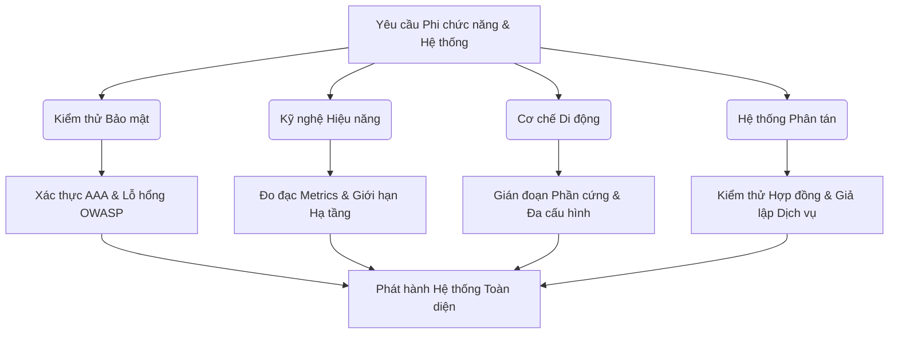
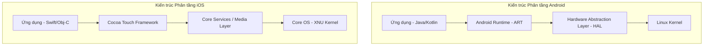
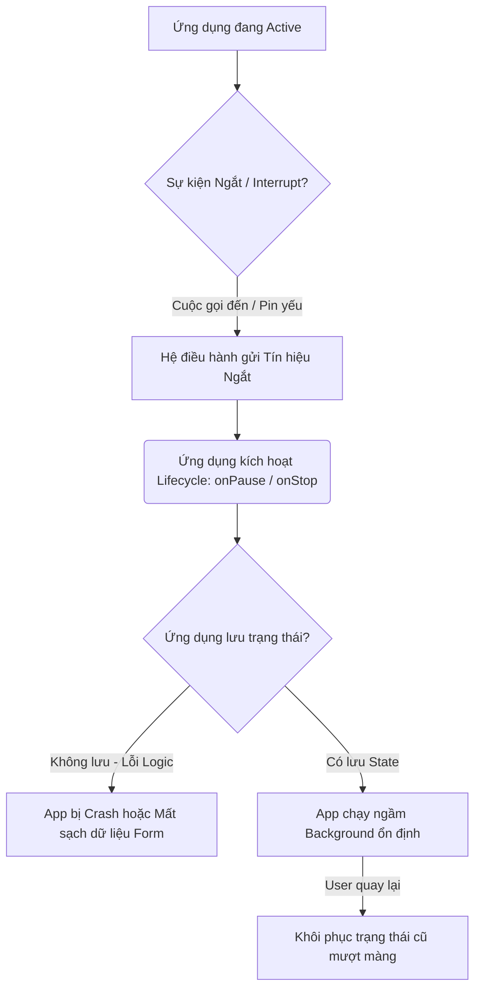

# 📁 11. Advanced Testing

*Mục tiêu: Mở rộng năng lực chuyên môn từ kiểm thử chức năng thông thường sang các mảng kỹ thuật chuyên sâu cao cấp bao gồm Kiểm thử Bảo mật (Security), Kỹ nghệ Hiệu năng (Performance), Cơ chế vận hành Di động (Mobile Mechanics) và Kiểm thử Hệ thống phân tán/Điện toán đám mây nhằm toàn diện hóa tư duy của một QA Expert thực chiến.*

# **11.3. Mobile Testing Mechanics**

## 📌 Mục lục nội bộ (Chặng 11)

- [ ] [**11.1. Security Testing Fundamentals**](./1_SecurityTesting.md)
- [ ] [**11.2. Performance Testing Engineering**](./2_PerformanceTesting.md)
- [ ] [**11.3. Mobile Testing Mechanics**](./3_MobileTesting.md)
  - [ ] [11.3.1. Android vs iOS Architecture & Emulator / Simulator Deployment](#1131-android-vs-ios-architecture--emulator--simulator-deployment)
  - [ ] [11.3.2. Testing Mobile Anomalies: Fragmentation, Installation, Interrupts](#1132-testing-mobile-anomalies-fragmentation-installation-interrupts)
- [ ] [**11.4. Distributed Systems, Contract & Cloud Testing**](./4_DistributedSystems.md)
---

## 🗺️ Bản đồ Tiến trình Phân rã Các Tầng Kiểm thử Nâng cao

Sơ đồ đơn sắc dưới đây mô tả lộ trình tiếp cận kiểm thử phi chức năng và hệ thống phân tán, giúp QA định vị chính xác khu vực cần cô lập và đánh giá rủi ro từ hạ tầng đến ứng dụng:



---

# 11.3.1. Android vs iOS Architecture & Emulator / Simulator Deployment

Kiểm thử ứng dụng di động (Mobile Testing) đòi hỏi Kỹ sư QA phải hiểu sâu sắc sự khác biệt bản chất trong kiến trúc hệ điều hành giữa Android và iOS. Việc nắm vững cơ chế vận hành của nhân hệ thống, quy trình quản lý vòng đời ứng dụng và cách triển khai các thiết bị giả lập (Emulator/Simulator) chuyên dụng là nền tảng cốt lõi để cô lập lỗi hiển thị, tối ưu hiệu năng client-side và xây dựng hệ thống kiểm thử tự động (Automation Framework) vững chắc.

## ⚙️ Bản chất chuyên sâu về Sự khác biệt Kiến trúc Android vs iOS

Android và iOS đại diện cho hai triết lý thiết kế hệ thống và quản lý tài nguyên phần cứng hoàn toàn độc lập, tác động trực tiếp đến cách ứng dụng vận hành và phân rã lỗi:

1. **Kiến trúc Hệ điều hành Android (Mở - Linh hoạt):**
   * *Nhân hệ thống:* Phát triển dựa trên nhân **Linux Kernel**. Android tương tác với phần cứng thông qua tầng HAL (Hardware Abstraction Layer).
   * *Môi trường thực thi (Runtime):* Ứng dụng Android được biên dịch thành mã Bytecode và chạy bên trong môi trường ảo **ART (Android Runtime)** thông qua cơ chế biên dịch trước (Ahead-Of-Time - AOT). Mỗi ứng dụng chạy trong một tiến trình (Process) cô lập hoàn toàn.
2. **Kiến trúc Hệ điều hành iOS (Đóng - Tối ưu):**
   * *Nhân hệ thống:* Phát triển dựa trên nhân **XNU Kernel** (Darwin), thuộc họ Unix. Hệ thống giao tiếp trực tiếp và đồng bộ tuyệt đối với phần cứng do Apple độc quyền thiết kế.
   * *Môi trường thực thi:* Ứng dụng iOS được biên dịch trực tiếp thành mã máy mã nguồn gốc (Native Machine Code) và chạy trực tiếp trên phần cứng thông qua tầng **Cocoa Touch Framework**. Không có tầng máy ảo trung gian giúp iOS tối ưu tài nguyên RAM vượt trội.



---

## 📊 Ma trận Triển khai Thiết bị Giả lập & Mô hình Định vị Lỗi cho QA

Dưới đây là bảng phân rã chi tiết về cơ chế vận hành của công cụ giả lập Android (Emulator) và iOS (Simulator), trọng tâm QA thực chiến và các lỗi cấu hình hệ thống phát sinh:

| Đặc tính Hạ tầng | Android Emulator (Thiết bị Mô phỏng) | iOS Simulator (Thiết bị Giả lập) | QA Mobile Focus (Trọng tâm thực chiến) | Defect thực tế (Lỗi hạ tầng & Cách sửa) |
| :--- | :--- | :--- | :--- | :--- |
| **Cơ chế Vận hành Kỹ thuật** | **Hardware Emulation:** Mô phỏng toàn bộ cấu trúc phần cứng (CPU kiến trúc ARM hoặc x86) độc lập. | **Architecture Simulation:** Chỉ giả lập lớp phần mềm và giao diện (API). Chạy trực tiếp trên kiến trúc phần cứng của máy Host (Mac). | QA cần phân biệt rõ: Android Emulator chạy nặng hơn nhưng mô phỏng sát phần cứng thật. iOS Simulator chạy cực nhanh nhưng không thể đo đạc chính xác hiệu năng RAM/CPU của iPhone thật. | **Lỗi sập nhân ảo hóa (VT-x Disabled):** Android Emulator không thể khởi động hoặc chạy siêu chậm trên máy Windows. <br>*Cách sửa:* Bật tính năng ảo hóa phần cứng (Intel VT-x hoặc AMD-V) trong BIOS và cài đặt `HAXM/WHPX`. |
| **Hệ thống Quản lý Tiến trình & CLI** | Sử dụng công cụ **ADB (Android Debug Bridge)** làm cầu nối điều phối: `adb devices`, `adb logcat`. | Sử dụng công cụ **simctl** (XCode Command Line): `xcrun simctl list`, `xcrun simctl boot`. | QA sử dụng CLI để tự động hóa khâu khởi động thiết bị ảo, đẩy tệp tin cài đặt (`.apk`, `.app`) và trích xuất tệp log hệ thống trong đường ống CI/CD. | **Không nhận diện thiết bị ảo (Device Offline):** Lệnh test tự động bị hủy do không kết nối được tới Emulator qua ADB. <br>*Cách sửa:* Chạy lệnh `adb kill-server && adb start-server` để khởi động lại trình điều khiển. |
| **Cơ chế Phân phối Đóng gói** | Định dạng tệp tin **`.apk`** (Android Package) hoặc `.aab`. Cấp quyền linh hoạt dựa trên tệp `AndroidManifest.xml`. | Định dạng tệp tin **`.ipa`** (iOS App Store Package) hoặc thư mục `.app` dành riêng cho Simulator. Định danh qua `Info.plist`. | QA phải kiểm tra kỹ tệp tin cài đặt được xuất ra. Tệp `.ipa` của iOS bắt buộc phải được ký số (Code Signing) bằng chứng chỉ nhà phát triển mới có thể cài lên máy thật. | **Lỗi sai kiến trúc tệp cài đặt (Incompatible Build):** Không thể kéo thả file `.app` vào iOS Simulator. <br>*Cách sửa:* Yêu cầu Developer xuất bản Build dành riêng cho cấu trúc chip (Intel hoặc Apple Silicon M1/M2) của máy Mac đang dùng. |

---

## 💡 Ví dụ thực tế liên hoàn: Quy trình Khởi tạo và Bắt log Thiết bị ảo của Kỹ sư QA

Hãy tưởng tượng bạn đang thiết lập môi trường máy chủ CI/CD để chạy bộ kịch bản kiểm thử tự động cho cả hai hệ điều hành Android và iOS:

1. **Chu trình điều phối Thiết bị ảo Android bằng ADB:**
   * Bạn kích hoạt thiết bị ảo Android từ dòng lệnh terminal:
     ```bash
     emulator -avd Pixel_7_API_33 -headless -no-audio &
     ```
   * Bạn kiểm tra xem thiết bị đã sẵn sàng nhận lệnh chưa và tiến hành cài đặt ứng dụng:
     ```bash
     adb wait-for-device
     adb install target/app-staging.apk
     ```
   * *Luồng săn lỗi thực chiến:* Khi chạy kịch bản Đăng nhập, ứng dụng bỗng nhiên bị văng ra màn hình chính (Crash). Bạn lập tức thực hiện lệnh trích xuất log để cô lập nguyên nhân:
     ```bash
     adb logcat *:E | grep -i "FATAL EXCEPTION"
     ```
   * *Kết quả:* Bạn bắt được dòng lỗi `NullPointerException` tại hàm xử lý dữ liệu Token của Backend. Bạn chụp log đính kèm vào Jira Ticket lỗi.

2. **Chu trình điều phối Thiết bị ảo iOS bằng simctl:**
   * Trên máy Mac ảo của đường ống CI, bạn tìm kiếm mã định danh (UUID) của thiết bị iPhone 14 Simulator và kích hoạt:
     ```bash
     xcrun simctl boot 1FE86B93-8C9B-4D14-9988-E4C868C6A5A1
     ```
   * Bạn tiến hành cài đặt file build chuyên dụng cho Simulator:
     ```bash
     xcrun simctl install booted target/app-staging.app
     ```

---

> ⚠️ **NGUYÊN LÝ BẤT BIẾN:** Tuyệt đối không bao giờ được phép sử dụng kết quả đo đạc về hiệu năng Client-side (như Tốc độ phản hồi khung hình FPS, Dung lượng tiêu thụ RAM, Mức độ ngốn pin) thu được từ các thiết bị giả lập (Emulator/Simulator) để làm số liệu báo cáo nghiệm thu chất lượng chính thức cho dự án. Các thiết bị ảo tận dụng sức mạnh phần cứng khổng lồ từ chip và RAM của máy tính Host nên không phản ánh đúng các điểm nghẽn giới hạn vật lý của một chiếc điện thoại thật (Real Device).

---

📚 **References**
* *ISTQB® Certified Tester Foundation Level - Mobile Application Testing Syllabus* - Section 3.1: *Mobile Application Platforms and Architecture* & Section 4.2: *Simulators, Emulators and Real Devices*.
* *Android Developers Architecture Guide* - *Android Runtime (ART) and Dalvik specification*.
* *Apple Developer Documentation* - *Xcode Simulator User Guide: Testing Apps in Simulator*.

# 11.3.2. Testing Mobile Anomalies: Fragmentation, Installation, Interrupts

Kiểm thử các hiện tượng bất thường trên thiết bị di động (Mobile Anomalies Testing) là kỹ thuật chuyên sâu nhằm đánh giá độ bền và tính ổn định của ứng dụng trong môi trường phần cứng biến động. Khác với môi trường Web ổn định, ứng dụng di động phải đối mặt với sự phân mảnh thiết bị (Fragmentation), quy trình cài đặt/nâng cấp phức tạp (Installation) và các sự kiện gián đoạn phần cứng thời gian thực (Interrupts). Việc làm chủ các kịch bản kiểm thử này giúp Kỹ sư QA ngăn chặn tình trạng sập ứng dụng đột ngột (App Crash), mất dữ liệu cục bộ và suy giảm trải nghiệm người dùng cuối.

## ⚙️ Bản chất chuyên sâu về Cơ chế Xử lý Gián đoạn và Phân mảnh Di động

Ứng dụng di động vận hành trong một hệ sinh thái tài nguyên hạn chế, nơi hệ điều hành (Android/iOS) có toàn quyền can thiệp và thu hồi tài nguyên thông qua 3 cơ chế kiến trúc:

1. **Fragmentation Mechanics (Cơ chế phân mảnh):** Sự phân tách ma trận thiết bị xảy ra do sự đa dạng về kích thước màn hình, mật độ điểm ảnh (DPI), cấu trúc vi xử lý (ARM64, x86) và đặc biệt là sự tùy biến hệ điều hành (Custom ROMs của Samsung, Xiaomi, Oppo). Ứng dụng bắt buộc phải tự thích ứng động với cấu hình phần cứng tại runtime.
2. **Installation Lifecycle (Vòng đời cài đặt & Bộ nhớ):** Quá trình phân bổ dữ liệu ứng dụng vào các phân vùng lưu trữ nội bộ. Khi cập nhật ứng dụng (App Upgrade), hệ điều hành thực hiện cơ chế ghi đè file nhị phân nhưng bắt buộc phải bảo toàn nguyên vẹn cấu trúc cơ sở dữ liệu cục bộ (SQLite/Room/CoreData) và các khóa bảo mật cũ (Shared Preferences/Keychain).
3. **Interrupt Handling (Cơ chế xử lý gián đoạn phần cứng):** Khi một sự kiện phần cứng xuất hiện (Cuộc gọi đến, mất mạng, cắm sạc), hệ điều hành sẽ gửi một tín hiệu ngắt (Signal Interrupt) ép ứng dụng từ trạng thái đang hoạt động (`Active`) rơi xuống trạng thái chạy ngầm (`Background`) hoặc tạm dừng (`Paused`). Ứng dụng phải thực hiện lưu trữ trạng thái hiện tại (State Preservation) để sẵn sàng khôi phục ngay khi người dùng quay lại.



---

## 📊 Ma trận Kịch bản Biên Mobile & Mô hình Kiểm soát Lỗi Thiết bị cho QA

Dưới đây là bảng phân rã chi tiết về các loại hình biến động Mobile, trọng tâm kịch bản test biên của QA thực chiến và các lỗi đặc thù (Mobile Defects) phát sinh:

| Loại hình Biến động | Trọng tâm QA Focus (Kịch bản kiểm thử biên) | Lý do Kỹ thuật chuyên sâu | Defect thực tế (Lỗi hệ thống Mobile & Cách sửa) |
| :--- | :--- | :--- | :--- |
| **Interrupt Testing** <br>*(Kiểm thử gián đoạn)* | Giả lập nhận cuộc gọi, tin nhắn SMS, thông báo pin yếu ($15\%$), cắm/rút sạc, hoặc khóa màn hình đúng vào giây hệ thống đang thực hiện lệnh gửi API thanh toán. | Xác thực ứng dụng không bị rò rỉ luồng xử lý hoặc treo cứng giao diện khi bị ép buộc chuyển đổi trạng thái vòng đời đột ngột. | **Lỗi sập App khi gián đoạn (Crash on Interrupt):** Ứng dụng bị văng (Force Close) khi có cuộc gọi đến do hàm callback không giải phóng bộ nhớ. <br>*Cách sửa:* Thực hiện giải phóng tài nguyên và lưu trạng thái dữ liệu trong hàm `onPause()` / `onStop()`. |
| **Network Switching** <br>*(Biến động mạng dữ liệu)* | Di chuyển thiết bị từ vùng Wifi sang mạng di động (4G/5G), đi vào thang máy (mất mạng đột ngột) và quay trở ra khi đang tải dữ liệu nặng. | Kiểm tra khả năng xử lý bất đồng bộ và cơ chế tự động kết nối lại (Retry Mechanism) của tầng mạng ứng dụng mà không bắt người dùng đăng nhập lại. | **Lỗi mất đồng bộ dữ liệu (Data Desynchronization):** Màn hình hiển thị vòng quay vô hạn (Infinite Loading) khi mất mạng. <br>*Cách sửa:* Tích hợp bộ chặn gói tin (Network Interceptor) để bắt mã lỗi Timeout và hiển thị thông báo Offline thân thiện. |
| **Installation & Upgrade** <br>*(Cài đặt & Nâng cấp)* | Kiểm thử cài đặt đè phiên bản mới (v2.0) lên phiên bản cũ (v1.0) khi tài khoản đang ở trạng thái đăng nhập và có dữ liệu lưu tạm (Draft). | Đảm bảo quá trình thay đổi cấu trúc cơ sở dữ liệu cục bộ (Database Migration) diễn ra trơn tru, không gây xung đột tệp tin cũ. | **Lỗi vỡ DB sau khi cập nhật (Migration Crash):** Ứng dụng crash lập tức sau khi update từ App Store do cấu trúc bảng SQLite mới bị thiếu trường so với bản cũ. <br>*Cách sửa:* Viết script cấu hình `Migration` tăng phiên bản DB rõ ràng trong mã nguồn. |
| **Device Fragmentation** <br>*(Phân mảnh thiết bị)* | Kiểm thử hiển thị giao diện trên màn hình có tai thỏ (Notch), màn hình gập (Foldable), các máy RAM yếu (2GB) và các hệ điều hành tùy biến sâu. | Đảm bảo tính tương thích và khả năng tối ưu bố cục giao diện (Responsive Layout) dựa trên các tỷ lệ viewport khác nhau. | **Lỗi tràn giao diện (UI Clipping Defect):** Nút "Thanh toán" bị che khuất hoàn toàn dưới phần tai thỏ hoặc cạnh dưới màn hình trên một số dòng máy Xiaomi. <br>*Cách sửa:* Sử dụng các vùng an toàn (`SafeAreaView` / `ConstraintLayout`) khi thiết kế giao diện UI. |

---

## 💡 Ví dụ thực tế liên hoàn: Luồng Kiểm thử Gián đoạn Mạng và Hạ tầng của QA

Hãy tưởng tượng bạn đang kiểm thử một ứng dụng Ví điện tử tại tính năng "Chuyển tiền nhanh qua mã QR".

1. **Giai đoạn kích nổ sự kiện gián đoạn (Interrupt Execution):**
   * Bạn mở App, quét mã QR thành công, nhập số tiền 500,000đ và bấm nút "Xác nhận chuyển tiền".
   * Ngay khi vòng tròn loading của nút chuyển tiền vừa xuất hiện (gói tin API bắt đầu gửi đi), bạn dùng một máy khác gọi điện trực tiếp vào số điện thoại của thiết bị đang test.
   * Giao diện cuộc gọi của hệ điều hành lập tức đè lên toàn màn hình, ứng dụng Ví điện tử bị đẩy xuống chạy ngầm (Background).

2. **Quy trình cô lập lỗi và đánh giá rủi ro (Defect Analysis):**
   * Bạn từ chối cuộc gọi để quay lại ứng dụng Ví điện tử.
   * *Kịch bản dính lỗi nghiêm trọng (Defect):* Ứng dụng hiển thị màn hình trắng xóa và bị treo cứng, không thể bấm được nút quay lại. Bạn kiểm tra tài khoản ngân hàng thì thấy đã bị trừ 500,000đ nhưng không hề nhận được biên lai thông báo thành công trong ứng dụng.
   * *Phân tích kỹ thuật của QA Expert:* Khi bị đẩy xuống background, ứng dụng đã ngắt kết nối socket nhận phản hồi từ server nhưng không có cơ chế khôi phục trạng thái (Resilience) khi quay lại trạng thái Active. Điều này dẫn đến lỗi rò rỉ luồng và làm mất dấu vết giao dịch của khách hàng.
   * *Hành động của QA:* Báo cáo lỗi dữ liệu mức độ **CRITICAL**, yêu cầu đội ngũ phát triển tích hợp cơ chế kiểm tra lại trạng thái giao dịch (Transaction Polling) ngay khi ứng dụng kích hoạt lại sự kiện `onResume()`.

---

> ⚠️ **NGUYÊN LÝ BẤT BIẾN:** Tuyệt đối không bao giờ được phép cấu hình ứng dụng di động lưu trữ các dữ liệu phiên làm việc nhạy cảm (như Mật khẩu, Mã PIN, Token API) vào phân vùng lưu trữ văn bản thuần mặc định (`Shared Preferences` trên Android hoặc `UserDefaults` trên iOS). Các tệp tin này hoàn toàn có thể bị đọc trích xuất dễ dàng khi thiết bị bị root/jailbreak. Bạn bắt buộc phải yêu cầu lập trình viên sử dụng các phân vùng mã hóa phần cứng an toàn tối cao độc lập (`Android Keystore` và `iOS Keychain`).

---

📚 **References**
* *ISTQB® Certified Tester Foundation Level - Mobile Application Testing Syllabus* - Section 4.5: *Testing for App Interrupts and Environmental Changes* & Section 4.6: *Device Fragmentation and Compatibility*.
* *Android Developers Quality Guidelines* - *Core app quality: Visual design and user interaction (Handling Interrupts & Lifecycle)*.
* *Apple iOS Human Interface Guidelines* - *App Architecture: Managing App State and Virtual Memory Limits*.

