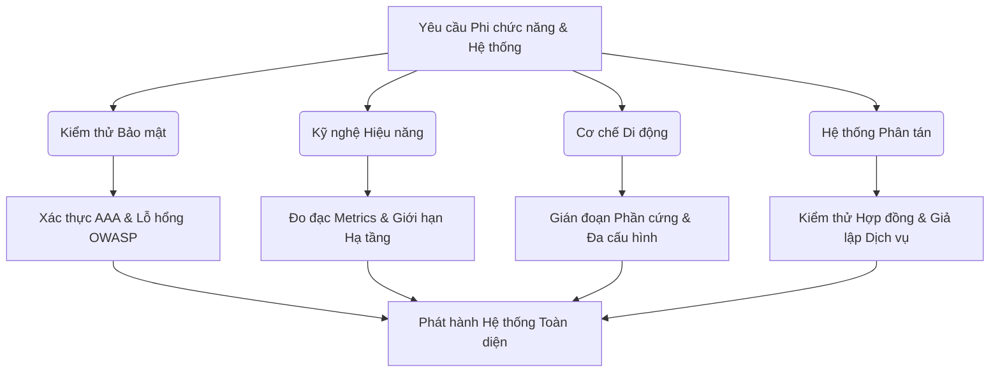
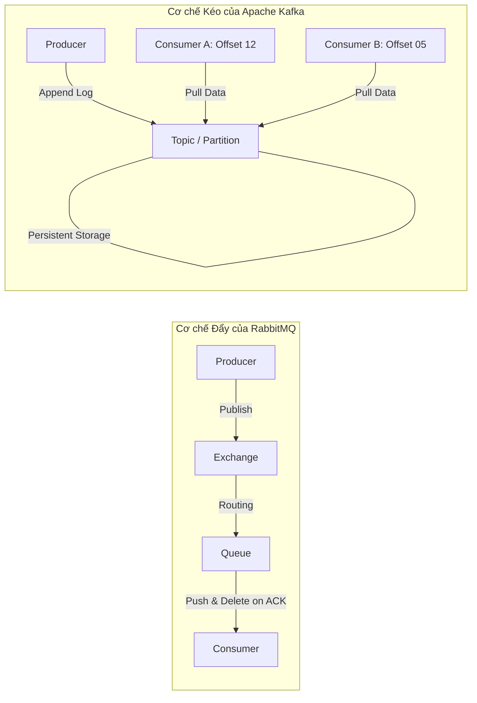
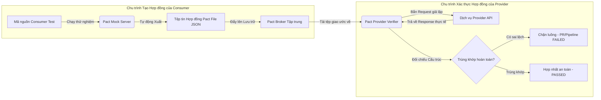
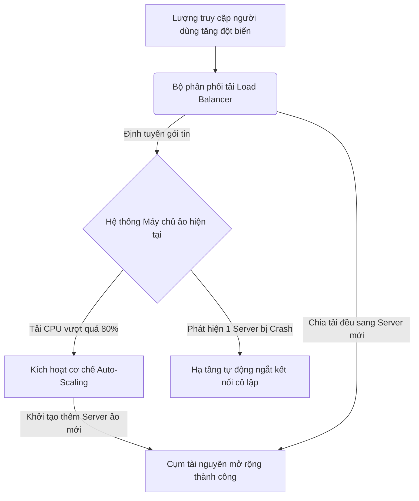
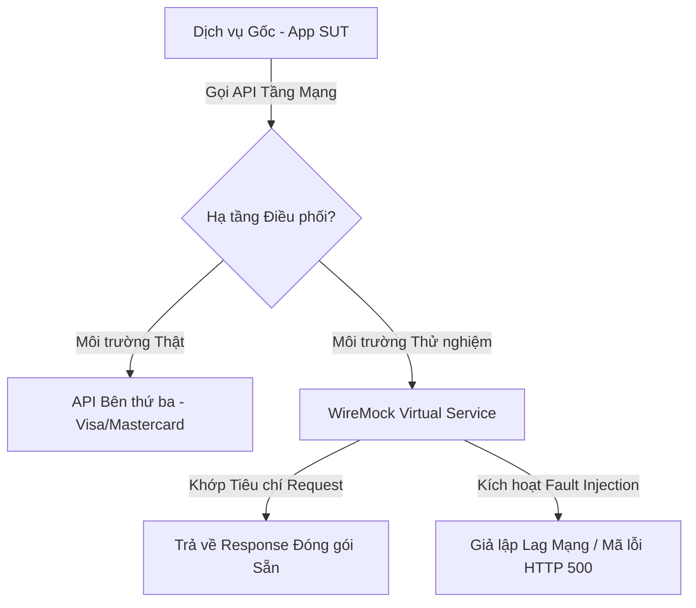

# 📁 11. Advanced Testing

*Mục tiêu: Mở rộng năng lực chuyên môn từ kiểm thử chức năng thông thường sang các mảng kỹ thuật chuyên sâu cao cấp bao gồm Kiểm thử Bảo mật (Security), Kỹ nghệ Hiệu năng (Performance), Cơ chế vận hành Di động (Mobile Mechanics) và Kiểm thử Hệ thống phân tán/Điện toán đám mây nhằm toàn diện hóa tư duy của một QA Expert thực chiến.*

# **11.4. Distributed Systems, Contract & Cloud Testing**

## 📌 Mục lục nội bộ (Chặng 11)
- [ ] [**11.1. Security Testing Fundamentals**](./1_SecurityTesting.md)
- [ ] [**11.2. Performance Testing Engineering**](./2_PerformanceTesting.md)
- [ ] [**11.3. Mobile Testing Mechanics**](./3_MobileTesting.md)
- [ ] [**11.4. Distributed Systems, Contract & Cloud Testing**](./4_DistributedSystems.md)
  - [ ] [11.4.1. Microservices Architecture & Async Message Brokers (Kafka, RabbitMQ)](#1141-microservices-architecture--async-message-brokers-kafka-rabbitmq)
  - [ ] [11.4.2. Contract Testing via Pact Framework](#1142-contract-testing-via-pact-framework)
  - [ ] [11.4.3. Cloud Infrastructure Testing (AWS, Azure, GCP)](#1143-cloud-infrastructure-testing-aws-azure-gcp)
  - [ ] [11.4.4. Service Virtualization (WireMock) & Advanced Test Data Management](#1144-service-virtualization-wiremock--advanced-test-data-management)

---

## 🗺️ Bản đồ Tiến trình Phân rã Các Tầng Kiểm thử Nâng cao

Sơ đồ đơn sắc dưới đây mô tả lộ trình tiếp cận kiểm thử phi chức năng và hệ thống phân tán, giúp QA định vị chính xác khu vực cần cô lập và đánh giá rủi ro từ hạ tầng đến ứng dụng:



---

# 11.4.1. Microservices Architecture & Async Message Brokers (Kafka, RabbitMQ)

Kiểm thử hệ thống phân tán dựa trên kiến trúc Microservices đặt ra những thách thức hoàn toàn khác biệt so với ứng dụng nguyên khối (Monolith). Trọng tâm của kỹ nghệ kiểm thử lúc này dịch chuyển từ xác thực logic hàm cục bộ sang kiểm soát luồng giao tiếp bất đồng bộ (Asynchronous Communication) giữa các dịch vụ độc lập thông qua các bộ điều phối trung gian - Message Brokers (Apache Kafka và RabbitMQ). Việc làm chủ kỹ thuật này giúp Kỹ sư QA cô lập chính xác các rủi ro mất mát gói tin, nghẽn hàng đợi và phá vỡ tính nhất quán dữ liệu của toàn bộ hệ thống distributed.

## ⚙️ Bản chất chuyên sâu về Cơ chế Điều phối Tin nhắn Bất đồng bộ

In kiến trúc hướng sự kiện (Event-Driven Architecture), các Microservices không gọi trực tiếp API HTTP của nhau nhằm triệt tiêu sự phụ thuộc tuyến tính và hiện tượng trễ mạng (Low Coupling). Thay vào đó, luồng dữ liệu được điều phối thông qua hai trường phái Message Brokers với cơ chế vận hành thuật toán độc lập tuyệt đối:

1. **RabbitMQ (Message Queueing - Mô hình Đẩy):** Vận hành dựa trên giao thức AMQP và **Mô hình Đẩy chủ động (Push Model)**. Dịch vụ gửi tin (`Producer`) đẩy gói tin vào một bộ định tuyến nội bộ (`Exchange`). Exchange dựa trên các quy tắc cấu hình (Routing Key) để phân phối gói tin vào các Hàng đợi (`Queue`). RabbitMQ sẽ chủ động đẩy tệp tin này tới các dịch vụ nhận (`Consumer`). Ngay khi Consumer xác nhận xử lý thành công (`ACK`), **gói tin sẽ lập tức bị xóa vĩnh viễn khỏi bộ nhớ của RAM**.
2. **Apache Kafka (Distributed Event Streaming - Mô hình Kéo):** Vận hành dựa trên kiến trúc **Nhật ký lưu trữ tuần tự phân tán (Append-Only Log)** và **Mô hình Kéo thụ động (Pull Model)**. Dữ liệu được tổ chức thành các Chủ đề (`Topics`), phân rã nhỏ thành nhiều Phân vùng (`Partitions`) độc lập. Gói tin gửi lên không bị xóa đi khi có người đọc mà được lưu trữ cố định trên đĩa cứng dựa trên thời gian cấu hình (Retention Policy). Các Consumer chủ động kéo dữ liệu về và tự quản lý vị trí đọc của mình thông qua con trỏ chỉ mục (`Offset`). Cơ chế này cho phép nhiều hệ thống khác nhau cùng đọc lại (Replay) một dòng dữ liệu lịch sử tại bất kỳ thời điểm nào.



---

## 📊 Ma trận Kiểm thử Hàng đợi & Mô hình Phân tách Lỗi Phân tán cho QA

Dưới đây là bảng phân rã chi tiết các cạm bẫy kỹ thuật đặc thù trong hệ thống bất đồng bộ, trọng tâm kịch bản test biên của QA thực chiến và các lỗi hệ thống (Distributed Defects) phát sinh:

| Kịch bản / Kỹ thuật Kiểm thử | Trọng tâm QA Focus (Kịch bản kiểm thử biên) | Lý do Kỹ thuật chuyên sâu | Defect thực tế (Lỗi hệ thống & Cách sửa) |
| :--- | :--- | :--- | :--- |
| **Idempotency Testing** <br>*(Kiểm thử tính độc lập)* | Giả lập mạng bị lag khiến Message Broker gửi trùng lặp một tin nhắn (Duplicate Message) tới Consumer 3 lần liên tiếp. | Xác thực hệ thống chỉ xử lý hành vi đúng 1 lần duy nhất, tránh việc ghi nhận trùng lặp dữ liệu trong DB nghiệp vụ. | **Lỗi trừ tiền hai lần (Double Processing Defect):** Hệ thống tạo ra 2 đơn hàng trùng nhau khi nhận 2 tin nhắn trùng mã. <br>*Cách sửa:* Bắt buộc Consumer kiểm tra tính duy nhất của mã `Message_ID` hoặc `Idempotency-Key` trong DB trước khi xử lý. |
| **Consumer Failure & DLQ** <br>*(Lỗi xử lý & Hàng đợi chết)* | Gửi một gói tin có cấu trúc Payload bị lỗi (Malformed JSON) vào hệ thống để cố tình ép Consumer xử lý thất bại. | Kiểm tra xem hệ thống có bị rơi vào vòng lặp vô hạn (Infinite Retry Loop) gây nghẽn hàng đợi hay không. Xác thực gói tin lỗi được cô lập an toàn. | **Lỗi ngộ độc hàng đợi (Poison Pill Defect):** Một tin nhắn lỗi khiến Consumer crash liên tục, làm đóng băng toàn bộ các tin nhắn đúng phía sau. <br>*Cách sửa:* Cấu hình giới hạn số lần thử lại (`Max Retries`), nếu quá hạn tự động đẩy tin lỗi vào Hàng đợi thư chết (`Dead Letter Queue - DLQ`). |
| **Out-of-Order Execution** <br>*(Sai lệch thứ tự tin nhắn)* | Gửi chuỗi tin nhắn có tính chất tuần tự: `[Tạo đơn hàng]` $\rightarrow$ `[Thành toán]` $\rightarrow$ `[Hủy đơn]`. Giả lập mạng khiến tin nhắn Hủy đơn bay tới trước tin nhắn Tạo đơn. | Đảm bảo máy trạng thái (State Machine) của Backend xử lý logic chặt chẽ, không bị xung đột luồng nghiệp vụ khi mất thứ tự tuyến tính. | **Lỗi dữ liệu ma (Ghost Record Defect):** Đơn hàng đã hủy bỗng nhiên sống lại ở trạng thái Đang xử lý do tin nhắn Tạo đơn xử lý sau cùng. <br>*Cách sửa:* Đối chiếu mốc thời gian phát tán (`Timestamp`) trong Payload hoặc sử dụng khóa phân vùng (`Partition Key`) của Kafka để ép chạy đơn luồng tuần tự. |
| **Message Durability** <br>*(Kiểm thử mất mát dữ liệu)* | Bắn hàng ngàn tin nhắn vào Broker và lập tức kích hoạt lệnh ép buộc tắt nguồn (Hard Kill / Reboot) máy chủ Message Broker đột ngột. | Xác minh cấu hình lưu trữ đệm của hệ thống đủ bền vững để không làm mất mát dữ liệu của khách hàng khi hạ tầng gặp sự cố phần cứng. | **Mất sạch tin nhắn khi mất điện (Transient Data Loss):** Toàn bộ tin nhắn đang chờ trong hàng đợi biến mất sau khi Broker khởi động lại. <br>*Cách sửa:* Cấu hình thuộc tính tin nhắn ở chế độ `Persistent` và bật tính năng bền vững (`Durable Queue`) đối với RabbitMQ. |

---

## 💡 Ví dụ thực tế liên hoàn: Quy trình Kiểm thử Bất đồng bộ luồng Đặt hàng của QA

Hãy tưởng tượng bạn đang là Kỹ sư QA thực hiện kiểm thử tích hợp hệ thống cho luồng Đặt hàng - Trừ kho của một trang Thương mại điện tử lớn. Hệ thống bao gồm `Order-Service` (Dịch vụ Đặt hàng) giao tiếp với `Inventory-Service` (Dịch vụ Kho) thông qua Kafka Topic `order-placed-events`.

1. **Giai đoạn Giả lập Sự cố Hạ tầng (Consumer Down Test):**
   * Bạn truy cập vào terminal máy chủ Staging và chủ động tắt ứng dụng `Inventory-Service` bằng lệnh:
     ```bash
     docker compose stop inventory-service
     ```
   * Bạn mở giao diện web UI lên, thực hiện đặt mua 1 chiếc điện thoại iPhone thành công. Hệ thống báo: "Đơn hàng đã được ghi nhận".
   * *Kiểm tra tầng dữ liệu trung gian của QA:* Bạn dùng CLI truy cập trực tiếp vào Broker Kafka để kiểm tra chỉ số Topic:
     ```bash
     kafka-consumer-groups.sh --bootstrap-server localhost:9092 --describe --group inventory-group
     ```
   * *Kết quả chỉ số:* Hệ thống hiển thị chỉ số **`LAG = 1`**. Điều này chứng minh rằng `Order-Service` đã phát tán sự kiện thành công, gói tin đang nằm chờ an toàn trên phân vùng đĩa cứng của Kafka, hoàn toàn không bị mất đi dù dịch vụ nhận đang bị sập.

2. **Giai đoạn Xác thực Tính Nhất quán (Data Consistency Validation):**
   * Bạn kích hoạt khởi động lại dịch vụ Kho:
     ```bash
     docker compose start inventory-service
     ```
   * Bạn mở log của `inventory-service` để theo dõi tiến trình: `docker logs -f inventory-service`.
   * *Quan sát hành vi:* Ngay khi bật lên, Consumer của dịch vụ Kho chủ động kéo gói tin cũ về, đọc mã sản phẩm, thực hiện trừ số lượng tồn kho đi 1 đơn vị, và cập nhật chỉ số **`LAG quay về mức 0`**.
   * *Hành động của QA:* Xác nhận hệ thống đạt chuẩn kiến trúc phân tán loose-coupling, dữ liệu hai bên đạt trạng thái nhất quán cuối cùng (Eventual Consistency).

---

> ⚠️ **NGUYÊN LÝ BẤT BIẾN:** Tuyệt đối không bao giờ được phép viết các kịch bản kiểm thử tự động (Automation Test) cho hệ thống bất đồng bộ bằng cách sử dụng cơ chế Chờ cứng (Hard Sleep) để đợi dữ liệu cập nhật vào Database (Ví dụ: viết lệnh `sleep(5000)` rồi mới chạy câu lệnh `SELECT` kiểm tra DB). Tốc độ xử lý của Message Queue phụ thuộc vào tải trọng mạng và CPU tại từng thời điểm. Bạn bắt buộc phải áp dụng cơ chế Chạy lặp kiểm tra (Polling Mechanism) với thời gian chờ tối đa (Timeout) để liên tục truy vấn trạng thái cho đến khi đạt kỳ vọng.

---

📚 **References**
* *ISTQB® Certified Tester Advanced Level (CTAL) Technical Test Analyst Syllabus* - Section 4.3: *Test Environment and Tooling (Distributed Systems Architecture testing)*.
* *Kleppmann, M. (2017). Designing Data-Intensive Applications: The Big Ideas Behind Reliable, Scalable, and Maintainable Systems.* O'Reilly Media - Chapter 11: *Stream Processing (Message Brokers and Logs)*.
* *Enterprise Integration Patterns Standard* - *Asynchronous Messaging Channels and Dead Letter Channels Specification Guide*.

# 11.4.2. Contract Testing via Pact Framework

Kiểm thử hợp đồng (Contract Testing) là kỹ thuật tiên tiến giúp đảm bảo tính tương thích về mặt cấu trúc và dữ liệu giao tiếp giữa các dịch vụ độc lập trong kiến trúc Microservices mà không cần phải khởi chạy toàn bộ hệ thống phân tán lên môi trường tích hợp. Việc sử dụng Pact Framework giúp các kỹ sư QA phát hiện sớm hiện tượng phá vỡ giao ước dữ liệu (Integration Breakage) ngay từ giai đoạn kiểm thử đơn vị độc lập, giải phóng sự phụ thuộc vào các môi trường Staging cồng kềnh.

## ⚙️ Bản chất chuyên sâu về Cơ chế Hoạt động của Pact Framework

Khác với kiểm thử tích hợp (Integration Testing) truyền thống dựa vào việc gọi API thật, Contract Testing vận hành dựa trên cơ chế **Kiểm thử hướng người tiêu dùng (Consumer-Driven Contract Testing)**, được phân rã thành hai chu trình độc lập kết nối qua một máy chủ lưu trữ trung tâm (Pact Broker):

1. **Consumer-Side Generation (Chu trình Người tiêu dùng):** Dịch vụ gọi API (`Consumer`) tự định nghĩa ra một bộ quy tắc kỳ vọng (Interactions) bao gồm cấu trúc gói tin gửi đi (Request) và phản hồi mong đợi nhận về (Expected Response). Khi chạy test cục bộ, Pact sẽ khởi tạo một Mock Server để ghi lại các tương tác này và xuất ra một tệp tin hợp đồng định dạng JSON (gọi là một `Pact File`). Tệp này sau đó được đẩy lên **Pact Broker** tập trung.
2. **Provider-Side Verification (Chu trình Nhà cung cấp):** Dịch vụ cung cấp API (`Provider`) tải tệp tin hợp đồng từ Pact Broker về. Pact sẽ tự động giả lập lại chính xác các yêu cầu mạng đã ghi trong hợp đồng hướng thẳng vào mã nguồn đang chạy thực tế của Provider để kiểm tra xem cấu trúc dữ liệu phản hồi thực tế có trùng khớp $100\%$ với giao ước cũ hay không.



---

## 📊 Ma trận Khớp dữ liệu Pact & Mô hình Chặn rủi ro Tích hợp cho QA

Dưới đây là bảng phân rã chi tiết về cơ chế khớp dữ liệu, trọng tâm kịch bản test biên của QA thực chiến và các lỗi phá vỡ giao ước (Contract Defects) phát sinh:

| Cơ chế Khớp dữ liệu Pact | Phương pháp Thực thi Kỹ thuật | QA Focus (Trọng tâm thực chiến) | Defect thực tế (Lỗi phá vỡ cấu hình & Cách sửa) |
| :--- | :--- | :--- | :--- |
| **Exact Matching** <br>*(Khớp giá trị tuyệt đối)* | Đối chiếu trùng khớp chính xác từng ký tự hoặc số cụ thể (Ví dụ: `status: "ACTIVE"`). | Dùng cho các trường dữ liệu cố định mang tính chất cấu hình hoặc mã trạng thái hệ thống bất biến. | **Lỗi sập luồng do đổi dữ liệu mẫu:** Provider thay đổi mã trạng thái từ chữ hoa `"ACTIVE"` sang chữ thường `"active"` khiến Consumer bị crash. <br>*Cách sửa:* Khóa chặt giá trị bằng hàm `Matchers.somethingLike` nếu giá trị có thể biến động. |
| **Type Matching** <br>*(Khớp kiểu dữ liệu)* | Sử dụng hàm `Matchers.like()` để xác thực kiểu dữ liệu đầu ra (String, Integer, Boolean, Array). | Đảm bảo cấu trúc thô của JSON không bị thay đổi. Chỉ quan tâm trường đó trả về đúng kiểu dữ liệu, không bắt bẻ giá trị nội dung cụ thể. | **Lỗi ép sai kiểu dữ liệu (Type Mismatch Defect):** Trường giá trị ID hóa đơn vốn là chuỗi String (`"1002"`) bỗng nhiên bị Provider sửa thành kiểu Số (`1002`). <br>*Cách sửa:* Sử dụng `Matchers.integer()` hoặc `Matchers.string()` rõ ràng trong file test của Consumer. |
| **RegEx Matching** <br>*(Khớp biểu thức chính quy)* | Sử dụng hàm `Matchers.term()` phối hợp với biểu thức mã hóa RegEx (Ví dụ: Định dạng ngày tháng, UUID). | Dùng để validate các chuỗi dữ liệu động phức tạp nhưng bắt buộc phải tuân thủ nghiêm ngặt theo phom cấu trúc quy định. | **Lỗi sai định dạng chuỗi (Format Violation):** Provider thay đổi định dạng ngày tháng trả về từ chuỗi chuẩn ISO `YYYY-MM-DD` sang `DD/MM/YYYY`. <br>*Cách sửa:* Đăng ký biểu thức chính quy định tuyến định dạng ngay tại gốc hợp đồng. |

---

## 💡 Ví dụ thực tế liên hoàn: Luồng Kiểm thử Hợp đồng giữa Dịch vụ Giỏ hàng và API Sản phẩm

Hãy tưởng tượng bạn đang kiểm thử luồng giao tiếp giữa `Cart-Service` (Consumer) cần gọi API `GET /products/:id` từ `Product-Service` (Provider).

### 1. Phía Consumer (`Cart-Service`): Khởi tạo Hợp đồng bằng JavaScript
Kỹ sư QA viết mã nguồn kiểm thử đơn vị tích hợp Pact để định nghĩa giao ước kỳ vọng:
```javascript
const { PactV3, Matchers } = require('@pact-foundation/pact');

const provider = new PactV3({
  consumer: 'Cart-Service',
  provider: 'Product-Service',
});

// Định nghĩa Tương tác kỳ vọng
provider.addInteraction({
  states: [{ description: 'Sản phẩm tồn tại trong hệ thống' }],
  uponReceiving: 'Một yêu cầu lấy thông tin sản phẩm bằng mã ID',
  withRequest: {
    method: 'GET',
    path: '/products/1001',
  },
  willRespondWith: {
    status: 200,
    headers: { 'Content-Type': 'application/json' },
    body: {
      id: Matchers.integer(1001),
      name: Matchers.string('Điện thoại iPhone 15 Pro'),
      // Kiểm tra trường giá trị phải là kiểu số thực
      price: Matchers.decimal(25000000.00),
    },
  },
});
```
*Kết quả:* Khi chạy bộ test này trên Local, Pact tự động xuất ra file `cart-service-product-service.json` và đẩy lên Pact Broker.

### 2. Phía Provider (`Product-Service`): Xác thực Hợp đồng tự động trên CI
Khi tệp code của `Product-Service` được push lên Git, đường ống CI tự động tải file hợp đồng của bên Giỏ hàng về để đối chiếu bằng câu lệnh:
```bash
pact-verifier --provider-base-url=http://localhost:8081 --pact-url=http://company.com
```
*Tình huống phát sinh lỗi phá vỡ giao ước (Contract Defect):* Một lập trình viên phía đội Product vô tình xóa bỏ hoặc đổi tên trường `price` thành `product_price` trong mã nguồn mà không thông báo cho đội Giỏ hàng. 

Khi lệnh `pact-verifier` kích hoạt, hệ thống sẽ phát hiện ra sự lệch pha cấu trúc dữ liệu phản hồi ngay lập tức và đưa ra thông báo: `Missing expected key 'price' in response body`. Đường ống CI của phía Product lập tức bị **FAILED**, ngăn chặn hoàn toàn việc deploy code lỗi lên môi trường chung, bảo vệ an toàn cho hệ thống.

---

> ⚠️ **NGUYÊN LÝ BẤT BIẾN:** Tuyệt đối không bao giờ được phép sử dụng kỹ thuật Kiểm thử hợp đồng (Contract Testing) để thay thế hoàn toàn cho các bài kiểm thử chức năng hộp đen hoặc kiểm thử hiệu năng (Performance Testing). Khớp hợp đồng dữ liệu thành công chỉ chứng minh rằng các dịch vụ giao tiếp ăn khớp với nhau về mặt cú pháp giao ước cấu trúc gói tin (Syntax & Types Alignment), hoàn toàn không thể bảo chứng rằng logic nghiệp vụ bên trong hàm xử lý của Provider chạy đúng thiết kế.

---

📚 **References**
* *ISTQB® Certified Tester Advanced Level (CTAL) Technical Test Analyst Syllabus* - Section 4.3: *Test Environment and Tooling (Component Integration and Contract Testing)*.
* *Pact Foundation International Open Source Project Specification.* - *Consumer-Driven Contracts Implementation Guide*.
* *Enterprise Microservices Design Standard* - *Architectural Patterns for Decoupled Integration Checking via Pact Broker*.

# 11.4.3. Cloud Infrastructure Testing (AWS, Azure, GCP)

Kiểm thử hạ tầng điện toán đám mây (Cloud Infrastructure Testing) là kỹ nghệ xác thực tính sẵn sàng cao, năng lực chịu tải, cơ chế bảo mật và khả năng phục hồi sau thảm họa của hệ thống được triển khai trên các nền tảng đám mây lớn như Amazon Web Services (AWS), Microsoft Azure và Google Cloud Platform (GCP) [1, 2]. Đối với một Kỹ sư QA, việc kiểm thử ở tầng này dịch chuyển trọng tâm từ kiểm tra logic ứng dụng sang kiểm tra cấu hình tài nguyên mạng ảo, chính sách điều phối phân phối tải và khả năng co giãn tự động dưới các điều kiện vận hành khắc nghiệt [2].

## ⚙️ Bản chất chuyên sâu về Cơ chế Vận hành Hạ tầng Đám mây

Hạ tầng điện toán đám mây vận hành dựa trên các tài nguyên phần cứng được ảo hóa phần mềm (Software-defined Resources) [2]. Quá trình phân phối và vận hành luồng kiểm thử hạ tầng đám mây tập trung vào 3 thành phần kiến trúc cốt lõi:

1. **Auto-Scaling Mechanics (Cơ chế co giãn tự động):** Khả năng hệ thống tự động tăng (Scale-out) hoặc giảm (Scale-in) số lượng máy chủ ảo ngầm (EC2 Instances, Azure VMs) dựa trên các ngưỡng cảnh báo (Tải CPU > $75\%$, Lượng Request tăng vọt) [2].
2. **Global Load Balancing (Cơ chế điều phối phân phối tải toàn cầu):** Bộ phân phối tải trung tâm (AWS ALB, Azure Application Gateway) có nhiệm vụ kiểm tra sức khỏe (Healthcheck) của các cụm máy chủ và định tuyến gói tin API đến vùng tài nguyên còn trống tốt nhất [1].
3. **Multi-Region & High Availability Architecture (Kiến trúc sẵn sàng cao):** Thiết kế hệ thống phân tán nằm rải rác trên nhiều Vùng sẵn sàng (Availability Zones - AZs) hoặc nhiều Khu vực địa lý (Regions) khác nhau nhằm đảm bảo nếu một trung tâm dữ liệu gặp sự cố mất điện vật lý, toàn bộ hệ thống vẫn sống sót và không làm gián đoạn trải nghiệm của người dùng.



---

## 📊 Ma trận Kiểm thử Hạ tầng Đám mây & Mô hình Cô lập Lỗi Hệ thống cho QA

Dưới đây là bảng phân rã chi tiết về phương pháp kịch bản kiểm thử, trọng tâm QA thực chiến và các lỗi cấu hình hạ tầng đám mây (Cloud Defects) phát sinh trong thực tế:

| Phân vùng Kiểm thử | Trọng tâm QA Focus (Kịch bản kiểm thử biên) | Lý do Kỹ thuật chuyên sâu | Defect thực tế (Lỗi hạ tầng Đám mây & Cách sửa) |
| :--- | :--- | :--- | :--- |
| **Auto-Scaling Validation** <br>*(Kiểm thử cơ chế co giãn)* | Sử dụng công cụ tạo tải (k6/JMeter) đẩy lượng request tăng vọt để ép hệ thống kích hoạt Auto-scaling, sau đó đột ngột hạ tải về 0 [2]. | Xác thực hệ thống co giãn đúng ngưỡng cấu hình, server mới khởi chạy được nạp đúng source code và cơ chế giảm tải (Scale-in) tự động giải phóng tài nguyên để tối ưu chi phí [2]. | **Lỗi chết hụt do trễ thời gian co giãn (Scaling Lag Defect):** Server mới mất quá nhiều thời gian để khởi động (vượt quá 5 phút), khiến các server cũ bị cạn kiệt tài nguyên và sập trước khi server mới kịp cứu viện [2]. <br>*Cách sửa:* Sử dụng các bản đóng gói rút gọn (Lightweight Images/Docker) hoặc giảm chu kỳ kích hoạt cảnh báo xuống mức thấp hơn [2]. |
| **Fault Tolerance & Chaos** <br>*(Kiểm thử khả năng chịu lỗi)* | Sử dụng kỹ thuật Chaos Engineering (giả lập tắt nguồn đột ngột một vùng máy chủ AZ, ngắt kết nối Database Master). | Đảm bảo hệ thống có khả năng tự động chuyển mạch (Failover) sang Database Slave hoặc Server dự phòng trong vùng AZ khác chỉ trong vòng vài giây mà không làm rơi gói tin của người dùng. | **Lỗi cấu hình định tuyến sai (Failover Misconfiguration):** Database chính bị sập, hệ thống chuyển mạch sang Database phụ nhưng quyền đọc/ghi bị khóa, làm tê liệt toàn bộ luồng tạo đơn hàng. <br>*Cách sửa:* Cấu hình kiểm tra đồng bộ dữ liệu hai chiều và chạy kịch bản diễn tập sự cố (Game Day) định kỳ. |
| **Cloud Security & IAM** <br>*(Bảo mật hạ tầng đám mây)* | Kiểm thử cấu hình các nhóm bảo mật (Security Groups), chính sách phân quyền tài khoản (IAM Roles) và kiểm tra các cổng mạng công khai. | Chặn đứng rủi ro rò rỉ dữ liệu hoặc hacker xâm nhập trực tiếp vào hệ thống hạ tầng máy chủ nội bộ. | **Lộ lọt kho lưu trữ công khai (Exposed Cloud Storage):** Kho lưu trữ dữ liệu (AWS S3 Bucket) chứa ảnh chụp hóa đơn khách hàng bị cấu hình sai ở chế độ Public, cho phép bất kỳ ai biết URL đều đọc được. <br>*Cách sửa:* Thiết lập chính sách chặn truy cập công khai mặc định ở cấp cao nhất của tài khoản đám mây (Block Public Access). |

---

## 💡 Ví dụ thực tế liên hoàn: Quy trình Kiểm thử Khả năng Chịu lỗi (Chaos Testing) trên AWS của QA

Hãy tưởng tượng bạn đang kiểm thử hạ tầng đám mây AWS cho một hệ thống Ví điện tử lõi. Bạn cần xác thực kiến trúc sẵn sàng cao (High Availability) của cụm Microservices.

1. **Thiết lập trạng thái tải nền ổn định (Baseline Execution):**
   * Bạn khởi chạy một bộ kịch bản kiểm thử hiệu năng duy trì mức tải phẳng 500 RPS hướng thẳng vào ứng dụng. Hệ thống đang vận hành đồng thời trên 2 Server đặt tại Vùng AZ-1 (Hà Nội) và Vùng AZ-2 (TP.HCM).

2. **Kích nổ sự kiện phá hủy hạ tầng (Chaos Injection):**
   * Giữa lúc bộ test đang chạy mượt mà, bạn truy cập vào AWS Console, tiến hành ép buộc tắt nguồn hoàn toàn (Hard Terminate) máy chủ ảo nằm tại Vùng AZ-1.
   * *Quan sát biến động trên Grafana Dashboard:* Ngay tại giây máy chủ bị tắt, biểu đồ Throughput bị sụt giảm khoảng $45\%$, tỷ lệ lỗi Error Rate tăng vọt lên $5\%$.
   * *Cơ chế tự phục hồi của đám mây:* Chỉ sau 10 giây, bộ phân phối tải (Application Load Balancer) phát hiện ra Server AZ-1 không phản hồi lệnh Healthcheck. Nó lập tức gỡ Server này ra khỏi danh sách định tuyến và đẩy $100\%$ lượng tải còn lại sang Server thuộc Vùng AZ-2.
   * *Hành động thu hoạch của QA:* Biểu đồ Throughput quay trở lại mức 500 RPS cũ, Error Rate giảm về mức $0\%$. Bạn xác nhận hạ tầng đám mây vượt qua bài test chịu lỗi (Fault Tolerance) thành công, ghi nhận thời gian gián đoạn chuyển mạch hệ thống là 10 giây để đối chiếu với cam kết SLO.

---

> ⚠️ **NGUYÊN LÝ BẤT BIẾN:** Tuyệt đối không bao giờ được phép thực hiện các bài kiểm thử hạ tầng đám mây (nhất là các bài test Chaos Engineering hoặc Stress Test quy mô lớn) mà không thông báo trước và nhận được sự đồng thuận phối hợp chặt chẽ từ đội ngũ Kỹ sư Vận hành hệ thống (DevOps/SRE) của doanh nghiệp. Việc tự ý kích nổ các lỗi hạ tầng có thể làm kích hoạt hàng loạt hệ thống cảnh báo khẩn cấp tự động, gây lãng phí tài nguyên xử lý sự cố của công ty và có nguy cơ làm ảnh hưởng chéo đến các dịch vụ khác đang chạy chung trên cùng một cụm hạ tầng tài nguyên mạng.

---

📚 **References**
* *ISTQB® Certified Tester Specialist - Cloud Testing Syllabus* - Section 3.0: *Testing Cloud Characteristics* & Section 3.2: *Resilience and Elasticity Testing* [2].
* *AWS Well-Architected Framework Whitepaper* - *Reliability Pillar (Design Principles & Fault Tolerance Verification)* [1].
* *ISO/IEC 17789:2014 Information technology — Cloud computing — Reference architecture*.

# 11.4.4. Service Virtualization (WireMock) & Advanced Test Data Management

Kỹ thuật ảo hóa dịch vụ (Service Virtualization) và quản lý dữ liệu kiểm thử nâng cao (Advanced Test Data Management) là những mắt xích tối quan trọng để hoàn thiện hạ tầng kiểm thử hệ thống phức tạp. Việc áp dụng WireMock để cô lập các dịch vụ phụ thuộc (Dependencies) và thiết lập chiến lược quản trị dữ liệu thông minh giúp Kỹ sư QA giải quyết triệt để bài toán nghẽn môi trường, xung đột dữ liệu chạy song song, và loại bỏ hoàn toàn chi phí phát sinh khi gọi sang các API mất phí của bên thứ ba.

## ⚙️ Bản chất chuyên sâu về Cơ chế Hoạt động của Service Virtualization

Ảo hóa dịch vụ hoàn toàn khác biệt so với kỹ thuật Mocking mã nguồn cục bộ (Unit Test Mocks). Ảo hóa hoạt động độc lập ở tầng hạ tầng mạng (Network Level) như một dịch vụ chạy độc lập, giả lập toàn diện hành vi của các API phụ thuộc thông qua hai cơ chế cốt lõi:

1. **Stubbing (Định nghĩa Phản hồi Cố định):** Khởi tạo các điểm neo (Endpoints) ảo để bắt chính xác các gói tin Request dựa trên các tiêu chí khớp (URL, Headers, Query Parameters, Body Payload) và trả về một gói tin Response đóng gói sẵn (HTTP Status, Headers, Body JSON) chỉ trong vài mili-giây.
2. **Behavioral Simulation & Fault Injection (Giả lập Hành vi & Tiêm lỗi):** WireMock cho phép cấu hình linh hoạt để giả lập các hiện tượng biến động hạ tầng như: Cố tình tạo độ trễ mạng ngẫu nhiên (Network Latency), trả về các mã lỗi hệ thống hiểm hóc (HTTP 502, 504), hoặc ngắt kết nối đột ngột nhằm kiểm thử độ bền (Resilience) của dịch vụ gốc.



---

## 📊 Ma trận Quản lý Dữ liệu Nâng cao & Mô hình Khử nhiễu Môi trường cho QA

Dưới đây là bảng phân rã chi tiết về các loại hình biến động dữ liệu, trọng tâm kịch bản test biên của QA thực chiến và các lỗi đặc thù (Data Defects) phát sinh:

| Chiến lược / Công cụ | Cơ chế Hoạt động Kỹ thuật | QA Focus (Trọng tâm thực chiến) | Defect thực tế (Lỗi dữ liệu & Cách sửa) |
| :--- | :--- | :--- | :--- |
| **Stateful Virtualization** <br>*(Giả lập trạng thái động)* | WireMock sử dụng tính năng *Scenarios* (Máy trạng thái - State Machine) để thay đổi phản hồi dựa trên chuỗi request tuần tự. | QA giả lập luồng thanh toán: Request 1 `[Kiểm tra số dư]` $\rightarrow$ Trả về `1 triệu`. Request 2 `[Rút 200k]`. Request 3 `[Kiểm tra lại]` $\rightarrow$ Trả về `800k` động. | **Lỗi kịch bản phẳng (Static Response Limitation):** Bộ test bị fail do Mock Server chỉ biết trả về duy nhất 1 kết quả cố định cho mọi ngữ cảnh. <br>*Cách sửa:* Sử dụng chỉ thị `newScenarioState` của WireMock để chuyển đổi trạng thái logic. |
| **Dynamic Data Generation** <br>*(Sinh dữ liệu động)* | Sử dụng các cú pháp Tokenizer biến đổi dữ liệu tự động tại runtime (như hàm băm ngẫu nhiên, UUID, cú pháp Handlebars). | Triệt tiêu hoàn toàn rủi ro trùng lặp bản ghi khi bộ kịch bản kiểm thử tự động thực thi song song (Parallel Execution) trên nhiều máy ảo. | **Xung đột trùng lặp khóa (Unique Constraint Defect):** Bộ test chạy luồng Đăng ký bị Failed hàng loạt do data file cứng bị trùng lặp số điện thoại. <br>*Cách sửa:* Sử dụng cú pháp biến động của WireMock: `{{randomValue type='NUMERIC' length=9}}`. |
| **Data Clean-up & Teardown** <br>*(Dọn dẹp dữ liệu hậu test)* | Thực thi các tập lệnh Hook (`afterAll`, `teardown`) để kích hoạt API xóa hoặc đảo ngược trạng thái dữ liệu trong DB. | Đảm bảo môi trường thử nghiệm Staging luôn sạch sẽ, giữ nguyên hiện trạng Baseline ban đầu cho các lượt chạy test tiếp theo. | **Rác dữ liệu môi trường (Data Pollution):** Môi trường Staging bị đầy bộ nhớ và chạy chậm do chứa hàng triệu tài khoản rác sau 1 tháng chạy Automation. <br>*Cách sửa:* Bắt buộc thiết kế các API dọn dẹp chuyên dụng hoặc rollback DB tự động sau mỗi chu kỳ test. |

---

## 💡 Ví dụ thực tế liên hoàn: Luồng Giả lập Cổng Thanh toán Quốc tế và Xử lý Lỗi Mạng bằng WireMock

Hãy tưởng tượng bạn đang kiểm thử một ứng dụng Đặt vé máy bay. Ứng dụng này cần gọi sang cổng thanh toán quốc tế Stripe (`://stripe.com`) để quẹt thẻ. Để tránh mất tiền thật và cô lập môi trường test, bạn thiết lập WireMock làm dịch vụ ảo hóa:

### 1. Cấu hình tệp tin giao ước ảo hóa (`Stubs JSON Mapping`)
Kỹ sư QA tạo một tệp tin cấu hình đặt tại thư mục `mappings/stripe-charge.json` để dạy WireMock cách phản hồi:
```json
{
  "request": {
    "method": "POST",
    "url": "/v3/charges",
    "headers": {
      "Authorization": { "contains": "Bearer sk_test_" }
    },
    "bodyPatterns": [
      { "matchesJsonPath": "\$.amount" },
      { "equalToJsonPath": "\$.currency", "equalTo": "vnd" }
    ]
  },
  "response": {
    "status": 200,
    "headers": { "Content-Type": "application/json" },
    "body": "{\"id\": \"ch_{{randomValue type='ALPHANUMERIC' length=16}}\", \"status\": \"succeeded\", \"amount\": {{{jsonPath request.body '\$.amount'}}}}",
    "transformers": ["response-template"]
  }
}
```

### 2. Kịch bản Tiêm lỗi kiểm thử độ bền (Fault Injection Test Case)
Để kiểm tra xem ứng dụng Đặt vé máy bay xử lý thế nào khi cổng Stripe bị nghẽn mạng (Kịch bản biên nâng cao), bạn cập nhật tệp cấu hình WireMock để tiêm độ trễ:
```json
{
  "request": {
    "method": "POST",
    "url": "/v3/charges"
  },
  "response": {
    "status": 504,
    "fixedDelayMilliseconds": 7000
  }
}
```
*Phân tích hành vi & Thu hoạch của QA Expert:* Bộ kịch bản Automation Test kích hoạt luồng mua vé. Hệ thống gọi sang WireMock và bị ngâm gói tin trong 7 giây rồi nhận về mã lỗi HTTP 504 Gateway Timeout. 
* *Tình huống dính Defect:* Ứng dụng phía Client bị quay vòng tròn vô hạn hoặc crash màn hình. Bạn lập tức Log Bug vì ứng dụng thiếu cơ chế thiết lập thời gian chờ tối đa (Client-side Timeout) và thiếu nút bấm cho người dùng "Thử lại".

---

> ⚠️ **NGUYÊN LÝ BẤT BIẾN:** Tuyệt đối không bao giờ được phép sử dụng các tệp tin lưu trữ dữ liệu kiểm thử (Test Data) chứa thông tin cá nhân thực tế (PII - Personally Identifiable Information) của khách hàng từ môi trường Production (như số điện thoại thật, họ tên thật, số thẻ tín dụng thật) đem nạp vào môi trường thử nghiệm Staging để chạy test. Hành vi này vi phạm nghiêm trọng luật an ninh mạng toàn cầu (GDPR/Nghị định 13) và quy chuẩn an toàn thông tin. Bạn bắt buộc phải áp dụng kỹ thuật xáo trộn dữ liệu (Data Masking) hoặc sinh dữ liệu giả định (Faker Data).

---

📚 **References**
* *ISTQB® Certified Tester Advanced Level (CTAL) Technical Test Analyst Syllabus* - Section 4.3: *Test Environment and Tooling (Service Virtualization and Test Data Management Architecture)*.
* *WireMock Official Technical Specifications Manual.* - *Stubbing, Fault Injection, and Response Templating Guide*.
* *ISO/IEC/IEEE 29119-5:2016 Standard* - *Software and systems engineering — Software testing — Part 5: Keyword-Driven Testing (Advanced Test Data Architectures)*.
