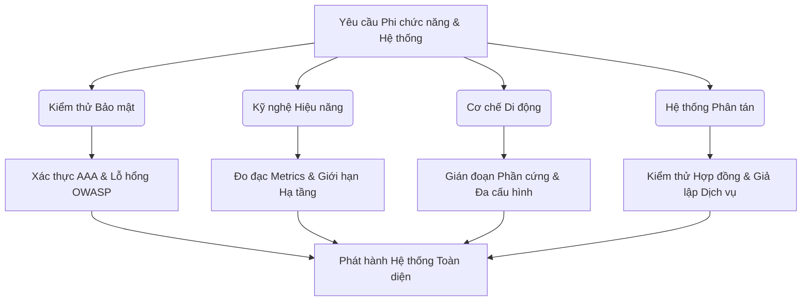

# 📁 11. Advanced Testing

*Mục tiêu: Mở rộng năng lực chuyên môn từ kiểm thử chức năng thông thường sang các mảng kỹ thuật chuyên sâu cao cấp bao gồm Kiểm thử Bảo mật (Security), Kỹ nghệ Hiệu năng (Performance), Cơ chế vận hành Di động (Mobile Mechanics) và Kiểm thử Hệ thống phân tán/Điện toán đám mây nhằm toàn diện hóa tư duy của một QA Expert thực chiến.*

## 📌 Mục lục nội bộ (Chặng 11)

- [ ] [**11.1. Security Testing Fundamentals**](./1_SecurityTesting.md)
  - [ ] [11.1.1. AAA Framework: Authentication, Authorization, Access Control](./1_SecurityTesting.md#1111-aaa-framework-authentication-authorization-access-control)
  - [ ] [11.1.2. Cryptography basics: Encryption, Hashing & HTTPS / TLS](./1_SecurityTesting.md#1112-cryptography-basics-encryption-hashing--https--tls)
  - [ ] [11.1.3. OWASP Top 10 Vulnerabilities (SQLi, XSS, CSRF, IDOR)](./1_SecurityTesting.md#1113-owasp-top-10-vulnerabilities-sqli-xss-csrf-idor)
  - [ ] [11.1.4. Security Auditing Tools: OWASP ZAP & Burp Suite Suite](./1_SecurityTesting.md#1114-security-auditing-tools-owasp-zap--burp-suite-suite)
- [ ] [**11.2. Performance Testing Engineering**](./2_PerformanceTesting.md)
  - [ ] [11.2.1. Testing Types: Load, Stress, Spike, Endurance, Scalability](./2_PerformanceTesting.md#1121-testing-types-load-stress-spike-endurance-scalability)
  - [ ] [11.2.2. Metrics: Throughput, Latency, Error Rate, Percentiles (P90/P95/P99)](./2_PerformanceTesting.md#1122-metrics-throughput-latency-error-rate-percentiles-p90p95p99)
  - [ ] [11.2.3. Infrastructure Monitoring: CPU/RAM Baseline & SLA/SLO](./2_PerformanceTesting.md#1123-infrastructure-monitoring-cpuram-baseline--slaslo)
  - [ ] [11.2.4. Performance Scripting via Apache JMeter & k6 Framework](./2_PerformanceTesting.md#1124-performance-scripting-via-apache-jmeter--k6-framework)
  - [ ] [11.2.5. Dashboard Visualization: Grafana & Prometheus](./2_PerformanceTesting.md#1125-dashboard-visualization-grafana--prometheus)
- [ ] [**11.3. Mobile Testing Mechanics**](./3_MobileTesting.md)
  - [ ] [11.3.1. Android vs iOS Architecture & Emulator / Simulator Deployment](./3_MobileTesting.md#1131-android-vs-ios-architecture--emulator--simulator-deployment)
  - [ ] [11.3.2. Testing Mobile Anomalies: Fragmentation, Installation, Interrupts](./3_MobileTesting.md#1132-testing-mobile-anomalies-fragmentation-installation-interrupts)
- [ ] [**11.4. Distributed Systems, Contract & Cloud Testing**](./4_DistributedSystems.md)
  - [ ] [11.4.1. Microservices Architecture & Async Message Brokers (Kafka, RabbitMQ)](./4_DistributedSystems.md#1141-microservices-architecture--async-message-brokers-kafka-rabbitmq)
  - [ ] [11.4.2. Contract Testing via Pact Framework](./4_DistributedSystems.md#1142-contract-testing-via-pact-framework)
  - [ ] [11.4.3. Cloud Infrastructure Testing (AWS, Azure, GCP)](./4_DistributedSystems.md#1143-cloud-infrastructure-testing-aws-azure-gcp)
  - [ ] [11.4.4. Service Virtualization (WireMock) & Advanced Test Data Management](./4_DistributedSystems.md#1144-service-virtualization-wiremock--advanced-test-data-management)

---

## 🗺️ Bản đồ Tiến trình Phân rã Các Tầng Kiểm thử Nâng cao

Sơ đồ đơn sắc dưới đây mô tả lộ trình tiếp cận kiểm thử phi chức năng và hệ thống phân tán, giúp QA định vị chính xác khu vực cần cô lập và đánh giá rủi ro từ hạ tầng đến ứng dụng:

---

📚 **References**
* *ISTQB® Certified Tester Advanced Level (CTAL) Test Analyst / Technical Test Analyst Syllabus* - Quy chuẩn quốc tế về kiểm thử phi chức năng, cấu trúc hệ thống và kỹ thuật chuyên sâu.
* *OWASP Top 10 Vulnerabilities Standard* - Tiêu chuẩn cốt lõi về đánh giá an ninh bảo mật ứng dụng web toàn cầu.
* *ISO/IEC/IEEE 29119-4:2021* - Tiêu chuẩn kỹ thuật kiểm thử các đặc tính chất lượng của phần mềm.
