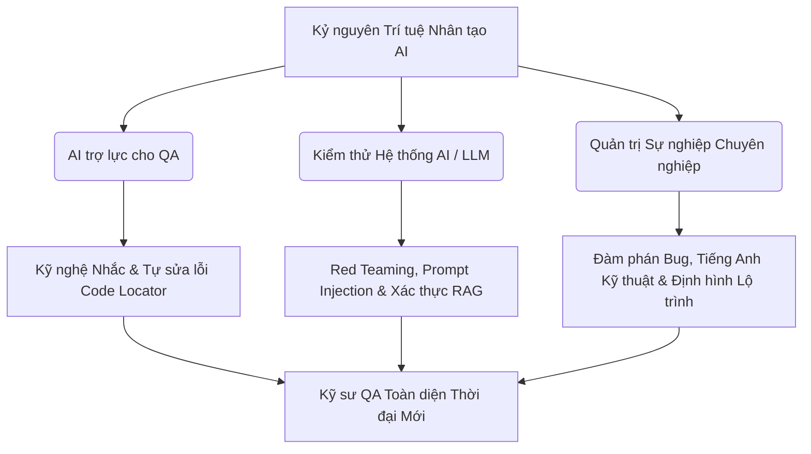
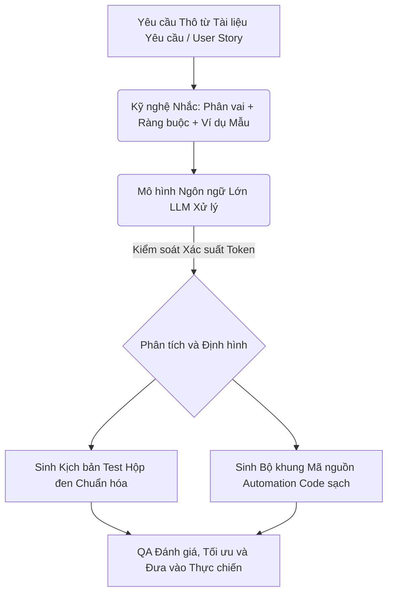
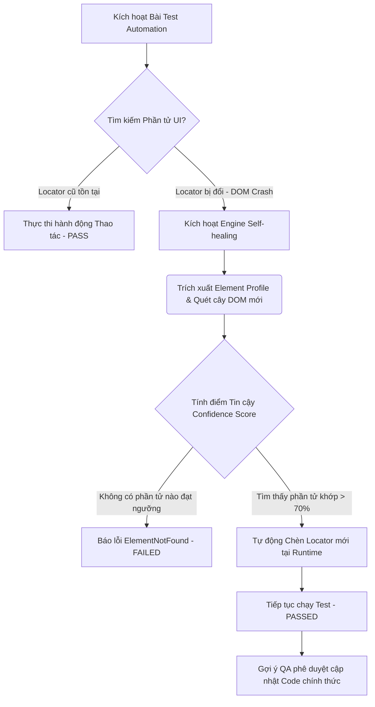

# 📁 12. Kỷ nguyên AI Testing & Định hướng sự nghiệp

*Mục tiêu: Đón đầu và làm chủ làn sóng trí tuệ nhân tạo (AI), ứng dụng Kỹ nghệ Nhắc (Prompt Engineering) và các Framework tự động sửa lỗi (Self-healing) để tối ưu hóa hiệu suất test, đồng thời trang bị tư duy Red Teaming chuyên sâu nhằm săn lỗi, đánh giá an toàn hệ thống Mô hình ngôn ngữ lớn (LLM) và định hình lộ trình thăng tiến sự nghiệp QA bền vững.*

# **12.1. AI-Assisted Testing (AI for Testers)**

## 📌 Mục lục nội bộ (Chặng 12)

- [ ] [**12.1. AI-Assisted Testing (AI for Testers)**](./1_AIForTesters.md)
  - [ ] [12.1.1. Prompt Engineering for QA: Generating Test Artifacts & Automation Code](#1211-prompt-engineering-for-qa-generating-test-artifacts--automation-code)
  - [ ] [12.1.2. Self-healing Automation Engines: Mabl, Testim, Healenium](#1212-self-healing-automation-engines-mabl-testim-healenium)
- [ ] [**12.2. Testing AI / LLM Systems**](./2_TestingAISystems.md)
- [ ] [**12.3. QA Professional Soft Skills & Career Path**](./3_SoftSkillsCareer.md)
---

## 🗺️ Bản đồ Tiến trình Khai phá Kỷ nguyên AI Testing và Quản trị Sự nghiệp

Sơ đồ đơn sắc dưới đây phân rã luồng tư duy từ việc ứng dụng AI trợ lực, kỹ thuật kiểm thử hệ thống trí tuệ nhân tạo phức tạp (LLM/Agents) cho đến các chốt chặn hoàn thiện kỹ năng mềm cốt lõi để thăng tiến sự nghiệp:



---
# 12.1.1. Prompt Engineering for QA: Generating Test Artifacts & Automation Code

Kỹ nghệ nhắc (Prompt Engineering) trong kiểm thử phần mềm không đơn thuần là việc trò chuyện với mô hình AI, mà là kỹ thuật thiết kế ngữ cảnh cấu trúc dữ liệu đầu vào (Input Context) nhằm khai thác tối đa tri thức của các mô hình ngôn ngữ lớn (LLM). Làm chủ kỹ nghệ nhắc giúp Kỹ sư QA tăng tốc gấp 5 lần tiến trình sinh tài liệu kiểm thử (Test Case, Test Scenario) và tạo lập bộ khung mã nguồn tự động hóa (Automation Boilerplate Code) đạt độ chính xác cao theo các chuẩn mực công nghệ quy định.

## ⚙️ Bản chất chuyên sâu về Cơ chế Xử lý Ngữ cảnh của LLM đối với QA

Mô hình ngôn ngữ lớn hoạt động dựa trên cơ chế dự đoán xác suất chuỗi ký tự tiếp theo (Token Prediction) dựa trên trọng số ngữ cảnh được cung cấp. Để triệt tiêu hiện tượng AI ảo tưởng thông tin (Hallucination) và ép AI xuất ra dữ liệu sạch cấu trúc, Prompt Engineering dành cho QA vận hành dựa trên 3 nguyên lý kiến trúc:

1. **Role-Based Context (Ngữ cảnh phân vai):** Ép mô hình đóng vai một chuyên gia Quality Engineer thực chiến nắm vững chuẩn ISTQB/ISO để định hình tư duy phản biện biên (Edge-case Thinking).
2. **Few-Shot Prompting (Nhắc nhở kèm ví dụ cụ thể):** Cung cấp trực tiếp ít nhất 1-2 biểu mẫu dữ liệu chuẩn (Template) làm mẫu đầu vào, hướng dẫn AI tuân thủ đúng định dạng và tư duy mong muốn mà không bị lệch luồng logic.
3. **Structured Constraints & Output Schema (Ràng buộc cấu trúc):** Sử dụng các thẻ khai báo mã nguồn (như Markdown, JSON) và cấu hình điều kiện chặn nghiêm ngặt để ép mô hình loại bỏ các câu từ sáo rỗng vô nghĩa, chỉ tập trung vào tri thức nghiệp vụ có khả năng thực thi hành động.



---

## 📊 Ma trận Kỹ thuật Prompting & Mô hình Khai thác Tri thức cho QA

Dưới đây là bảng phân rã chi tiết về cấu trúc câu lệnh nhắc chuyên sâu, trọng tâm QA thực chiến và các cạm bẫy kỹ thuật phát sinh khi ứng dụng AI trợ lực:

| Kỹ thuật Prompting | Cơ chế hoạt động Kỹ thuật | QA Focus (Trọng tâm thực chiến) | Defect thực tế (Cạm bẫy của AI & Cách xử lý) |
| :--- | :--- | :--- | :--- |
| **System Role-Play** <br>*(Nhắc phân vai hệ thống)* | Đặt câu chỉ thị tối cao cố định ở đầu phiên: `[Role: Senior SDET / QA Architect Expert]`. | Ép AI kích hoạt vùng tri thức chuyên sâu về thiết kế toán học kiểm thử (Black-box Techniques), tránh việc AI trả về các kịch bản hời hợt lớp UI. | **Lỗi sinh test case sáo rỗng (Superficial Output):** AI chỉ liệt kê các bước check đúng/sai cơ bản, bỏ sót kịch bản biên phần cứng/hạ tầng. <br>*Cách sửa:* Bổ sung chỉ thị kỹ thuật rõ ràng: `Áp dụng Boundary Value Analysis và phân tích Edge-cases hạ tầng`. |
| **Few-Shot Prompting** <br>*(Nhắc kèm ví dụ mẫu)* | Cung cấp cặp dữ liệu: `[Ví dụ đầu vào đầu ra chuẩn]` trước khi đưa User Story thực tế của dự án vào. | Định hình cấu trúc phân rã thông tin vi mô (Tiêu đề, Tiền điều kiện, Các bước, Kết quả mong đợi) đồng bộ 100% với hệ thống quản lý của doanh nghiệp (Jira/Xray). | **Lỗi sai định dạng tệp tin (Format Drift Defect):** AI tự ý thay đổi cấu trúc bảng biểu hoặc đổi ngôn ngữ giữa các lượt phản hồi. <br>*Cách sửa:* Khóa chặt định dạng đầu ra bằng chỉ thị: `Bắt buộc xuất bản dưới dạng bảng Markdown theo chính xác biểu mẫu trên`. |
| **Boilerplate Code Generation** <br>*(Sinh mã nguồn khung)* | Truyền cấu trúc DOM HTML hoặc tài liệu Swagger API kèm chỉ thị: `[Write Playwright/k6 script using POM pattern]`. | Tạo nhanh bộ khung Page Object Model sạch sẽ, tiết kiệm thời gian gõ code lặp đi lặp lại (Boilerplate) cho Kỹ sư Automation. | **Lỗi Locator ma (Hallucinated Locators):** AI tự chế ra các ID hoặc Selector không hề tồn tại trong mã nguồn thực tế của website. <br>*Cách sửa:* Không cho AI đoán mò; bắt buộc copy-paste trực tiếp đoạn mã HTML thô chứa phần tử cần định vị vào Prompt. |

---

## 💡 Ví dụ thực tế liên hoàn: Triển khai Cấu trúc Prompt Tiêu chuẩn Doanh nghiệp dành cho QA

Dưới đây là biểu mẫu thiết kế câu lệnh nhắc (Prompt Template) tối ưu hóa cao được Kỹ sư QA thực chiến áp dụng để bóc tách một User Story phức tạp thành bộ Test Case đạt chuẩn chất lượng:

### 📁 Mã nguồn Câu lệnh Nhắc mẫu (Prompt Blueprint)
```text
[ROLE & CONTEXT]
Bạn là một Kỹ sư Kiểm thử Phần mềm Chuyên nghiệp (Senior QA Engineer) đạt chứng chỉ ISTQB CTFL/CTAL. Bạn có tư duy phản biện sắc bén, luôn săn tìm các kịch bản lỗi biên (Edge-cases) và lỗ hổng logic hệ thống.

[OBJECTIVE]
Nhiệm vụ của bạn là phân tích tài liệu User Story dưới đây để thiết kế một bộ kịch bản kiểm thử hộp đen (Black-box Test Cases) toàn diện.

[CONSTRAINTS & RULES]
1. Áp dụng kỹ thuật phân vùng tương đương (Equivalence Partitioning) và phân tích giá trị biên (Boundary Value Analysis).
2. Bắt buộc phải bao gồm các nhóm kịch bản: Happy Path, Unhappy Path, Edge-cases hệ thống và Rủi ro bảo mật/Hiệu năng thô (nếu có).
3. Tuyệt đối loại bỏ các câu từ giải thích sáo rỗng dài dòng. Không lặp lại thông tin.
4. Đầu ra bắt buộc phải sử dụng định dạng bảng Markdown theo đúng cấu trúc của mục [OUTPUT SCHEMA].

[FEW-SHOT EXAMPLE]
Input User Story: "Tính năng nhập tuổi đăng ký: Tuổi hợp lệ từ 18 đến 60 tuổi."
Output Expected Table:

| ID | Nhóm kiểm thử | Tóm tắt kịch bản | Dữ liệu kiểm thử (Test Data) | Kết quả mong đợi (Expected Result) |
| :--- | :--- | :--- | :--- | :--- |
| TC-01 | Happy Path | Kiểm tra biên dưới của tuổi hợp lệ | Tuổi = 18 | Đăng ký thành công, hệ thống chuyển trang |
| TC-02 | Boundary Edge | Kiểm tra cận biên dưới không hợp lệ | Tuổi = 17 | Hệ thống báo lỗi: "Tuổi phải từ 18 trở lên" |

[INPUT DATA: USER STORY THỰC TẾ]
"Tính năng: Nâng cấp hạn mức chuyển tiền nhanh qua mã QR cho tài khoản đã xác thực (KYC). 
- Hạn mức tối thiểu cho 1 giao dịch: 50.000 VNĐ.
- Hạn mức tối đa cho 1 giao dịch: 500.000.000 VNĐ.
- Nếu số tiền vượt quá 50.000.000 VNĐ cho 1 giao dịch, hệ thống bắt buộc phải yêu cầu thêm một bước xác thực khuôn mặt (FaceID/Biometrics) trước khi trừ tiền."

[OUTPUT SCHEMA]
Hãy xuất bản bảng kịch bản kiểm thử Markdown của bạn tại đây:
```

### 🎯 Kết quả xử lý sạch thu được từ LLM sau khi tối ưu kỹ nghệ nhắc:

| ID | Nhóm kiểm thử | Tóm tắt kịch bản | Dữ liệu kiểm thử (Test Data) | Kết quả mong đợi (Expected Result) |
| :--- | :--- | :--- | :--- | :--- |
| TC-01 | Happy Path | Chuyển khoản số tiền tối thiểu hợp lệ (Biên dưới) | Số tiền = 50,000 VNĐ | Giao dịch thành công, không cần FaceID |
| TC-02 | Happy Path | Chuyển khoản số tiền nằm trong hạn mức thường | Số tiền = 10,000,000 VNĐ | Giao dịch thành công, không cần FaceID |
| TC-03 | Happy Path | Chuyển khoản số tiền chạm ngưỡng bắt đầu yêu cầu FaceID | Số tiền = 50,000,001 VNĐ | Hệ thống kích hoạt pop-up quét FaceID |
| TC-04 | Happy Path | Chuyển khoản số tiền tối đa hợp lệ (Biên trên) | Số tiền = 500,000,000 VNĐ | Hệ thống yêu cầu FaceID, xác thực xong báo thành công |
| TC-05 | Boundary Edge | Chuyển khoản số tiền nhỏ hơn hạn mức tối thiểu | Số tiền = 49,999 VNĐ | Hệ thống chặn lỗi: "Số tiền tối thiểu là 50.000 VNĐ" |
| TC-06 | Boundary Edge | Chuyển khoản số tiền vượt quá hạn mức tối đa | Số tiền = 500,000,001 VNĐ | Hệ thống chặn lỗi: "Vượt quá hạn mức tối đa cho phép" |
| TC-07 | Unhappy Path | Nhập số tiền là ký tự đặc biệt hoặc số âm | Số tiền = -100,000 VNĐ hoặc "ABC" | Form chặn nhập hoặc báo lỗi: "Số tiền không hợp lệ" |
| TC-08 | Performance Risk | Giả lập người dùng cố tình nhấn nút xác nhận 2 lần | Click liên tục (Double Click) | Hệ thống áp dụng cơ chế chặn trùng lặp, chỉ xử lý 1 giao dịch |

---

> ⚠️ **NGUYÊN LÝ BẤT BIẾN:** Tuyệt đối không bao giờ được phép copy-paste các tài liệu yêu cầu nghiệp vụ mật, mã nguồn cốt lõi (Source Code) của doanh nghiệp, thông tin nhạy cảm của khách hàng hoặc các khóa bí mật (API Keys/Tokens) lên các mô hình AI công khai bản miễn phí (Public LLMs - như ChatGPT, Claude bản free). Hành vi này vi phạm nghiêm trọng chính sách bảo mật dữ liệu toàn cầu của doanh nghiệp, có nguy cơ làm rò rỉ tri thức độc quyền vào tập dữ liệu huấn luyện của bên thứ ba. Bạn bắt buộc phải sử dụng các mô hình AI chạy trong mạng nội bộ (Self-hosted Local LLM) hoặc các phiên bản Enterprise được cam kết bảo mật bằng văn bản.

---

📚 **References**
* *ISTQB® Certified Tester Specialist - AI Testing (AIT) Syllabus* - Section 4.1: *AI in the Test Lifecycle (Using LLMs for Test Artifacts Generation)*.
* *OWASP Top 10 for Large Language Model Applications* - A06:2023-Sensitive Information Disclosure.
* *White, J., et al. (2023). A Prompt Pattern Catalog to Enhance Code Quality and Refactoring with Large Language Models.* arXiv preprint.

# 12.1.2. Self-healing Automation Engines: Mabl, Testim, Healenium

Cơ chế tự động sửa lỗi kịch bản (Self-healing) là bước tiến đột phá của ngành kiểm thử tự động, giải quyết triệt để bài toán bảo trì mã nguồn do giao diện người dùng (UI) biến động liên tục. Việc thấu hiểu cơ chế vận hành của các công cụ AI-driven như Mabl, Testim và plugin mã nguồn mở Healenium giúp Kỹ sư QA giảm thiểu tối đa hiện tượng kịch bản chết oan (Flaky Tests), tối ưu hóa thời gian vận hành đường ống CI/CD và dịch chuyển vai trò từ sửa code định vị thủ công sang quản trị chất lượng thông minh.

## ⚙️ Bản chất chuyên sâu về Cơ chế Tự chữa lành của AI Test Engines

Khác với các Framework truyền thống (Selenium/Playwright thuần) chỉ dựa vào một Locator duy nhất (như một ID hoặc một chuỗi XPath cố định) và sẽ báo Failed lập tức nếu UI thay đổi, các AI Self-healing Engines vận hành dựa trên cơ chế **Định vị đa cấu trúc dòng thời gian (Multi-attribute Dynamic Scoring)** qua 3 bước kiến trúc:

1. **Baseline Ingestion (Thu thập chỉ mục gốc):** Trong các lượt chạy đầu tiên thành công, AI tự động quét toàn bộ cây tài liệu DOM (Document Object Model), bóc tách hàng chục thuộc tính của một phần tử (ID, Class, Name, CSS Properties, Text Content, Vị trí hình học X/Y, và mối quan hệ cha-con). Tập hợp này tạo thành một mã định danh sinh trắc học phần tử (Element Profile).
2. **Anomaly Detection & Dynamic Scoring (Phát hiện biến động & Chấm điểm động):** Khi Frontend cập nhật giao diện khiến Locator gốc bị mất, thay vì dừng bài test, AI kích hoạt thuật toán so khớp xác suất. Nó quét qua DOM mới, chấm điểm phần trăm trùng khớp (Confidence Score) của tất cả phần tử xung quanh dựa trên Element Profile cũ.
3. **Healing Execution & Feedback Loop (Thực thi chữa lành & Ghi nhận lịch sử):** Nếu tìm thấy phần tử có số điểm vượt qua ngưỡng tin cậy quy định (thường là $>70\%$), AI tự động nạp Locator mới thay thế tại runtime để bài test tiếp tục chạy mượt mà không bị ngắt quãng. Lịch sử sửa đổi được lưu lại để đề xuất QA cập nhật chính thức vào mã nguồn gốc.



---

## 📊 Ma trận Công cụ Self-healing & Mô hình Tối ưu Luồng chạy cho QA

Dưới đây là bảng phân rã chi tiết về kiến trúc hạ tầng, trọng tâm kịch bản test biên của QA thực chiến và các cạm bẫy lỗi hệ thống đặc thù (Self-healing Defects) phát sinh khi ứng dụng AI:

| Công cụ / Plugin | Kiến trúc Vận hành Hạ tầng | QA Focus (Trọng tâm thực chiến) | Defect thực tế (Cạm bẫy của AI & Cách xử lý) |
| :--- | :--- | :--- | :--- |
| **Healenium** <br>*(Mã nguồn mở / Plugin)* | Hoạt động như một proxy đứng giữa mã nguồn Test (Selenium/Playwright) và trình duyệt. Lưu dữ liệu Element Profile vào Database (PostgreSQL). | Tối ưu chi phí cho doanh nghiệp. QA dễ dàng tích hợp Healenium vào các Framework có sẵn của công ty mà không cần đập đi xây lại từ đầu. | **Lỗi chậm tiến trình đường ống (Execution Lag Defect):** Thời gian chạy test bị kéo dài do Healenium phải mất thời gian tính toán thuật toán so khớp khi UI đổi. <br>*Cách sửa:* Cấu hình giới hạn thời gian chờ tối đa (`healing-timeout`) trong file `healenium.properties`. |
| **Mabl / Testim** <br>*(Nền tảng Cloud SaaS)* | Hệ sinh thái Low-code/No-code khép kín trên đám mây. Sử dụng thuật toán học máy nâng cao (Machine Learning) để tự cập nhật Locator ngầm. | Phù hợp cho các dự án Agile chạy nhanh. QA có thể tạo kịch bản test bằng cách quay màn hình (Record & Playback) mà vẫn đảm bảo độ bền vững cao nhờ AI. | **Cạm bẫy nhận diện sai (False Positive Healing):** AI nhận diện nhầm nút "Hủy đơn" thành nút "Xác nhận" do hai nút có cấu trúc DOM quá giống nhau. <br>*Cách sửa:* QA cấu hình tăng ngưỡng điểm tin cậy bắt buộc hoặc khóa cứng (Pin) các thuộc tính bất biến của nút. |

---

## 💡 Ví dụ thực tế liên hoàn: Luồng Tự động Chữa lành Locator của Hệ thống Thực chiến

Hãy tưởng tượng bạn đang vận hành một bộ kịch bản kiểm thử tự động cho luồng "Đăng xuất" của trang quản trị doanh nghiệp.

1. **Giai đoạn Frontend cập nhật mã nguồn làm vỡ kịch bản:**
   * Trong mã nguồn test cũ, bạn định vị nút Đăng xuất bằng XPath cứng:
     ```javascript
     const logoutBtn = page.locator('//button[@id="btn-logout-old"]');
     ```
   * Đội ngũ Frontend triển khai code mới lên Staging, đổi ID của nút thành `id="logout-v2-prod"` và chuyển nút vào bên trong một thẻ `div` khác để tối ưu giao diện.

2. **Cơ chế tự chữa lành kích hoạt tại Runtime (Self-healing in Action):**
   * Bộ chạy test tự động (ví dụ có tích hợp Healenium) chạy qua dòng lệnh trên và không tìm thấy phần tử `@id="btn-logout-old"`.
   * Engine lập tức can thiệp, truy vết tệp chỉ mục cũ của nút Đăng xuất và ghi nhận: *Nút này có màu nền đỏ, chữ hiển thị là "Đăng xuất", nằm cạnh icon avatar*.
   * Engine quét cây DOM mới, phát hiện ra nút `id="logout-v2-prod"` hội tụ đủ $85\%$ các đặc điểm trên.
   * Hệ thống tự động bẻ lái dòng lệnh tại bộ nhớ cache, click chính xác vào nút Đăng xuất mới $\rightarrow$ Bài test hoàn thành trọn vẹn ở trạng thái **PASSED**.
   * *Hành động hậu kiểm của QA:* Cuối ngày, hệ thống gửi một Pull Request tự động hoặc hiển thị thông báo trên giao diện: *"Đề xuất cập nhật Locator nút Đăng xuất từ id="btn-logout-old" sang id="logout-v2-prod"*. Bạn chỉ cần nhấn nút Phê duyệt (Approve) để cập nhật sạch mã nguồn mà không mất một giây nào tự đi rà quét lỗi.

---

> ⚠️ **NGUYÊN LÝ BẤT BIẾN:** Tuyệt đối không bao giờ được phép phó mặc và tin tưởng hoàn toàn 100% vào cơ chế tự động sửa lỗi (Self-healing) của AI để bỏ qua bước bảo trì và dọn dẹp mã nguồn kịch bản kiểm thử định kỳ. Cơ chế tự chữa lành chỉ là một chốt chặn giảm chấn tại runtime giúp bảo vệ đường ống CI/CD không bị sập nghẽn diện rộng. Nếu QA lười biếng không cập nhật các Locator đã đổi vào mã nguồn gốc, số lượng phần tử cần chữa lành tích tụ ngày càng lớn sẽ làm giảm độ chính xác của thuật toán AI, gây ra các lỗi nhận diện sai nghiêm trọng.

---

📚 **References**
* *ISTQB® Certified Tester Specialist - AI Testing (AIT) Syllabus* - Section 4.2: *AI in Automation (Self-healing and Maintenance Optimization)*.
* *Healenium Open-Source Specification Manual.* - *Backend Storage and Element Profile Matcher Algorithm*.
* *Mabl Research Whitepaper (2025)* - *Advancements in Multi-Attribute Locator Strategies for Web Applications*.
