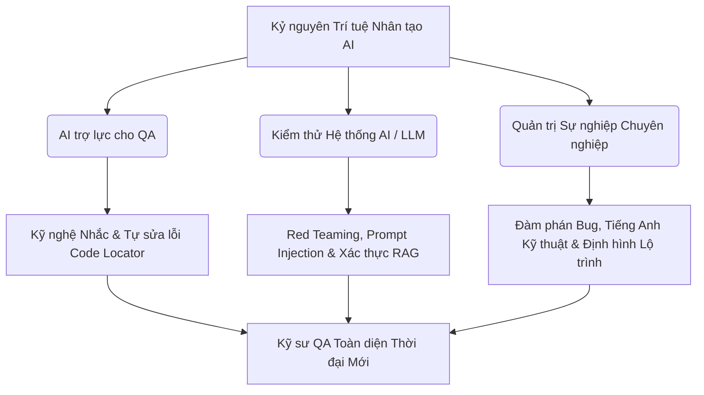
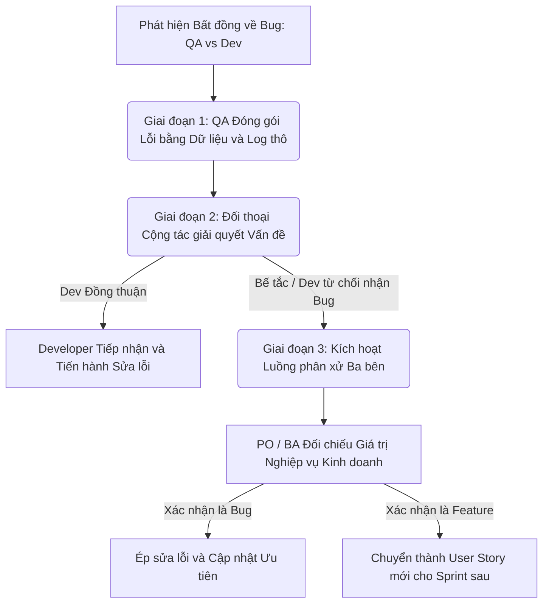
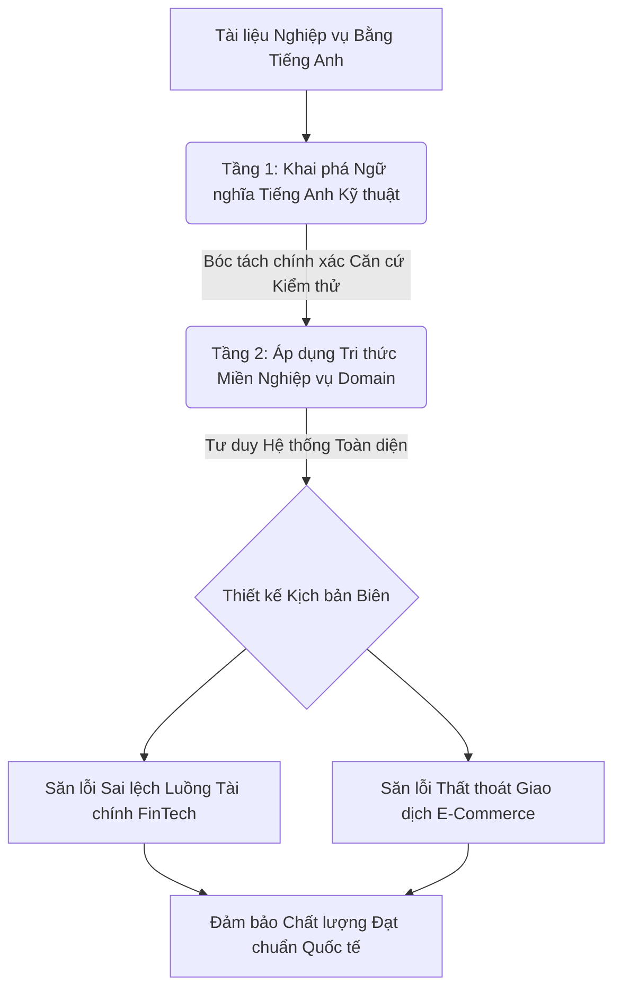
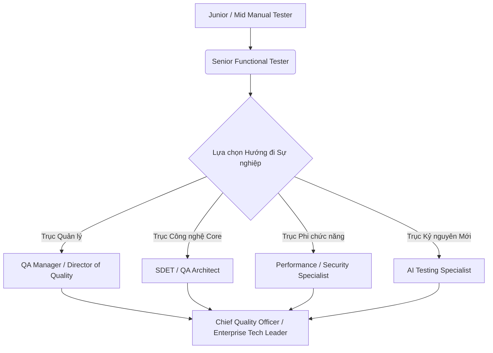

# 📁 12. Kỷ nguyên AI Testing & Định hướng sự nghiệp

*Mục tiêu: Đón đầu và làm chủ làn sóng trí tuệ nhân tạo (AI), ứng dụng Kỹ nghệ Nhắc (Prompt Engineering) và các Framework tự động sửa lỗi (Self-healing) để tối ưu hóa hiệu suất test, đồng thời trang bị tư duy Red Teaming chuyên sâu nhằm săn lỗi, đánh giá an toàn hệ thống Mô hình ngôn ngữ lớn (LLM) và định hình lộ trình thăng tiến sự nghiệp QA bền vững.*

# **12.3. QA Professional Soft Skills & Career Path**

## 📌 Mục lục nội bộ (Chặng 12)

- [ ] [**12.1. AI-Assisted Testing (AI for Testers)**](./1_AIForTesters.md)
- [ ] [**12.2. Testing AI / LLM Systems**](./2_TestingAISystems.md)
- [ ] [**12.3. QA Professional Soft Skills & Career Path**](./3_SoftSkillsCareer.md)
  - [ ] [12.3.1. Technical Communication & Professional Bug Negotiation](#1231-technical-communication--professional-bug-negotiation)
  - [ ] [12.3.2. Technical English for QA & Business Domain Mastery](#1232-technical-english-for-qa--business-domain-mastery)
  - [ ] [12.3.3. Long-term Testing Career Path Roadmap](#1233-long-term-testing-career-path-roadmap)

## 📌 Mục lục nội bộ (Chặng 12)

- [ ] [**12.1. AI-Assisted Testing (AI for Testers)**](./1_AIForTesters.md)
  - [ ] [12.1.1. Prompt Engineering for QA: Generating Test Artifacts & Automation Code](#1211-prompt-engineering-for-qa-generating-test-artifacts--automation-code)
  - [ ] [12.1.2. Self-healing Automation Engines: Mabl, Testim, Healenium](#1212-self-healing-automation-engines-mabl-testim-healenium)
- [ ] [**12.2. Testing AI / LLM Systems**](./2_TestingAISystems.md)
  - [ ] [12.2.1. Vulnerabilities of LLMs: Hallucination, Bias, Toxicity, Safety](#1221-vulnerabilities-of-llms-hallucination-bias-toxicity-safety)
  - [ ] [12.2.2. Red Teaming: Prompt Injection & Jailbreak Testing](#1222-red-teaming-prompt-injection--jailbreak-testing)
  - [ ] [12.2.3. RAG Validation: Retrieval Accuracy, Groundedness, Context Handling](#1223-rag-validation-retrieval-accuracy-groundedness-context-handling)
  - [ ] [12.2.4. Autonomous AI Agents Testing & Tool-Calling Safety](#1224-autonomous-ai-agents-testing--tool-calling-safety)
- [ ] [**12.3. QA Professional Soft Skills & Career Path**](./3_SoftSkillsCareer.md)
  - [ ] [12.3.1. Technical Communication & Professional Bug Negotiation](#1231-technical-communication--professional-bug-negotiation)
  - [ ] [12.3.2. Technical English for QA & Business Domain Mastery](#1232-technical-english-for-qa--business-domain-mastery)
  - [ ] [12.3.3. Long-term Testing Career Path Roadmap](#1233-long-term-testing-career-path-roadmap)

---

## 🗺️ Bản đồ Tiến trình Khai phá Kỷ nguyên AI Testing và Quản trị Sự nghiệp

Sơ đồ đơn sắc dưới đây phân rã luồng tư duy từ việc ứng dụng AI trợ lực, kỹ thuật kiểm thử hệ thống trí tuệ nhân tạo phức tạp (LLM/Agents) cho đến các chốt chặn hoàn thiện kỹ năng mềm cốt lõi để thăng tiến sự nghiệp:



---
# 12.3.1. Technical Communication & Professional Bug Negotiation

Kỹ năng giao tiếp kỹ thuật (Technical Communication) và Đàm phán Bug chuyên nghiệp (Bug Negotiation) là những mảnh ghép tối quan trọng phân tách một Kỹ sư QA tầm trung với một Chuyên gia Quản trị Chất lượng cao cấp. Trong thực tế dự án Agile, xung đột giữa QA và Developer là điều không thể tránh khỏi khi đối diện với các bất đồng về mặt định nghĩa lỗi. Việc làm chủ tư duy đàm phán dựa trên dữ liệu, thấu hiểu tâm lý kỹ thuật và cấu trúc tài liệu minh bạch giúp QA bảo vệ chốt chặn chất lượng mà không làm rạn nứt mối quan hệ cộng tác trong đội ngũ.

## ⚙️ Bản chất chuyên sâu về Cơ chế Tâm lý và Luồng Đàm phán Bug

Quy trình đàm phán Bug không phải là một cuộc tranh luận thắng thua cảm tính, mà là một quy trình kỹ thuật dựa trên dữ liệu thực chứng (Data-driven Process), vận hành qua 3 giai đoạn của mô hình giao tiếp bất bạo động trong công nghệ (Non-violent Technical Communication):

1. **Isolation & Factual Documentation (Cô lập & Hồ sơ hóa Sự thật):** Loại bỏ hoàn toàn các nhận định chủ quan (như viết: *"Hệ thống chạy rất lag, code lỗi"*). Thay vào đó, QA đóng gói lỗi bằng các chỉ số đo đạc vật lý không thể chối cãi: Mã lỗi HTTP, tệp tin log hệ thống (Stack Trace), video quay chuỗi hành động và tỷ lệ ảnh hưởng rủi ro (Impact Matrix).
2. **Empathy-driven Framing (Giao tiếp thấu hiểu):** Tiếp cận Developer dựa trên nguyên lý cộng tác giải quyết vấn đề (Problem-solving Approach). Hiểu rằng Developer từ chối nhận Bug phần lớn do áp lực tiến độ (Deadline) hoặc do tài liệu yêu cầu (User Story) không rõ ràng dẫn đến hiểu nhầm logic.
3. **Tripartite Alignment (Cơ chế phân xử ba bên):** Khi cuộc đàm phán rơi vào trạng thái bế tắc (Dev khăng khăng: *"Đây là tính năng, không phải lỗi"*), QA chủ động kích hoạt luồng phân xử có sự tham gia của Product Owner (PO) hoặc Business Analyst (BA) để đối chiếu trực tiếp với giá trị kinh doanh và trải nghiệm người dùng cuối (User Experience).



---

## 📊 Ma trận Kịch bản Đàm phán Bug & Mô hình Giải quyết Xung đột cho QA

Dưới đây là bảng phân rã chi tiết các tình huống từ chối Bug kinh điển của Developer, trọng tâm xử lý thực chiến của QA Expert và cách lật ngược tình thế bằng giao tiếp kỹ thuật:

| Câu nói từ chối của Dev | Nguyên nhân gốc rễ phía sau | QA Professional Focus (Trọng tâm đàm phán) | Kịch bản Phản biện Chuẩn Chuyên gia (Mẫu câu xử lý) |
| :--- | :--- | :--- | :--- |
| **"Code chạy trên máy tôi bình thường!"** <br>*(It works on my machine)* | Do sự sai lệch về cấu hình môi trường, bộ nhớ đệm (Cache) hoặc dữ liệu test cục bộ của Dev quá sạch. | QA không tranh cãi. Chủ động cung cấp thông tin chi tiết về hạ tầng môi trường test đang dính lỗi để cô lập vùng biến động. | *"Tôi hiểu code đã pass trên máy của bạn. Tuy nhiên, lỗi này xuất hiện trên môi trường Staging (vùng chứa Docker image bản v1.4). Dưới đây là tệp log hệ thống chứa mã lỗi HTTP 500 kèm bộ dữ liệu test biên (ID tài khoản ngẫu nhiên). Hãy dùng tài khoản này để tái hiện lại lỗi cùng tôi nhé."* |
| **"Cái này không có trong tài liệu yêu cầu!"** <br>*(Not in the Requirement)* | Do tài liệu User Story viết quá sơ sài, BA quên không bao phủ hết các kịch bản Unhappy Path. | QA dịch chuyển góc nhìn từ câu chữ tài liệu sang **Trải nghiệm Người dùng** và **Rủi ro Hệ thống**. | *"Đúng là tài liệu không viết rõ bước xử lý khi người dùng mất mạng đột ngột lúc đang bấm nút thanh toán. Nhưng nếu chúng ta bỏ qua, hệ thống sẽ bị treo vòng xoay vô hạn và khách hàng sẽ bị trừ tiền oan mà không có hóa đơn. Tôi đề xuất chúng ta gọi BA/PO vào để chốt phương án hiển thị thông báo lỗi thân thiện ở đây nhé."* |
| **"Lỗi này nhẹ lắm, không đáng để sửa!"** <br>*(Low Priority / Minor issue)* | Do Developer đang bị quá tải task hoặc cho rằng kịch bản đó người dùng thực tế không bao giờ bấm vào. | QA sử dụng **Ma trận Tần suất và Tác động** (Probability & Impact) để chứng minh rủi ro kinh tế kỹ thuật. | *"Lỗi hiển thị vỡ khung hình này đúng là không làm sập server. Nhưng nó nằm ngay tại trang chủ - nơi khách hàng thực hiện quét mã QR thanh toán lần đầu. Nếu giao diện bị lỗi font, khách hàng sẽ nghi ngờ ứng dụng thiếu uy tín và rời bỏ dịch vụ. Chỉ số ảnh hưởng thương hiệu là rất lớn, nên tôi đề xuất giữ nguyên mức Severity: Medium."* |

---

## 💡 Ví dụ thực tế liên hoàn: Quy trình Đàm phán Bug chuyên nghiệp trong phòng họp Sprint

Hãy tưởng tượng bạn đang tham gia buổi họp rà soát lỗi (Bug Triage Meeting) trước ngày phát hành sản phẩm. Bạn đưa ra một Bug: *"Ứng dụng bị sập (Crash) khi người dùng cố tình nhấn liên tục 3 lần vào nút Áp dụng mã giảm giá"*. Developer chính của dự án lập tức phản ứng và muốn từ chối (Reject) Bug này.

1. **Bước 1: Đối thoại trực diện dựa trên dữ liệu (Factual Negotiation):**
   * *Developer phản biện:* "Kịch bản này là người dùng cố tình phá hoại chứ thực tế không ai rảnh rỗi bấm liên tục như vậy cả. Hơn nữa tiến độ phát hành rất gấp, tôi đề xuất đóng Bug này lại."
   * *QA Expert phản đòn bằng kỹ thuật:* "Tôi đã kiểm tra tab Network trong tệp đính kèm của Bug Report. Khi bấm liên tục, ứng dụng gửi 3 request API `POST /api/v1/coupon/apply` song song đồng thời. Do Backend thiếu cơ chế khóa Idempotency Key, cơ sở dữ liệu dính lỗi `Deadlock Lock Wait Timeout` làm sập toàn bộ tiến trình của cụm máy chủ. Đây không phải lỗi giao diện, đây là lỗi an toàn logic tầng Backend."

2. **Bước 2: Dẫn dắt luồng đưa ra giải pháp tối ưu (Win-Win Resolution):**
   * Nhận thấy Developer bắt đầu im lặng vì dữ liệu log quá chính xác, bạn không ép họ vào thế bí mà chủ động đưa ra giải pháp hỗ trợ giải tỏa áp lực:
   * *QA đề xuất:* "Để kịp tiến độ release tối nay, ở tầng Backend chúng ta chưa cần sửa logic DB phức tạp. Phía Frontend bạn chỉ cần thêm một dòng mã để vô hiệu hóa nút bấm (`disable button`) ngay sau cú click đầu tiên của người dùng. Việc này vừa chặn được lỗi sập server lập tức, vừa giúp bạn chỉ mất 5 phút sửa code. Tôi sẽ hỗ trợ kiểm thử lại ngay khi bạn lên bài."
   * *Kết quả:* Developer vui vẻ đồng ý tiếp nhận Bug, tiến hành sửa code Frontend trong 3 phút. Bộ test tự động chạy lại báo **PASSED**. Lỗi nghiêm trọng được vá an toàn nhờ nghệ thuật đàm phán đỉnh cao của QA.

---

> ⚠️ **NGUYÊN LÝ BẤT BIẾN:** Tuyệt đối không bao giờ được phép tự ý thỏa hiệp, hạ thấp mức độ nghiêm trọng (Severity) của các lỗi liên quan đến an ninh bảo mật (Security), toàn vẹn dữ liệu (Data Integrity) hoặc sập hệ thống (System Crash) chỉ vì nể nang mối quan hệ cá nhân với đồng nghiệp hoặc để chạy theo áp lực tiến độ phát hành của dự án. Sự thỏa hiệp vô kỷ luật của QA ngày hôm nay chính là tiền đề kích nổ các thảm họa công nghệ của doanh nghiệp trên môi trường Production ngày mai, hủy hoại hoàn toàn uy tín chuyên môn của chính bản thân bạn.

---

📚 **References**
* *ISTQB® Certified Tester Foundation Level (CTFL) Syllabus v4.0* - Section 5.1.2: *Defect Management (Defect Reporting & Collaboration Cultures)*.
* *Katzenbach, J. R., & Smith, D. K. (2015). The Wisdom of Teams: Creating the High-Performance Organization.* Harvard Business Review Press.
* *IEEE Std 829-2008 Standard* - *IEEE Standard for Software and System Test Documentation (Defect Communication Protocols)*.

# 12.3.2. Technical English for QA & Business Domain Mastery

Làm chủ Tiếng Anh kỹ thuật (Technical English) và Làm chủ miền nghiệp vụ kinh doanh (Business Domain Mastery) là hai bệ phóng quyết định giúp Kỹ sư QA xóa bỏ rào chắn ngôn ngữ, trực tiếp làm việc trong các dự án toàn cầu với mức thu nhập vượt trội và nâng cao năng lực bóc tách lỗ hổng logic chuyên sâu dựa trên sự thấu hiểu mô hình kinh doanh sản phẩm.

## ⚙️ Bản chất chuyên sâu về Cơ chế Vận hành Từ vựng và Nghiệp vụ trong QA

Năng lực giao tiếp quốc tế và tư duy nghiệp vụ của một Chuyên gia QA không dừng lại ở việc đọc hiểu thông thường, mà được phân rã thành hai bộ khung kiến trúc hạ tầng:

1. **Semantic Precision in Technical English (Sự chuẩn xác ngữ nghĩa Tiếng Anh Kỹ thuật):** Hệ thống thuật ngữ QA quốc tế (như chuẩn hóa bởi ISTQB) yêu cầu độ chuẩn xác tuyệt đối để tránh hiểu nhầm giữa các đội ngũ đa quốc gia. Một từ vựng mơ hồ trong tệp mô tả lỗi có thể làm tăng gấp đôi thời gian điều tra của Developer.
2. **Domain-Driven Testing Logic (Kiểm thử định hướng miền nghiệp vụ):** Mọi ứng dụng phần mềm đều vận hành để giải quyết một bài toán kinh doanh thực tế. QA nắm vững Domain (FinTech, E-Commerce, HealthTech) sẽ sở hữu tư duy của người dùng cuối, từ đó thiết kế ra các kịch bản kiểm thử hành vi (Behavioral Scenarios) bẻ gãy các lỗ hổng ẩn sâu trong luồng luân chuyển dòng tiền hoặc dữ liệu mà tài liệu thiết kế chưa bao giờ bao phủ hết.



---

## 📊 Ma trận Thuật ngữ Kỹ thuật & Luồng Cô lập Lỗi Nghiệp vụ cho QA

Dưới đây là bảng phân rã chi tiết về các cụm từ vựng cốt lõi, tư duy miền nghiệp vụ thực chiến và các defect logic kinh doanh (Business Logic Defects) phát sinh:

| Miền Tri thức Domain | Thuật ngữ Tiếng Anh Chuyên ngành cốt lõi | QA Focus (Trọng tâm thực chiến) | Defect thực tế (Lỗi logic nghiệp vụ & Cách sửa) |
| :--- | :--- | :--- | :--- |
| **Core Software Testing** <br>*(Nền tảng chung)* | `Test Basis`, `Test Oracle`, `Defect Escape`, `Flaky Test`, `Regression Testing`, `Sign-off Criteria`. | Sử dụng thuật ngữ chuẩn xác để viết Bug Report hoặc Test Plan bằng Tiếng Anh, giúp các đội ngũ Onsite/Offshore hiểu ngay lập tức. | **Lỗi dùng từ mơ hồ làm sai lệch lỗi:** Viết `The button is broken` thay vì `The Submit button returns HTTP 500 on click`. <br>*Cách sửa:* Sử dụng cấu trúc câu chuẩn: `[Action] + [Component] + [Expected vs Actual Result] + [Logs]`. |
| **FinTech & Banking** <br>*(Tài chính ngân hàng)* | `Ledger Balance`, `Reconciliation`, `Idempotency Key`, `Double-entry`, `KYC/AML Compliance`. | Kiểm thử tính nhất quán của dòng tiền, xác thực việc ghi nhận sổ cái tài chính, và các kịch bản biên về múi giờ, quy đổi tỷ giá, concurrency thanh toán. | **Lỗi lệch số dư do làm tròn toán học (Rounding Bug):** Hệ thống làm tròn số tiền lẻ sau khi trừ thuế làm thất thoát 1 VNĐ trong tổng số cái. <br>*Cách sửa:* Ép hệ thống Backend tính toán tài chính bằng kiểu dữ liệu thập phân chính xác tuyệt đối (`BigDecimal`). |
| **E-Commerce / Logistics** <br>*(Thương mại điện tử)* | `Cart Abandonment`, `Inventory Allocation`, `SKU Mutation`, `Idempotent Checkout`, `Waybill State`. | Kiểm thử luồng gối đầu giữ kho tạm thời (Inventory Holding), áp dụng chồng chéo hàng loạt mã giảm giá (Coupon Stacking), và đồng bộ trạng thái vận đơn. | **Lỗi trục lợi mã giảm giá (Promo Stacking Vulnerability):** Người dùng tận dụng lỗ hổng bất đồng bộ để áp dụng 1 coupon giảm giá 50% vào 2 đơn hàng cùng lúc. <br>*Cách sửa:* Khóa trạng thái mã giảm giá (Race Condition Lock) ngay khi request check-out đầu tiên bắt đầu xử lý. |

---

## 💡 Ví dụ thực tế liên hoàn: Kịch bản Viết Bug Report Tiếng Anh chuyên nghiệp cho Dự án Outsourcing

Hãy tưởng tượng bạn đang là Kỹ sư QA làm việc cho một dự án Phần mềm Quản lý Kho vận (Logistics) toàn cầu của Singapore, giao tiếp 100% bằng Tiếng Anh. Bạn phát hiện ra lỗi logic nghiệp vụ: *"Hệ thống tự động cho xuất kho khi số lượng hàng tồn bằng 0"*.

Dưới đây là biểu mẫu tài liệu báo cáo lỗi (Bug Report) đạt chuẩn chuyên gia quốc tế được bạn trực tiếp khởi tạo trên Jira:

### 📁 Mã nguồn Tài liệu Bug Report trên Jira
```text
Title: bug(inventory): System permits stock dispatch when inventory count is zero (SKU Underflow Defect)

Environment: Staging-US-Node2 (App v2.4.5, DB: PostgreSQL 15)
Severity: High | Priority: High
Jira Ticket Reference: LOG-402 (Order Dispatch Workflow)

[BUSINESS CONTEXT]
According to the Business Requirement Document (BRD Section 3.4), the system must enforce strict inventory validation. No waybill should be generated if the SKU stock count is lower than the requested quantity.

[STEPS TO REPRODUCE]
1. Authenticate with a standard Warehouse Operator account.
2. Navigate to Inventory Dashboard and isolate SKU "IPHONE15-PRO-128GB" (Verify Current Stock = 0).
3. Open a separate tab, initiate a Dispatch Order for 5 units of the aforementioned SKU.
4. Execute the "Confirm Dispatch" action via API client or UI button.

[ACTUAL RESULT]
The system bypasses the stock barrier, successfully logs the transaction to the database, generates a valid Waybill ID, and mutates the inventory count to a negative value (-5). 

[EXPECTED RESULT]
The transaction must be aborted at the database transaction layer. The API should return a 'HTTP 409 Conflict' with the error payload: `{"error": "INSUFFICIENT_STOCK", "available": 0}`. The UI must render an alert banner: "Dispatch rejected due to zero inventory availability."

[TECHNICAL LOGS ATTACHED]
- server_error.log (Capturing DB Constraint Violation if any)
- API_payload_response.json (HTTP 200 OK captured instead of 409)
```

---

> ⚠️ **NGUYÊN LÝ BẤT BIẾN:** Tuyệt đối không bao giờ được phép sử dụng các công cụ dịch thuật tự động (như Google Translate thuần) để dịch nguyên văn một Bug Report hoặc Test Plan từ Tiếng Việt sang Tiếng Anh một cách máy móc mà không có sự hiệu đính thuật ngữ kỹ thuật. Các công cụ dịch thô thường làm biến đổi hoàn toàn ngữ nghĩa chuyên ngành (Ví dụ: dịch chữ "kiểm thử hồi quy" thành "regression test" bị biến thành "backward test"), gây ra sự hiểu nhầm tai hại, hạ thấp tính chuyên nghiệp và làm tắc nghẽn luồng vận hành của dự án đa quốc gia.

---

📚 **References**
* *ISTQB® Certified Tester Foundation Level (CTFL) Syllabus v4.0* - Appendix: *Official ISTQB Glossary of Testing Terms*.
* *Evans, E. (2003). Domain-Driven Design: Tackling Complexity in the Heart of Software.* Addison-Wesley Professional.
* *ISO/IEC/IEEE 29119-3:2021 Standard* - *Software and systems engineering — Software testing — Part 3: Test documentation (International Bug Reporting Schema)*.

# 12.3.3. Long-term Testing Career Path Roadmap

Định hình lộ trình thăng tiến sự nghiệp dài hạn (Long-term Career Path) là chốt chặn cuối cùng giúp Kỹ sư QA chuyển dịch từ một người thực thi kịch bản bị động thành một nhà hoạch định chiến lược chất lượng tối cao. Ngành Software Testing hiện đại đã phá vỡ hoàn toàn định kiến về một công việc "tìm lỗi thủ công đơn điệu", mở ra các nhánh phát triển chuyên sâu có giá trị thương mại và kỹ thuật khổng lồ, cho phép các kỹ sư liên tục nâng tầm thu nhập và vị thế trong chuỗi cung ứng công nghệ toàn cầu.

## ⚙️ Bản chất chuyên sâu về Phân nhánh Kỹ nghệ của Lộ trình QA

Lộ trình sự nghiệp dài hạn của một kỹ sư quản trị chất lượng được phân cấu trúc thành 4 trục xương sống kỹ thuật độc lập nhưng có tính giao thoa cao về mặt tri thức cốt lõi:

1. **The Management Track (Trục Quản lý Chiến lược):** Đi từ `QA Lead` $\rightarrow$ `QA Manager` $\rightarrow$ `Head of Quality` $\rightarrow$ `Director of Quality`. Nhánh này tập trung vào việc thiết kế quy trình quản lý chất lượng (STLC/SOP), quản trị rủi ro dự án, tối ưu hóa ngân sách công nghệ và điều phối năng lực nhân sự toàn đội ngũ.
2. **The Technical Track - SDET / QA Architect (Trục Kỹ nghệ Đầu não):** Đi từ `Automation Engineer` $\rightarrow$ `Senior SDET` $\rightarrow$ `QA Architect` $\rightarrow$ `Principal Quality Engineer`. Trọng tâm là thiết kế kiến trúc khung kiểm thử tự động (Automation Framework Architecture), tối ưu hạ tầng thực thi CI/CD, đóng gói container và xây dựng các giải pháp ảo hóa dữ liệu/môi trường quy mô lớn.
3. **The Non-Functional Specialist (Trục Chuyên gia Phi chức năng):** Phát triển thành các `Performance Engineer` (Kỹ sư Hiệu năng chuyên sâu) hoặc `Security Pen-Tester` (Chuyên gia kiểm thử xâm nhập bảo mật). Đây là vùng kỹ thuật cao cấp, đòi hỏi năng lực bóc tách hệ thống ở tầng sâu phần cứng, mật mã học và cấu trúc phân tán.
4. **The Modern Paradigm - AI Testing Specialist (Trục Kỹ sư AI Công nghệ mới):** Phân nhánh thời đại mới, tập trung vào việc xây dựng hệ thống đánh giá tự động cho LLM (RAG Evals), thực hiện Red Teaming bẻ khóa mô hình, kiểm thử tính an toàn của các Autonomous AI Agents và vận hành các AI-driven Testing Pipelines.



---

## 📊 Ma trận Cấp bậc Kỹ năng & Mô hình Định vị Thu nhập cho QA Expert

Dưới đây là bảng phân rã chi tiết về tiêu chuẩn năng lực, ma trận công nghệ bắt buộc và ranh giới trách nhiệm nghiệp vụ tương ứng với từng cấp bậc thăng tiến:

| Cấp bậc Sự nghiệp | Ma trận Công nghệ & Công cụ cốt lõi | QA Focus (Trọng tâm thực chiến) | Đóng góp giá trị thực tế cho Doanh nghiệp |
| :--- | :--- | :--- | :--- |
| **Junior / Mid QA** <br>*(1 - 3 năm)* | Jira, Xray, Postman, SQL, Chrome DevTools, Basic Git. | Thực thi viết kịch bản Test Case hộp đen, chạy test thủ công, cô lập lỗi giao diện/API và báo cáo Bug Report sạch sẽ. | Đảm bảo các User Stories trong từng Sprint được bao phủ đủ kịch bản Happy/Unhappy Path, giảm tỷ lệ sót lỗi thô ngoài UI. |
| **Senior QA / SDET** <br>*(4 - 7 năm)* | Playwright, Selenium, k6, GitHub Actions, Docker, Pact, Unix CLI. | Xây dựng bộ khung Automation Framework, thiết kế luồng test API/E2E tự động, cấu hình chạy song song đa máy ảo trên đường ống CI/CD. | Cắt giảm thời gian thực thi bộ test hồi quy từ nhiều ngày xuống vài phút, tạo phản hồi nhanh (Fast Feedback Loop) cho đội lập trình. |
| **QA Architect** <br>*(7+ năm)* | Prometheus, Grafana, Kubernetes, Infrastructure as Code (IaC), AWS/Azure, AI Evals. | Thiết kế kiến trúc khung kiểm thử toàn diện cho hệ thống Microservices, ảo hóa dịch vụ bên thứ ba, tối ưu hạ tầng giám sát phần cứng và bảo mật hệ thống. | Triệt tiêu hoàn toàn hiện tượng Flaky Test diện rộng, bảo vệ tính toàn vẹn dữ liệu hệ thống phân tán, định hình cổng chặn chất lượng (Quality Gates). |
| **QA Manager / Director** <br>*(8+ năm)* | ROI Metrics, OKRs/KPIs, Agile/Scrum Frameworks, QA SOP Governance. | Thiết lập quy chuẩn vận hành nghiêm ngặt (SOP Summary), quản trị rủi ro kinh doanh, đàm phán ngân sách tools và huấn luyện nhân sự nâng cấp kỹ năng. | Định vị phòng QA thành một trung tâm tối ưu hóa chi phí (Cost Efficiency), giảm thiểu tỷ lệ lỗi thoát rò rỉ ra môi trường thật (Defect Escape Rate < $1\%$). |

---

## 💡 Ví dụ thực tế liên hoàn: Hành trình Bứt phá Sự nghiệp từ Tester lên QA Architect

Hãy tưởng tượng hành trình phát triển sự nghiệp thực tế của chính bạn thông qua 3 cột mốc chuyển dịch kỹ thuật lớn:

1. **Giai đoạn năm 2021 (Manual Tester):**
   Bạn gia nhập dự án với vai trò Manual Tester, hằng ngày ngồi bấm form đăng ký, check cơ sở dữ liệu bằng các câu lệnh `SELECT` đơn giản. Bạn nhận ra nếu chỉ làm manual, bạn sẽ bị quá tải khi dự án phình to. Bạn quyết định tự học lập trình, làm chủ Locator và chuyển mình sang Automation.
2. **Giai đoạn năm 2024 (Senior SDET):**
   Bạn tự tay thiết kế bộ framework Playwright chạy chạy song song đa luồng cho công ty. Bạn tích hợp bộ test vào GitHub Actions, đóng gói toàn bộ mã nguồn vào Docker Container. Bạn giúp công ty tự động hóa $80\%$ luồng test hồi quy. Thu nhập của bạn tăng gấp 3 lần, bạn bắt đầu tiếp cận các bài toán khó về bảo mật OWASP Top 10 và hiệu năng hệ thống.
3. **Giai đoạn năm 2026 (QA Architect / AI Testing Specialist):**
   Đứng trước làn sóng trí tuệ nhân tạo, bạn không sợ bị AI thay thế mà chủ động biến AI thành trợ thủ. Bạn thiết lập hệ thống chấm điểm tự động cho các ứng dụng LLM Chatbot của tập đoàn bằng Framework Ragas, xây dựng kịch bản Red Teaming bẻ khóa mô hình để chặn đứng lỗ hổng Prompt Injection. Bạn đứng ở vị thế kiến trúc sư chất lượng cao cấp, người duy nhất có khả năng bảo chứng an toàn và hiệu năng cho toàn bộ hệ thống trí tuệ nhân tạo của doanh nghiệp trước khi phát hành ra thị trường.

---

> ⚠️ **NGUYÊN LÝ BẤT BIẾN:** Tuyệt đối không bao giờ được phép rơi vào cái bẫy tự mãn chuyên môn (Tech Comfort Zone) hoặc đóng khung năng lực cá nhân vào duy nhất một công cụ cụ thể (như tự gọi mình là "Selenium Tester" hoặc "JMeter Tester"). Công cụ công nghệ luôn biến động và thay đổi theo chu kỳ đào thải cực nhanh của thị trường. Vũ khí tối cao giúp bạn thăng tiến dài hạn và trở nên không thể thay thế chính là **Tư duy phản biện biên (Critical QA Mindset)**, khả năng tự học sâu (Deep Learning) và năng lực bóc tách kiến trúc hệ thống thấu đáo.

---

📚 **References**
* *ISTQB® Certified Tester Foundation Level (CTFL) Syllabus v4.0* - Section 1.5: *Testing Skills and Career Paths*.
* *Whittaker, J. A., Arbon, J., & Carollo, J. (2012). How Google Tests Software.* Addison-Wesley Professional - Chapter 5: *The Software Engineer in Test (SDET) and Software Technical Lead long-term path*.
* *Global Quality Engineering Career Framework Benchmark Standard v2026*.
