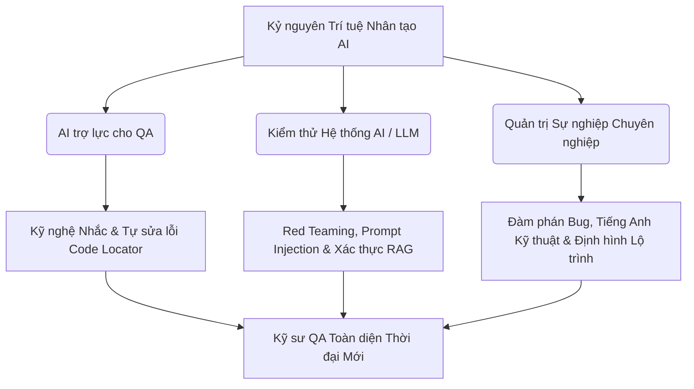

# 📁 12. Kỷ nguyên AI Testing & Định hướng sự nghiệp

*Mục tiêu: Đón đầu và làm chủ làn sóng trí tuệ nhân tạo (AI), ứng dụng Kỹ nghệ Nhắc (Prompt Engineering) và các Framework tự động sửa lỗi (Self-healing) để tối ưu hóa hiệu suất test, đồng thời trang bị tư duy Red Teaming chuyên sâu nhằm săn lỗi, đánh giá an toàn hệ thống Mô hình ngôn ngữ lớn (LLM) và định hình lộ trình thăng tiến sự nghiệp QA bền vững.*

## 📌 Mục lục nội bộ (Chặng 12)

- [ ] [**12.1. AI-Assisted Testing (AI for Testers)**](./1_AIForTesters.md)
  - [ ] [12.1.1. Prompt Engineering for QA: Generating Test Artifacts & Automation Code](./1_AIForTesters.md#1211-prompt-engineering-for-qa-generating-test-artifacts--automation-code)
  - [ ] [12.1.2. Self-healing Automation Engines: Mabl, Testim, Healenium](./1_AIForTesters.md#1212-self-healing-automation-engines-mabl-testim-healenium)
- [ ] [**12.2. Testing AI / LLM Systems**](./2_TestingAISystems.md)
  - [ ] [12.2.1. Vulnerabilities of LLMs: Hallucination, Bias, Toxicity, Safety](./2_TestingAISystems.md#1221-vulnerabilities-of-llms-hallucination-bias-toxicity-safety)
  - [ ] [12.2.2. Red Teaming: Prompt Injection & Jailbreak Testing](./2_TestingAISystems.md#1222-red-teaming-prompt-injection--jailbreak-testing)
  - [ ] [12.2.3. RAG Validation: Retrieval Accuracy, Groundedness, Context Handling](./2_TestingAISystems.md#1223-rag-validation-retrieval-accuracy-groundedness-context-handling)
  - [ ] [12.2.4. Autonomous AI Agents Testing & Tool-Calling Safety](./2_TestingAISystems.md#1224-autonomous-ai-agents-testing--tool-calling-safety)
- [ ] [**12.3. QA Professional Soft Skills & Career Path**](./3_SoftSkillsCareer.md)
  - [ ] [12.3.1. Technical Communication & Professional Bug Negotiation](./3_SoftSkillsCareer.md#1231-technical-communication--professional-bug-negotiation)
  - [ ] [12.3.2. Technical English for QA & Business Domain Mastery](./3_SoftSkillsCareer.md#1232-technical-english-for-qa--business-domain-mastery)
  - [ ] [12.3.3. Long-term Testing Career Path Roadmap](./3_SoftSkillsCareer.md#1233-long-term-testing-career-path-roadmap)

---

## 🗺️ Bản đồ Tiến trình Khai phá Kỷ nguyên AI Testing và Quản trị Sự nghiệp

Sơ đồ đơn sắc dưới đây phân rã luồng tư duy từ việc ứng dụng AI trợ lực, kỹ thuật kiểm thử hệ thống trí tuệ nhân tạo phức tạp (LLM/Agents) cho đến các chốt chặn hoàn thiện kỹ năng mềm cốt lõi để thăng tiến sự nghiệp:

---

📚 **References**
* *ISTQB® Certified Tester Specialist - AI Testing (AIT) Syllabus* - Tiêu chuẩn quốc tế cao cấp về kiểm thử hệ thống trí tuệ nhân tạo và ứng dụng AI vào QA.
* *OWASP Top 10 for Large Language Model Applications* - Bộ quy chuẩn toàn cầu về các lỗ hổng an ninh bảo mật đặc thù của ứng dụng AI/LLM.
* *Long-term Software Quality Engineering Career Growth Guide v2026*.
