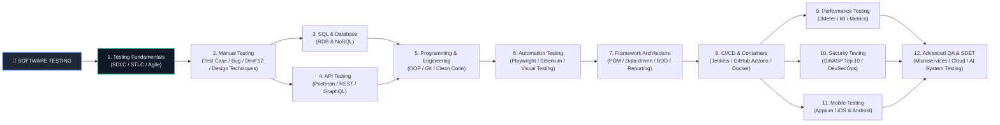

# 🚀 Software Testing Roadmap & Checklist

Tài liệu này chứa lộ trình từ khóa (Keyword Map) chi tiết nhất về ngành **Software Testing / Quality Assurance**, được thiết kế dưới dạng checklist để theo dõi tiến độ học tập từ **Beginner → Junior → Mid → Senior / QA Engineer / SDET**.

---

## 📋 Mục lục

1. [I. Mindset & Quy trình (Core Process)](#i-mindset--quy-trình-core-process)
2. [II. Manual Testing (Kỹ thuật cốt lõi & DevTools)](#ii-manual-testing-kỹ-thuật-cốt-lõi--devtools)
3. [III. Database & SQL Testing (RDB & NoSQL)](#iii-database--sql-testing-rdb--nosql)
4. [IV. API Testing](#iv-api-testing)
5. [V. Automation Testing & Visual Testing](#v-automation-testing--visual-testing)
6. [VI. Programming & Engineering](#vi-programming--engineering)
7. [VII. Git, CI/CD & DevOps](#vii-git-cicd--devops)
8. [VIII. Advanced Testing & Architecture](#viii-advanced-testing--architecture)
9. [IX. Security Testing (DevSecOps & OWASP)](#ix-security-testing-devsecops--owasp)
10. [X. Mobile Testing](#x-mobile-testing)
11. [XI. AI-Driven & AI System Testing](#xi-ai-driven--ai-system-testing)
12. [XII. Performance Testing](#xii-performance-testing)
13. [XIII. Tools & Ecosystem](#xiii-tools--ecosystem)
14. [XIV. Chứng chỉ & Career Path](#xiv-chứng-chỉ--career-path)
15. [🗺️ Recommended Learning Path](#%EF%B8%8F-recommended-learning-path)

---

# I. Mindset & Quy trình (Core Process)

### 1.1. Software Testing Fundamentals
- [ ] 1.1.1. What is Software Testing?
- [ ] 1.1.2. Verification vs Validation
- [ ] 1.1.3. QA vs QC vs Tester vs Quality Engineer (QE)
- [ ] 1.1.4. Defect / Bug / Error / Failure
- [ ] 1.1.5. Test Objective & Test Basis
- [ ] 1.1.6. Test Oracle

### 1.2. SDLC (Software Development Life Cycle)
- [ ] 1.2.1. Waterfall
- [ ] 1.2.2. V-Model
- [ ] 1.2.3. Agile / Scrum / Kanban
- [ ] 1.2.4. DevOps & DevSecOps

### 1.3. STLC (Software Testing Life Cycle)
- [ ] 1.3.1. Requirement Analysis
- [ ] 1.3.2. Test Planning
- [ ] 1.3.3. Test Case Development
- [ ] 1.3.4. Test Environment Setup
- [ ] 1.3.5. Test Execution
- [ ] 1.3.6. Defect Reporting
- [ ] 1.3.7. Test Cycle Closure

### 1.4. Shift-Left & Shift-Right Testing
- [ ] 1.4.1. Shift-Left: Kiểm thử sớm từ khâu Requirement & Design
- [ ] 1.4.2. Shift-Right: Monitoring trên Production (A/B Testing, Canary Deployment, Feature Toggles)

### 1.5. 7 Testing Principles
- [ ] 1.5.1. Testing shows presence of defects
- [ ] 1.5.2. Exhaustive testing is impossible
- [ ] 1.5.3. Early testing
- [ ] 1.5.4. Defect clustering
- [ ] 1.5.5. Pesticide paradox
- [ ] 1.5.6. Testing is context dependent
- [ ] 1.5.7. Absence-of-errors fallacy

### 1.6. Agile / Scrum Framework
- [ ] 1.6.1. User Story & Acceptance Criteria (AC)
- [ ] 1.6.2. Product Backlog & Sprint Backlog
- [ ] 1.6.3. Sprint Planning / Daily Scrum / Sprint Review / Retrospective
- [ ] 1.6.4. Definition of Ready (DoR) & Definition of Done (DoD)
- [ ] 1.6.5. QA Role in Agile Teams

### 1.7. Risk-based Testing
- [ ] 1.7.1. Risk Identification & Analysis
- [ ] 1.7.2. Risk Prioritization & Mitigation
- [ ] 1.7.3. Risk-based Test Planning

### 1.8. QA Mindset
- [ ] 1.8.1. Requirement questioning
- [ ] 1.8.2. Critical & Edge-case thinking
- [ ] 1.8.3. User & Business perspective
- [ ] 1.8.4. Quality ownership

---

# II. Manual Testing (Kỹ thuật cốt lõi & DevTools)

### 2.1. Test Inputs & Planning
- [ ] 2.1.1. Requirements: SRS, BRD, User Story, Acceptance Criteria, Mockup/Wireframe, API Docs
- [ ] 2.1.2. Test Plan: Scope (In/Out), Strategy, Approach, Schedule, Resources, Risk & Mitigation, Entry/Exit Criteria, Deliverables

### 2.2. Web Developer Tools (F12) - Kỹ thuật debug lỗi
- [ ] 2.2.1. **Elements Tab:** Inspect UI, DOM Tree, CSS Styles
- [ ] 2.2.2. **Network Tab:** Inspect API Requests/Responses, HTTP Headers, Payload, Status Codes, Response Time, Waterfalls
- [ ] 2.2.3. **Console Tab:** JavaScript Errors, Warnings, Application Logs
- [ ] 2.2.4. **Application Tab:** Cookies, Local Storage, Session Storage, Cache Management

### 2.3. Test Design Techniques
- [ ] 2.3.1. **Black-box Testing:** Equivalence Partitioning, Boundary Value Analysis (BVA), Decision Table, State Transition, Use Case Testing, Pairwise Testing
- [ ] 2.3.2. **White-box Concepts:** Statement Coverage, Branch/Decision Coverage, Path Coverage
- [ ] 2.3.3. **Experience-based Testing:** Error Guessing, Exploratory Testing, Checklist-based, Ad-hoc Testing

### 2.4. Testing Types
- [ ] 2.4.1. Functional Testing (Smoke, Sanity, Regression, Retesting, System, E2E, UAT)
- [ ] 2.4.2. Non-functional Testing (Compatibility, Usability, Accessibility - WCAG 2.1, Localization, Internationalization)

### 2.5. Bug Management & Documentation
- [ ] 2.5.1. Bug Report Structure, Severity vs Priority
- [ ] 2.5.2. Bug Lifecycle (New → Open → Fixed → Retest → Closed/Reopen)
- [ ] 2.5.3. Defect Leakage, Defect Escape, Root Cause Analysis (RCA)
- [ ] 2.5.4. Documents: Test Scenario, Test Case, Test Suite, RTM (Requirement Traceability Matrix), Test Summary Report

---

# III. Database & SQL Testing (RDB & NoSQL)

### 3.1. SQL Fundamentals
- [ ] 3.1.1. Basic Query: `SELECT`, `WHERE`, `ORDER BY`, `DISTINCT`, `GROUP BY`, `HAVING`, `LIMIT`
- [ ] 3.1.2. Joins: `INNER JOIN`, `LEFT JOIN`, `RIGHT JOIN`, `FULL JOIN`, `CROSS JOIN`
- [ ] 3.1.3. Advanced: `UNION`, Subquery, `CASE WHEN`, Window Functions
- [ ] 3.1.4. Aggregate Functions: `COUNT`, `SUM`, `AVG`, `MIN`, `MAX`, NULL Handling

### 3.2. Database Concepts
- [ ] 3.2.1. RDBMS: Table, Rows/Columns, Primary Key, Foreign Key, Unique Key, Indexes, Constraints
- [ ] 3.2.2. ACID Properties, Transactions (`COMMIT`, `ROLLBACK`)

### 3.3. NoSQL Basics
- [ ] 3.3.1. MongoDB: Collections, Documents, Basic CRUD Queries
- [ ] 3.3.2. Redis: Key-Value storage, Caching Testing

### 3.4. Database Testing Operations
- [ ] 3.4.1. Data Validation (UI ↔ DB, API ↔ DB)
- [ ] 3.4.2. Data Integrity, Referential Integrity, Stored Procedure Testing, Data Migration Testing

---

# IV. API Testing

### 4.1. API & HTTP Fundamentals
- [ ] 4.1.1. REST vs SOAP vs GraphQL, RESTful Principles, Endpoints, Resources
- [ ] 4.1.2. HTTP Methods: `GET`, `POST`, `PUT`, `PATCH`, `DELETE`, `OPTIONS`, `HEAD`
- [ ] 4.1.3. HTTP Status Codes: 2xx (Success), 3xx (Redirection), 4xx (Client Error), 5xx (Server Error)
- [ ] 4.1.4. Request/Response: Headers, Query Params, Path Params, Body (JSON, XML), Cookies, JSONPath

### 4.2. Authentication & Authorization
- [ ] 4.2.1. API Key, Basic Auth, Bearer Token, JWT, OAuth 2.0, Session/Cookie Auth

### 4.3. API Test Scenarios & Tools
- [ ] 4.3.1. Positive/Negative, Boundary, Rate Limiting, Idempotency, Pagination, Webhook, Mock API
- [ ] 4.3.2. **Postman:** Collection, Environment, Variables, Pre-request Script, Test Script, Collection Runner, Newman CLI
- [ ] 4.3.3. REST Assured, Swagger/OpenAPI, curl

---

# V. Automation Testing & Visual Testing

### 5.1. Strategy & Pyramid
- [ ] 5.1.1. Why Automation? Automation ROI, Flaky Tests Management
- [ ] 5.1.2. Testing Pyramid: Unit Test → Integration Test → API Test → UI Test / E2E

### 5.2. Web & Mobile Automation Frameworks
- [ ] 5.2.1. Web Tools: Playwright, Selenium WebDriver, Cypress
- [ ] 5.2.2. Mobile Tools: Appium, UiAutomator, XCUITest
- [ ] 5.2.3. Locators: ID, Name, CSS Selector, XPath (Absolute, Relative, Dynamic Axes)

### 5.3. Visual Regression Testing (UI Image Matching)
- [ ] 5.3.1. Visual Testing Concepts (Pixel-by-pixel comparison, Layout comparison)
- [ ] 5.3.2. Tools: Applitools, Percy, Playwright Screenshots Comparison

### 5.4. Framework Architecture
- [ ] 5.4.1. Page Object Model (POM), Data-Driven, Keyword-Driven, BDD (Gherkin/Cucumber)
- [ ] 5.4.2. Synchronizations (Implicit, Explicit, Fluent, Auto-wait)
- [ ] 5.4.3. Assertions (Hard Assert vs Soft Assert), Parallel Execution, Cross-browser Testing, Headless Execution
- [ ] 5.4.4. Reporting: Allure Report, Extent Report, Screenshot on Failure, Logging

---

# VI. Programming & Engineering

### 6.1. Fundamentals & OOP
- [ ] 6.1.1. Variables, Data Types, Control Flows, Functions, Collections, String Manipulation, Exception Handling
- [ ] 6.1.2. OOP Core: Class/Object, Encapsulation, Inheritance, Polymorphism, Abstraction, Interfaces

### 6.2. Design Patterns for QA
- [ ] 6.2.1. Page Object Pattern, Factory Pattern, Builder Pattern, Singleton Pattern

### 6.3. Main Programming Language
- [ ] 6.3.1. Choose One: TypeScript / JavaScript | Python | Java | C#

---

# VII. Git, CI/CD & DevOps

### 7.1. Git Version Control
- [ ] 7.1.1. Commands: `clone`, `add`, `commit`, `push`, `pull`, `fetch`
- [ ] 7.1.2. Workflows: Branching, Merging, Rebase, PR, Code Review

### 7.2. CI/CD & Containers
- [ ] 7.2.1. CI/CD Pipeline: Jenkins, GitHub Actions, GitLab CI/CD, Azure DevOps
- [ ] 7.2.2. Docker: Images, Containers, Dockerfile, Docker Compose, Running Tests in Docker Containers
- [ ] 7.2.3. Linux / CLI Basics: File System, Processes, Permissions, Bash Scripting

---

# VIII. Advanced Testing & Architecture

### 8.1. Distributed Systems & Microservices
- [ ] 8.1.1. Service-to-Service Communication, Message Queues (Kafka, RabbitMQ)
- [ ] 8.1.2. Consumer-Driven Contract Testing (Pact Framework)

### 8.2. Cloud Testing & Mocks
- [ ] 8.2.1. AWS / Azure / GCP Basics, Cloud Environment Logs
- [ ] 8.2.2. Service Virtualization, WireMock, Stubs, Test Data Management (TDM)

---

# IX. Security Testing (DevSecOps & OWASP)

### 9.1. Security Fundamentals & Vulnerabilities
- [ ] 9.1.1. Authentication, Authorization, Access Control, Encryption/Hashing, HTTPS/TLS
- [ ] 9.1.2. **OWASP Top 10:** SQL Injection, XSS, CSRF, IDOR / BOLA, Broken Authentication, SSRF, Sensitive Data Exposure

### 9.2. Security Tools
- [ ] 9.2.1. OWASP ZAP, Burp Suite, Postman Security Testing

---

# X. Mobile Testing

### 10.1. Fundamentals & Scenarios
- [ ] 10.1.1. Android & iOS Ecosystems, Real Devices vs Emulators/Simulators, Device Fragmentation
- [ ] 10.1.2. Scenarios: Installation/Upgrade, Interruptions (Call/SMS), Network Switching, Deep Links, Push Notifications, Battery/Performance

### 10.2. Automation
- [ ] 10.2.1. Appium Framework, UiAutomator (Android), XCUITest (iOS)

---

# XI. AI-Driven & AI System Testing

### 11.1. AI for Testers
- [ ] 11.1.1. Prompt Engineering cho Tester (Sinh Test Case, Test Data, Query SQL, Automation Code)
- [ ] 11.1.2. AI Assistants: ChatGPT, GitHub Copilot
- [ ] 11.1.3. Self-Healing Automation Tools (Mabl, Testim, Healenium)

### 11.2. Testing AI / LLM Systems
- [ ] 11.2.1. LLM Evaluation: Hallucination, Bias, Toxicity, Safety, Prompt Injection, Jailbreak Testing
- [ ] 11.2.2. RAG Testing: Retrieval Accuracy, Groundedness, Context Handling
- [ ] 11.2.3. AI Agent & Tool-calling Testing

---

# XII. Performance Testing

### 12.1. Concepts & Metrics
- [ ] 12.1.1. Types: Load, Stress, Spike, Endurance/Soak, Scalability Testing
- [ ] 12.1.2. Metrics: Response Time, Throughput (TPS), Latency, Error Rate, Percentiles (P50, P90, P95, P99), Resource Usage (CPU, RAM)

### 12.2. Tools & Analysis
- [ ] 12.2.1. Tools: JMeter, k6, Grafana, Prometheus
- [ ] 12.2.2. Bottleneck Analysis, Performance Baseline, SLA / SLO

---

# XIII. Tools & Ecosystem

### 13.1. Test Management
- [ ] 13.1.1. JIRA, TestRail, Zephyr, Xray, Azure DevOps

### 13.2. Observability & Logs
- [ ] 13.2.1. Grafana, Prometheus, ELK Stack (Elasticsearch, Logstash, Kibana)

### 13.3. API & DB Tools
- [ ] 13.3.1. Postman, Swagger, DBeaver, MongoDB Compass

---

# XIV. Chứng chỉ & Career Path

### 14.1. Chứng chỉ quốc tế
- [ ] 14.1.1. ISTQB CTFL (Foundation Level)
- [ ] 14.1.2. ISTQB CTAL (Advanced Level: Test Analyst, Technical Test Analyst, Test Manager)

### 14.2. Lộ trình phát triển & Kỹ năng mềm
- [ ] 14.2.1. **Career Path:** Junior Tester → Mid/Senior Tester → Automation Tester / Quality Engineer (QE) → SDET / QA Lead → Test Manager
- [ ] 14.2.2. **Soft Skills:** Communication, Bug Negotiation, Critical Thinking, Technical English

---

# 🗺️ Recommended Learning Path

