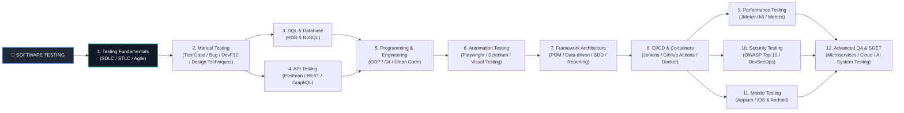

# 🗺️ Bản đồ lộ trình học Software Testing (12 Chặng)

<<<<<<< HEAD
**Mục tiêu:** Hoàn thành từng chặng kiểm thử theo lộ trình từ cơ bản đến chuyên sâu. Tích chọn vào checkbox để theo dõi tiến độ học tập cá nhân.

1. [x] [**01. Nền tảng & Tư duy QA**](#-01-testing-fundamentals--qa-mindset-01-testing-fundamentals) `01-testing-fundamentals/`
2. [x] [**02. SDLC, STLC & Mô hình Agile**](#-02-sdlc-stlc--agile-02-sdlc-stlc-agile) `02-sdlc-stlc-agile/`
3. [x] [**03. Kiểm thử thủ công (Manual Testing)**](#-03-manual-testing-03-manual-testing) `03-manual-testing/`
4. [x] [**04. Thiết kế kịch bản & Quản lý Bug**](#-04-test-design--bug-management-04-test-design-bug-management) `04-test-design-bug-management/`
5. [x] [**05. Kiểm thử Web & Chrome DevTools**](#-05-web-testing--devtools-05-web-testing-devtools) `05-web-testing-devtools/`
6. [x] [**06. Cơ sở dữ liệu & Truy vấn SQL**](#-06-database--sql-testing-06-database-sql) `06-database-sql/`
7. [x] [**07. Kiểm thử tầng tích hợp API**](#-07-api-testing-07-api-testing) `07-api-testing/`
8. [x] [**08. Tư duy lập trình cốt lõi & OOP**](#-08-programming-fundamentals-08-programming) `08-programming/`
9. [x] [**09. Kiểm thử tự động (Automation Testing)**](#-09-automation-testing-09-automation-testingg) `09-automation-testing/`
10. [x] [**10. Git, CI/CD Pipeline & Docker**](#-10-git-cicd--devops-10-git-cicd-devops) `10-git-cicd-devops/`
11. [x] [**11. Kiểm thử nâng cao (Performance, Security, Mobile)**](#-11-advanced-testing-11-advanced-testing) `11-advanced-testing/`
12. [x] [**12. Kỷ nguyên AI Testing & Định hướng sự nghiệp**](#-12-ai-testing--career-path-12-ai-testing-career) `12-ai-testing-career/`

---

# 📚 Mục lục lộ trình học Software Testing từ Zero đến Hero

## 📁 01. Testing Fundamentals & QA Mindset (`01-testing-fundamentals/`)

*Mục tiêu: Hiểu Testing là gì, tại sao cần Testing và tư duy phản biện của một Tester chuyên nghiệp.*

- [ ] **1.1. Core Software Testing**
  - [ ] [1.1.1. What is Software Testing?](../01-testing-fundamentals/1_CoreTesting.md#111-what-is-software-testing)
  - [ ] [1.1.2. Verification vs Validation](../01-testing-fundamentals/1_CoreTesting.md#112-verification-vs-validation)
  - [ ] [1.1.3. QA vs QC vs Tester vs QE](../01-testing-fundamentals/1_CoreTesting.md#113-qa-vs-qc-vs-tester-vs-qe)
  - [ ] [1.1.4. Error vs Defect vs Failure](../01-testing-fundamentals/1_CoreTesting.md#114-error-vs-defect-vs-failure)
  - [ ] [1.1.5. Test Objective](../01-testing-fundamentals/1_CoreTesting.md#115-test-objective)
  - [ ] [1.1.6. Test Basis](../01-testing-fundamentals/1_CoreTesting.md#116-test-basis)
  - [ ] [1.1.7. Test Oracle](../01-testing-fundamentals/1_CoreTesting.md#117-test-oracle)
  - [ ] [1.1.8. 7 Testing Principles](../01-testing-fundamentals/1_CoreTesting.md#118-7-testing-principles)
- [ ] **1.2. QA Mindset**
  - [ ] [1.2.1. Requirement Questioning](../01-testing-fundamentals/2_QAMindset.md#121-requirement-questioning)
  - [ ] [1.2.2. Critical Thinking](../01-testing-fundamentals/2_QAMindset.md#122-critical-thinking)
  - [ ] [1.2.3. Edge-case Thinking](../01-testing-fundamentals/2_QAMindset.md#123-edge-case-thinking)
  - [ ] [1.2.4. User & Business Perspective](../01-testing-fundamentals/2_QAMindset.md#124-user--business-perspective)
  - [ ] [1.2.5. Quality Ownership](../01-testing-fundamentals/2_QAMindset.md#125-quality-ownership)

---

## 📁 02. SDLC, STLC & Agile (`02-sdlc-stlc-agile/`)

*Mục tiêu: Hiểu cách phần mềm vận hành từ ý tưởng đến thực tế và vị trí của Testing trong quy trình.*

- [ ] **2.1. SDLC (Software Development Life Cycle)**
  - [ ] [2.1.1. SDLC Overview](../02-sdlc-stlc-agile/1_SDLC.md#211-sdlc-overview)
  - [ ] [2.1.2. Waterfall Model](../02-sdlc-stlc-agile/1_SDLC.md#212-waterfall-model)
  - [ ] [2.1.3. V-Model](../02-sdlc-stlc-agile/1_SDLC.md#213-v-model)
  - [ ] [2.1.4. Agile Methodology](../02-sdlc-stlc-agile/1_SDLC.md#214-agile-methodology)
  - [ ] [2.1.5. Scrum Framework](../02-sdlc-stlc-agile/1_SDLC.md#215-scrum-framework)
  - [ ] [2.1.6. Kanban Board](../02-sdlc-stlc-agile/1_SDLC.md#216-kanban-board)
  - [ ] [2.1.7. DevOps & DevSecOps](../02-sdlc-stlc-agile/1_SDLC.md#217-devops--devsecops)
- [ ] **2.2. STLC (Software Testing Life Cycle)**
  - [ ] [2.2.1. Requirement Analysis](../02-sdlc-stlc-agile/2_STLC.md#221-requirement-analysis)
  - [ ] [2.2.2. Test Planning](../02-sdlc-stlc-agile/2_STLC.md#222-test-planning)
  - [ ] [2.2.3. Test Case Development](../02-sdlc-stlc-agile/2_STLC.md#223-test-case-development)
  - [ ] [2.2.4. Test Environment Setup](../02-sdlc-stlc-agile/2_STLC.md#224-test-environment-setup)
  - [ ] [2.2.5. Test Execution](../02-sdlc-stlc-agile/2_STLC.md#225-test-execution)
  - [ ] [2.2.6. Defect Reporting](../02-sdlc-stlc-agile/2_STLC.md#226-defect-reporting)
  - [ ] [2.2.7. Test Cycle Closure](../02-sdlc-stlc-agile/2_STLC.md#227-test-cycle-closure)
- [ ] **2.3. Agile / Scrum In-Depth**
  - [ ] [2.3.1. User Story](../02-sdlc-stlc-agile/3_AgileScrum.md#231-user-story)
  - [ ] [2.3.2. Acceptance Criteria (AC)](../02-sdlc-stlc-agile/3_AgileScrum.md#232-acceptance-criteria-ac)
  - [ ] [2.3.3. Product Backlog & Sprint Backlog](../02-sdlc-stlc-agile/3_AgileScrum.md#233-product-backlog--sprint-backlog)
  - [ ] [2.3.4. Scrum Meetings (Planning, Daily, Review, Retro)](../02-sdlc-stlc-agile/3_AgileScrum.md#234-scrum-meetings)
  - [ ] [2.3.5. Definition of Ready (DoR) & Definition of Done (DoD)](../02-sdlc-stlc-agile/3_AgileScrum.md#235-definition-of-ready-dor--definition-of-done-dod)
  - [ ] [2.3.6. QA Role in Agile Teams](../02-sdlc-stlc-agile/3_AgileScrum.md#236-qa-role-in-agile-teams)
- [ ] **2.4. Testing Strategy**
  - [ ] [2.4.1. Shift-Left Testing](../02-sdlc-stlc-agile/4_TestingStrategy.md#241-shift-left-testing)
  - [ ] [2.4.2. Shift-Right Testing](../02-sdlc-stlc-agile/4_TestingStrategy.md#242-shift-right-testing)
  - [ ] [2.4.3. Risk-based Testing](../02-sdlc-stlc-agile/4_TestingStrategy.md#243-risk-based-testing)

---

## 📁 03. Manual Testing (`03-manual-testing/`)

*Mục tiêu: Làm chủ quy trình, phân tích tài liệu và thực thi kiểm thử thủ công chuyên nghiệp.*

- [ ] **3.1. Requirements Analysis**
  - [ ] [3.1.1. SRS (Software Requirement Specification)](../03-manual-testing/1_Requirements.md#311-srs)
  - [ ] [3.1.2. BRD (Business Requirement Document)](../03-manual-testing/1_Requirements.md#312-brd)
  - [ ] [3.1.3. User Story & AC Review](../03-manual-testing/1_Requirements.md#313-user-story--ac-review)
  - [ ] [3.1.4. Mockup / Wireframe Analysis](../03-manual-testing/1_Requirements.md#314-mockup--wireframe-analysis)
  - [ ] [3.1.5. API Documentation Review](../03-manual-testing/1_Requirements.md#315-api-documentation-review)
- [ ] **3.2. Test Artifacts**
  - [ ] [3.2.1. Test Scenario](../03-manual-testing/2_Artifacts.md#321-test-scenario)
  - [ ] [3.2.2. Test Case & Test Suite](../03-manual-testing/2_Artifacts.md#322-test-case--test-suite)
  - [ ] [3.2.3. Test Data Management](../03-manual-testing/2_Artifacts.md#323-test-data-management)
  - [ ] [3.2.4. Test Plan Fundamentals](../03-manual-testing/2_Artifacts.md#324-test-plan-fundamentals)
  - [ ] [3.2.5. Test Execution & Result Logs](../03-manual-testing/2_Artifacts.md#325-test-execution--result-logs)
  - [ ] [3.2.6. Test Summary Report](../03-manual-testing/2_Artifacts.md#326-test-summary-report)
  - [ ] [3.2.7. RTM (Requirements Traceability Matrix)](../03-manual-testing/2_Artifacts.md#327-rtm)
- [ ] **3.3. Functional Testing Levels & Types**
  - [ ] [3.3.1. Functional Testing Overview](../03-manual-testing/3_FunctionalTesting.md#331-functional-testing-overview)
  - [ ] [3.3.2. Smoke Testing vs Sanity Testing](../03-manual-testing/3_FunctionalTesting.md#332-smoke-testing-vs-sanity-testing)
  - [ ] [3.3.3. Retesting vs Regression Testing](../03-manual-testing/3_FunctionalTesting.md#333-retesting-vs-regression-testing)
  - [ ] [3.3.4. System Testing](../03-manual-testing/3_FunctionalTesting.md#334-system-testing)
  - [ ] [3.3.5. End-to-End (E2E) Testing](../03-manual-testing/3_FunctionalTesting.md#335-end-to-end-e2e-testing)
  - [ ] [3.3.6. UAT (User Acceptance Testing)](../03-manual-testing/3_FunctionalTesting.md#336-uat)
- [ ] **3.4. Non-functional Testing**
  - [ ] [3.4.1. Compatibility Testing](../03-manual-testing/4_NonFunctionalTesting.md#341-compatibility-testing)
  - [ ] [3.4.2. Usability & Accessibility Testing](../03-manual-testing/4_NonFunctionalTesting.md#342-usability--accessibility-testing)
  - [ ] [3.4.3. Localization & Internationalization (L10n/I18n)](../03-manual-testing/4_NonFunctionalTesting.md#343-localization--internationalization)

---

## 📁 04. Test Design & Bug Management (`04-test-design-bug-management/`)

*Mục tiêu: Áp dụng kỹ thuật toán học để thiết kế tối ưu hóa số lượng Test Case và quản lý Bug khoa học.*

- [ ] **4.1. Black-box Test Design Techniques**
  - [ ] [4.1.1. Equivalence Partitioning (Phân vùng tương đương)](../04-test-design-bug-management/1_BlackBoxDesign.md#411-equivalence-partitioning)
  - [ ] [4.1.2. Boundary Value Analysis (Phân tích giá trị biên)](../04-test-design-bug-management/1_BlackBoxDesign.md#412-boundary-value-analysis)
  - [ ] [4.1.3. Decision Table Testing (Bảng quyết định)](../04-test-design-bug-management/1_BlackBoxDesign.md#413-decision-table-testing)
  - [ ] [4.1.4. State Transition Testing (Chuyển đổi trạng thái)](../04-test-design-bug-management/1_BlackBoxDesign.md#414-state-transition-testing)
  - [ ] [4.1.5. Use Case Testing](../04-test-design-bug-management/1_BlackBoxDesign.md#415-use-case-testing)
  - [ ] [4.1.6. Pairwise / Orthogonal Array Testing](../04-test-design-bug-management/1_BlackBoxDesign.md#416-pairwise-testing)
- [ ] **4.2. Experience-based Testing Techniques**
  - [ ] [4.2.1. Error Guessing (Đoán lỗi)](../04-test-design-bug-management/2_ExperienceDesign.md#421-error-guessing)
  - [ ] [4.2.2. Exploratory Testing (Kiểm thử khám phá)](../04-test-design-bug-management/2_ExperienceDesign.md#422-exploratory-testing)
  - [ ] [4.2.3. Checklist-based & Ad-hoc Testing](../04-test-design-bug-management/2_ExperienceDesign.md#423-checklist-based--ad-hoc-testing)
- [ ] **4.3. White-box Concepts**
  - [ ] [4.3.1. Statement Coverage](../04-test-design-bug-management/3_WhiteBoxConcepts.md#431-statement-coverage)
  - [ ] [4.3.2. Branch / Decision Coverage](../04-test-design-bug-management/3_WhiteBoxConcepts.md#432-branch--decision-coverage)
  - [ ] [4.3.3. Path Coverage](../04-test-design-bug-management/3_WhiteBoxConcepts.md#433-path-coverage)
- [ ] **4.4. Bug Management & Lifecycle**
  - [ ] [4.4.1. How to Write a Professional Bug Report](../04-test-design-bug-management/4_BugManagement.md#441-bug-report)
  - [ ] [4.4.2. Severity vs Priority (Độ nghiêm trọng vs Độ ưu tiên)](../04-test-design-bug-management/4_BugManagement.md#442-severity-vs-priority)
  - [ ] [4.4.3. Bug Lifecycle (Vòng đời của Bug)](../04-test-design-bug-management/4_BugManagement.md#443-bug-lifecycle)
  - [ ] [4.4.4. Retest & Regression Testing after Fix](../04-test-design-bug-management/4_BugManagement.md#444-retest-after-fix)
  - [ ] [4.4.5. Defect Leakage vs Defect Escape](../04-test-design-bug-management/4_BugManagement.md#445-defect-leakage-vs-defect-escape)
  - [ ] [4.4.6. Root Cause Analysis (RCA)](../04-test-design-bug-management/4_BugManagement.md#446-root-cause-analysis)

---

## 📁 05. Web Testing & DevTools (`05-web-testing-devtools/`)

*Mục tiêu: Hiểu kiến trúc Web Application và sử dụng thành thạo DevTools để bắt lỗi, phân tích hiệu năng Client.*

- [ ] **5.1. Web Application Fundamentals**
  - [ ] [5.1.1. How Browsers Work](../05-web-testing-devtools/1_WebFundamentals.md#511-browser)
  - [ ] [5.1.2. Frontend vs Backend System](../05-web-testing-devtools/1_WebFundamentals.md#512-frontend-vs-backend-system)
  - [ ] [5.1.3. Client-Server Architecture & Request-Response Lifecycle](../05-web-testing-devtools/1_WebFundamentals.md#513-client-server-architecture--request-response-lifecycle)
- [ ] **5.2. Mastering Chrome DevTools for Testers**
  - [ ] [5.2.1. Elements Panel & DOM/CSS Inspection](../05-web-testing-devtools/2_DevTools.md#521-elements-panel--domcss-inspection)
  - [ ] [5.2.2. Console Panel & JavaScript Error Tracking](../05-web-testing-devtools/2_DevTools.md#522-console-panel--javascript-error-tracking)
  - [ ] [5.2.3. Network Panel: Capturing Headers, Payloads, Responses](../05-web-testing-devtools/2_DevTools.md#523-network-panel-capturing-headers-payloads-responses)
  - [ ] [5.2.4. HTTP Status Codes, Response Time & Waterfall Analysis](../05-web-testing-devtools/2_DevTools.md#524-http-status-codes-response-time--waterfall-analysis)
  - [ ] [5.2.5. Application Panel: Cookies, Local/Session Storage & Cache](../05-web-testing-devtools/2_DevTools.md#525-application-panel-cookies-localsession-storage--cache)

---

## 📁 06. Database & SQL Testing (`06-database-sql/`)

*Mục tiêu: Kiểm tra dữ liệu nằm ẩn dưới hệ thống thông qua các câu lệnh truy vấn dữ liệu SQL.*

- [ ] **6.1. Database Fundamentals**
  - [ ] [6.1.1. Relational Database (RDBMS) Concepts](../06-database-sql/1_DBFundamentals.md#611-relational-database-rdbms-concepts)
  - [ ] [6.1.2. Table, Row, Column, Keys (Primary, Foreign, Unique)](../06-database-sql/1_DBFundamentals.md#612-table-row-column-keys-primary-foreign-unique)
  - [ ] [6.1.3. Database Constraints & Indexes](../06-database-sql/1_DBFundamentals.md#613-database-constraints--indexes)
- [ ] **6.2. SQL Fundamentals for Testers**
  - [ ] [6.2.1. Data Query: SELECT, WHERE, ORDER BY, DISTINCT](../06-database-sql/2_SQLFundamentals.md#621-data-query-select-where-order-by-distinct)
  - [ ] [6.2.2. Data Aggregation: GROUP BY, HAVING, Aggregate Functions](../06-database-sql/2_SQLFundamentals.md#622-data-aggregation-group-by-having-aggregate-functions)
  - [ ] [6.2.3. Table Joins: INNER, LEFT, RIGHT, FULL JOIN](../06-database-sql/2_SQLFundamentals.md#623-table-joins-inner-left-right-full-join)
  - [ ] [6.2.4. Handling NULL Values & Limits](../06-database-sql/2_SQLFundamentals.md#624-handling-null-values--limits)
- [ ] **6.3. Advanced Database Concepts**
  - [ ] [6.3.1. ACID Properties & Transactions](../06-database-sql/3_DBConcepts.md#631-acid-properties--transactions)
  - [ ] [6.3.2. Transaction Control: COMMIT & ROLLBACK](../06-database-sql/3_DBConcepts.md#632-transaction-control-commit--rollback)
  - [ ] [6.3.3. Referential Integrity](../06-database-sql/3_DBConcepts.md#633-referential-integrity)
- [ ] **6.4. Database Testing Strategies**
  - [ ] [6.4.1. UI to Database Validation](../06-database-sql/4_DBTesting.md#641-ui-to-database-validation)
  - [ ] [6.4.2. API to Database Validation](../06-database-sql/4_DBTesting.md#642-api-to-database-validation)
  - [ ] [6.4.3. Data Integrity & Data Migration Testing](../06-database-sql/4_DBTesting.md#643-data-integrity--data-migration-testing)
- [ ] **6.5. NoSQL Overview**
  - [ ] [6.5.1. NoSQL Concepts: Document (MongoDB) vs Key-Value (Redis)](../06-database-sql/5_NoSQLOverview.md#651-nosql-concepts-document-mongodb-vs-key-value-redis)

---

## 📁 07. API Testing (`07-api-testing/`)

*Mục tiêu: Kiểm thử tầng tích hợp hệ thống, xử lý giao thức HTTP, tham số truyền tải và các phương thức bảo mật.*

- [ ] **7.1. API Fundamentals**
  - [ ] [7.1.1. What is an API? Architectural Styles: REST, SOAP, GraphQL](../07-api-testing/1_APIFundamentals.md#711-what-is-an-api-architectural-styles-rest-soap-graphql)
  - [ ] [7.1.2. RESTful Architecture Principles, Endpoints & Resources](../07-api-testing/1_APIFundamentals.md#712-restful-architecture-principles-endpoints--resources)
- [ ] **7.2. HTTP Protocol in API**
  - [ ] [7.2.1. HTTP Methods: GET, POST, PUT, PATCH, DELETE, OPTIONS](../07-api-testing/2_HTTPProtocol.md#721-http-methods-get-post-put-patch-delete-options)
  - [ ] [7.2.2. HTTP Status Codes Classification (2xx, 3xx, 4xx, 5xx)](../07-api-testing/2_HTTPProtocol.md#722-http-status-codes-classification-2xx-3xx-4xx-5xx)
- [ ] **7.3. Request & Response Anatomy**
  - [ ] [7.3.1. Headers, Query Parameters, Path Parameters](../07-api-testing/3_RequestResponse.md#731-headers-query-parameters-path-parameters)
  - [ ] [7.3.2. Request Body & Response Body parsing (JSON / XML)](../07-api-testing/3_RequestResponse.md#732-request-body--response-body-parsing-json--xml)
  - [ ] [7.3.3. Advanced Data Extraction: JSONPath Syntax](../07-api-testing/3_RequestResponse.md#733-advanced-data-extraction-jsonpath-syntax)
- [ ] **7.4. API Authentication Mechanisms**
  - [ ] [7.4.1. Basic Auth vs API Key](../07-api-testing/4_Authentication.md#741-basic-auth-vs-api-key)
  - [ ] [7.4.2. Bearer Token & JWT (JSON Web Token)](../07-api-testing/4_Authentication.md#742-bearer-token--jwt-json-web-token)
  - [ ] [7.4.3. OAuth 2.0 Flow & Session/Cookie Auth](../07-api-testing/4_Authentication.md#743-oauth-20-flow--sessioncookie-auth)
- [ ] **7.5. API Test Scenarios Designing**
  - [ ] [7.5.1. Positive & Negative Testing, Boundary Testing](../07-api-testing/5_APITestingStrategy.md#751-positive--negative-testing-boundary-testing)
  - [ ] [7.5.2. Pagination, Rate Limiting & Idempotency Testing](../07-api-testing/5_APITestingStrategy.md#752-pagination-rate-limiting--idempotency-testing)
  - [ ] [7.5.3. Webhooks & Mocking APIs](../07-api-testing/5_APITestingStrategy.md#753-webhooks--mocking-apis)
- [ ] **7.6. API Testing Tooling**
  - [ ] [7.6.1. Postman: Collections, Environments, Test Scripts](../07-api-testing/6_Tools.md#761-postman-collections-environments-test-scripts)
  - [ ] [7.6.2. Swagger / OpenAPI Documentation & Curl Command line](../07-api-testing/6_Tools.md#762-swagger--openapi-documentation--curl-command-line)
  - [ ] [7.6.3. REST Assured Framework Overview](../07-api-testing/6_Tools.md#763-rest-assured-framework-overview)

---

## 📁 08. Programming Fundamentals (`08-programming/`)

*Mục tiêu: Xây dựng nền tảng tư duy lập trình vững chắc và làm chủ các nguyên lý Hướng đối tượng (OOP).*

- [ ] **8.1. Programming Fundamentals**
  - [ ] [8.1.1. Variables, Data Types & Operators](../08-programming/1_ProgFundamentals.md#811-variables-data-types--operators)
  - [ ] [8.1.2. Conditional Statements & Loops](../08-programming/1_ProgFundamentals.md#812-conditional-statements--loops)
  - [ ] [8.1.3. Functions, Return Types & Scopes](../08-programming/1_ProgFundamentals.md#813-functions-return-types--scopes)
  - [ ] [8.1.4. Data Structures: Arrays, Lists, Collections & String Manipulation](../08-programming/1_ProgFundamentals.md#814-data-structures-arrays-lists-collections--string-manipulation)
  - [ ] [8.1.5. Exception Handling (Try-Catch blocks)](../08-programming/1_ProgFundamentals.md#815-exception-handling-try-catch-blocks)
- [ ] **8.2. OOP (Object-Oriented Programming)**
  - [ ] [8.2.1. Class & Object Concepts](../08-programming/2_OOPConcepts.md#821-class--object-concepts)
  - [ ] [8.2.2. 4 Pillars of OOP: Encapsulation, Inheritance, Polymorphism, Abstraction](../08-programming/2_OOPConcepts.md#822-4-pillars-of-oop-encapsulation-inheritance-polymorphism-abstraction)
  - [ ] [8.2.3. Interfaces & Abstract Classes](../08-programming/2_OOPConcepts.md#823-interfaces--abstract-classes)
- [ ] **8.3. Programming Language (Choose One Track)**
  - [ ] [8.3.1. Track 1: TypeScript / JavaScript](../08-programming/3_Languages.md#831-track-1-typescript--javascript)
  - [ ] [8.3.2. Track 2: Python](../08-programming/3_Languages.md#832-track-2-python)
  - [ ] [8.3.3. Track 3: Java](../08-programming/3_Languages.md#833-track-3-java)

---

## 📁 09. Automation Testing (`09-automation-testing/`)

*Mục tiêu: Phát triển hệ thống kiểm thử tự động, làm chủ thiết kế Locator và kiến trúc Framework.*

- [ ] **9.1. Automation Fundamentals**
  - [ ] [9.1.1. Why Automation Testing? ROI (Return on Investment) Calculation](../09-automation-testing/1_AutomationFundamentals.md#911-why-automation-testing-roi-return-on-investment-calculation)
  - [ ] [9.1.2. Flaky Tests Resolution & The Software Testing Pyramid](../09-automation-testing/1_AutomationFundamentals.md#912-flaky-tests-resolution--the-software-testing-pyramid)
- [ ] **9.2. Automation Testing Levels**
  - [ ] [9.2.1. Unit & Integration Testing Automation](../09-automation-testing/2_TestingLevels.md#921-unit--integration-testing-automation)
  - [ ] [9.2.2. API & UI / E2E Automation Testing](../09-automation-testing/2_TestingLevels.md#922-api--ui--e2e-automation-testing)
- [ ] **9.3. Web Automation Tooling**
  - [ ] [9.3.1. Playwright Framework In-Depth](../09-automation-testing/3_WebAutomation.md#931-playwright-framework-in-depth)
  - [ ] [9.3.2. Selenium WebDriver & Cypress Architecture](../09-automation-testing/3_WebAutomation.md#932-selenium-webdriver--cypress-architecture)
- [ ] **9.4. Mobile Automation Overview**
  - [ ] [9.4.1. Appium, UiAutomator & XCUITest Architecture](../09-automation-testing/4_MobileAutomation.md#941-appium-uiautomator--jcuitest-architecture)
- [ ] **9.5. Dynamic Locators Engineering**
  - [ ] [9.5.1. ID, Name & Text Locators Strategy](../09-automation-testing/5_Locators.md#951-id-name--text-locators-strategy)
  - [ ] [9.5.2. CSS Selectors Mechanics & Advanced XPath Axes](../09-automation-testing/5_Locators.md#952-css-selectors-mechanics--advanced-xpath-axes)
- [ ] **9.6. Core Automation Concepts**
  - [ ] [9.6.1. Smart Assertions & Dynamic Waits (Auto-wait vs Hard-wait)](../09-automation-testing/6_CoreConcepts.md#961-smart-assertions--dynamic-waits-auto-wait-vs-hard-wait)
  - [ ] [9.6.2. Headless Execution, Cross-browser Testing & Parallel Execution](../09-automation-testing/6_CoreConcepts.md#962-headless-execution-cross-browser-testing--parallel-execution)
- [ ] **9.7. Test Automation Architecture / Framework**
  - [ ] [9.7.1. POM (Page Object Model) Design Pattern](../09-automation-testing/7_Framework.md#971-pom-page-object-model-design-pattern)
  - [ ] [9.7.2. Data-Driven & Keyword-Driven Testing Frameworks](../09-automation-testing/7_Framework.md#972-data-driven--keyword-driven-testing-frameworks)
  - [ ] [9.7.3. BDD (Behavior-Driven Development) & Gherkin Language](../09-automation-testing/7_Framework.md#973-bdd-behavior-driven-development--gherkin-language)
  - [ ] [9.7.4. Automation Reporting Engines](../09-automation-testing/7_Framework.md#974-automation-reporting-engines)

---

## 📁 10. Git, CI/CD & DevOps (`10-git-cicd-devops/`)

*Mục tiêu: Đưa bộ mã nguồn kiểm thử vào quy trình phân phối sản phẩm tự động CI/CD sử dụng Docker.*

- [ ] **10.1. Git Version Control for Testers**
  - [ ] [10.1.1. Basic Git Workflow: Clone, Add, Commit, Push, Pull, Fetch](../10-git-cicd-devops/1_Git.md#1011-basic-git-workflow-clone-add-commit-push-pull-fetch)
  - [ ] [10.1.2. Branching Strategies, Merging vs Rebase](../10-git-cicd-devops/1_Git.md#1012-branching-strategies-merging-vs-rebase)
  - [ ] [10.1.3. Pull Request (PR) Lifecycle & Code Review for Automation Test](../10-git-cicd-devops/1_Git.md#1013-pull-request-pr-lifecycle--code-review-for-automation-test)
- [ ] **10.2. CI/CD Pipelines Integration**
  - [ ] [10.2.1. CI/CD Principles (Continuous Integration / Delivery / Deployment)](../10-git-cicd-devops/2_CICD.md#1021-cicd-principles-continuous-integration--delivery--deployment)
  - [ ] [10.2.2. Building Test Pipelines with GitHub Actions & Jenkins](../10-git-cicd-devops/2_CICD.md#1022-building-test-pipelines-with-github-actions--jenkins)
  - [ ] [10.2.3. GitLab CI/CD & Azure DevOps Test Automation Engines](../10-git-cicd-devops/2_CICD.md#1023-gitlab-cicd--azure-devops-test-automation-engines)
- [ ] **10.3. Containerization via Docker**
  - [ ] [10.3.1. Docker Architecture: Image, Container, Dockerfile](../10-git-cicd-devops/3_Docker.md#1031-docker-architecture-image-container-dockerfile)
  - [ ] [10.3.2. Multi-container Setup using Docker Compose for Automation Framework](../10-git-cicd-devops/3_Docker.md#1032-multi-container-setup-using-docker-compose-for-automation-framework)
- [ ] **10.4. Linux & CLI Essentials**
  - [ ] [10.4.1. File System Navigation, Process Management & Basic Bash Scripting](../10-git-cicd-devops/4_LinuxCLI.md#1041-file-system-navigation-process-management--basic-bash-scripting)

---

## 📁 11. Advanced Testing (`11-advanced-testing/`)

*Mục tiêu: Mở rộng chuyên môn sang các mảng kiểm thử cao cấp: Hiệu năng, Bảo mật, Di động và Hệ thống phân tán.*

- [ ] **11.1. Security Testing Fundamentals**
  - [ ] [11.1.1. AAA Framework: Authentication, Authorization, Access Control](../11-advanced-testing/1_SecurityTesting.md#1111-aaa-framework-authentication-authorization-access-control)
  - [ ] [11.1.2. Cryptography basics: Encryption, Hashing & HTTPS / TLS](../11-advanced-testing/1_SecurityTesting.md#1112-cryptography-basics-encryption-hashing--https--tls)
  - [ ] [11.1.3. OWASP Top 10 Vulnerabilities (SQLi, XSS, CSRF, IDOR)](../11-advanced-testing/1_SecurityTesting.md#1113-owasp-top-10-vulnerabilities-sqli-xss-csrf-idor)
  - [ ] [11.1.4. Security Auditing Tools: OWASP ZAP & Burp Suite Suite](../11-advanced-testing/1_SecurityTesting.md#1114-security-auditing-tools-owasp-zap--burp-suite-suite)
- [ ] **11.2. Performance Testing Engineering**
  - [ ] [11.2.1. Testing Types: Load, Stress, Spike, Endurance, Scalability](../11-advanced-testing/2_PerformanceTesting.md#1121-testing-types-load-stress-spike-endurance-scalability)
  - [ ] [11.2.2. Metrics: Throughput, Latency, Error Rate, Percentiles (P90/P95/P99)](../11-advanced-testing/2_PerformanceTesting.md#1122-metrics-throughput-latency-error-rate-percentiles-p90p95p99)
  - [ ] [11.2.3. Infrastructure Monitoring: CPU/RAM Baseline & SLA/SLO](../11-advanced-testing/2_PerformanceTesting.md#1123-infrastructure-monitoring-cpuram-baseline--slaslo)
  - [ ] [11.2.4. Performance Scripting via Apache JMeter & k6 Framework](../11-advanced-testing/2_PerformanceTesting.md#1124-performance-scripting-via-apache-jmeter--k6-framework)
  - [ ] [11.2.5. Dashboard Visualization: Grafana & Prometheus](../11-advanced-testing/2_PerformanceTesting.md#1125-dashboard-visualization-grafana--prometheus)
- [ ] **11.3. Mobile Testing Mechanics**
  - [ ] [11.3.1. Android vs iOS Architecture & Emulator / Simulator Deployment](../11-advanced-testing/3_MobileTesting.md#1131-android-vs-ios-architecture--emulator--simulator-deployment)
  - [ ] [11.3.2. Testing Mobile Anomalies: Fragmentation, Installation, Interrupts](../11-advanced-testing/3_MobileTesting.md#1132-testing-mobile-anomalies-fragmentation-installation-interrupts)
- [ ] **11.4. Distributed Systems, Contract & Cloud Testing**
  - [ ] [11.4.1. Microservices Architecture & Async Message Brokers (Kafka, RabbitMQ)](../11-advanced-testing/4_DistributedSystems.md#1141-microservices-architecture--async-message-brokers-kafka-rabbitmq)
  - [ ] [11.4.2. Contract Testing via Pact Framework](../11-advanced-testing/4_DistributedSystems.md#1142-contract-testing-via-pact-framework)
  - [ ] [11.4.3. Cloud Infrastructure Testing (AWS, Azure, GCP)](../11-advanced-testing/4_DistributedSystems.md#1143-cloud-infrastructure-testing-aws-azure-gcp)
  - [ ] [11.4.4. Service Virtualization (WireMock) & Advanced Test Data Management](../11-advanced-testing/4_DistributedSystems.md#1144-service-virtualization-wiremock--advanced-test-data-management)

---

## 📁 12. AI Testing & Career Path (`12-ai-testing-career/`)

*Mục tiêu: Đón đầu kỷ nguyên AI, kiểm thử mô hình ngôn ngữ lớn LLM và định hình lộ trình thăng tiến sự nghiệp.*

- [ ] **12.1. AI-Assisted Testing (AI for Testers)**
  - [ ] [12.1.1. Prompt Engineering for QA: Generating Test Artifacts & Automation Code](../12-ai-testing-career/1_AIForTesters.md#1211-prompt-engineering-for-qa-generating-test-artifacts--automation-code)
  - [ ] [12.1.2. Self-healing Automation Engines: Mabl, Testim, Healenium](../12-ai-testing-career/1_AIForTesters.md#1212-self-healing-automation-engines-mabl-testim-healenium)
- [ ] **12.2. Testing AI / LLM Systems**
  - [ ] [12.2.1. Vulnerabilities of LLMs: Hallucination, Bias, Toxicity, Safety](../12-ai-testing-career/2_TestingAISystems.md#1221-vulnerabilities-of-llms-hallucination-bias-toxicity-safety)
  - [ ] [12.2.2. Red Teaming: Prompt Injection & Jailbreak Testing](../12-ai-testing-career/2_TestingAISystems.md#1222-red-teaming-prompt-injection--jailbreak-testing)
  - [ ] [12.2.3. RAG Validation: Retrieval Accuracy, Groundedness, Context Handling](../12-ai-testing-career/2_TestingAISystems.md#1223-rag-validation-retrieval-accuracy-groundedness-context-handling)
  - [ ] [12.2.4. Autonomous AI Agents Testing & Tool-Calling Safety](../12-ai-testing-career/2_TestingAISystems.md#1224-autonomous-ai-agents-testing--tool-calling-safety)
- [ ] **12.3. QA Professional Soft Skills & Career Path**
  - [ ] [12.3.1. Technical Communication & Professional Bug Negotiation](../12-ai-testing-career/3_SoftSkillsCareer.md#1231-technical-communication--professional-bug-negotiation)
  - [ ] [12.3.2. Technical English for QA & Business Domain Mastery](../12-ai-testing-career/3_SoftSkillsCareer.md#1232-technical-english-for-qa--business-domain-mastery)
  - [ ] [12.3.3. Long-term Testing Career Path Roadmap](../12-ai-testing-career/3_SoftTesting-career-path-roadmap)

---

# 📚 References
* [ISTQB® Certified Tester Foundation Level (CTFL) Syllabus v4.0](https://istqb.org) - Quy chuẩn khung quản lý chất lượng và kiểm thử phần mềm quốc tế.
* [ISO/IEC/IEEE 29119-1:2022 Standard](https://iso.org) - Tiêu chuẩn quốc tế về khái niệm chung trong Software Testing.

--- 

# Cite

[1] [https://www.slideshare.net](https://www.slideshare.net/slideshow/foundations-of-software-testing-istqb-certificationpdf/267083589)

[2] [https://huddle.eurostarsoftwaretesting.com](https://huddle.eurostarsoftwaretesting.com/hands-on-examples-of-common-test-design-techniques/)

[3] [https://abstracta.us](https://abstracta.us/blog/test-automation/automated-functional-testing-guide)

[4] [https://www.andagon.com](https://www.andagon.com/en/blog/performance-tests-load-tests-and-stress-tests)
=======
Tài liệu này chứa lộ trình từ khóa (Keyword Map) chi tiết nhất về ngành **Software Testing / Quality Assurance**, được thiết kế dưới dạng checklist để theo dõi tiến độ học tập từ **Beginner → Junior → Mid → Senior / QA Engineer / SDET**.

---

## 📋 Mục lục

1. [I. Mindset & Quy trình (Core Process)](#i-mindset--quy-trình-core-process)
2. [II. Manual Testing (Kỹ thuật cốt lõi & DevTools)](#ii-manual-testing-kỹ-thuật-cốt-lõi--devtools)
3. [III. Database & SQL Testing (RDB & NoSQL)](#iii-database--sql-testing-rdb--nosql)
4. [IV. API Testing](#iv-api-testing)
5. [V. Automation Testing & Visual Testing](#v-automation-testing--visual-testing)
6. [VI. Programming & Engineering](#vi-programming--engineering)
7. [VII. Git, CI/CD & DevOps](#vii-git-cicd--devops)
8. [VIII. Advanced Testing & Architecture](#viii-advanced-testing--architecture)
9. [IX. Security Testing (DevSecOps & OWASP)](#ix-security-testing-devsecops--owasp)
10. [X. Mobile Testing](#x-mobile-testing)
11. [XI. AI-Driven & AI System Testing](#xi-ai-driven--ai-system-testing)
12. [XII. Performance Testing](#xii-performance-testing)
13. [XIII. Tools & Ecosystem](#xiii-tools--ecosystem)
14. [XIV. Chứng chỉ & Career Path](#xiv-chứng-chỉ--career-path)
15. [🗺️ Recommended Learning Path](#%EF%B8%8F-recommended-learning-path)

---

# I. Mindset & Quy trình (Core Process)

### 1.1. Software Testing Fundamentals
- [ ] 1.1.1. What is Software Testing?
- [ ] 1.1.2. Verification vs Validation
- [ ] 1.1.3. QA vs QC vs Tester vs Quality Engineer (QE)
- [ ] 1.1.4. Defect / Bug / Error / Failure
- [ ] 1.1.5. Test Objective & Test Basis
- [ ] 1.1.6. Test Oracle

### 1.2. SDLC (Software Development Life Cycle)
- [ ] 1.2.1. Waterfall
- [ ] 1.2.2. V-Model
- [ ] 1.2.3. Agile / Scrum / Kanban
- [ ] 1.2.4. DevOps & DevSecOps

### 1.3. STLC (Software Testing Life Cycle)
- [ ] 1.3.1. Requirement Analysis
- [ ] 1.3.2. Test Planning
- [ ] 1.3.3. Test Case Development
- [ ] 1.3.4. Test Environment Setup
- [ ] 1.3.5. Test Execution
- [ ] 1.3.6. Defect Reporting
- [ ] 1.3.7. Test Cycle Closure

### 1.4. Shift-Left & Shift-Right Testing
- [ ] 1.4.1. Shift-Left: Kiểm thử sớm từ khâu Requirement & Design
- [ ] 1.4.2. Shift-Right: Monitoring trên Production (A/B Testing, Canary Deployment, Feature Toggles)

### 1.5. 7 Testing Principles
- [ ] 1.5.1. Testing shows presence of defects
- [ ] 1.5.2. Exhaustive testing is impossible
- [ ] 1.5.3. Early testing
- [ ] 1.5.4. Defect clustering
- [ ] 1.5.5. Pesticide paradox
- [ ] 1.5.6. Testing is context dependent
- [ ] 1.5.7. Absence-of-errors fallacy

### 1.6. Agile / Scrum Framework
- [ ] 1.6.1. User Story & Acceptance Criteria (AC)
- [ ] 1.6.2. Product Backlog & Sprint Backlog
- [ ] 1.6.3. Sprint Planning / Daily Scrum / Sprint Review / Retrospective
- [ ] 1.6.4. Definition of Ready (DoR) & Definition of Done (DoD)
- [ ] 1.6.5. QA Role in Agile Teams

### 1.7. Risk-based Testing
- [ ] 1.7.1. Risk Identification & Analysis
- [ ] 1.7.2. Risk Prioritization & Mitigation
- [ ] 1.7.3. Risk-based Test Planning

### 1.8. QA Mindset
- [ ] 1.8.1. Requirement questioning
- [ ] 1.8.2. Critical & Edge-case thinking
- [ ] 1.8.3. User & Business perspective
- [ ] 1.8.4. Quality ownership

---

# II. Manual Testing (Kỹ thuật cốt lõi & DevTools)

### 2.1. Test Inputs & Planning
- [ ] 2.1.1. Requirements: SRS, BRD, User Story, Acceptance Criteria, Mockup/Wireframe, API Docs
- [ ] 2.1.2. Test Plan: Scope (In/Out), Strategy, Approach, Schedule, Resources, Risk & Mitigation, Entry/Exit Criteria, Deliverables

### 2.2. Web Developer Tools (F12) - Kỹ thuật debug lỗi
- [ ] 2.2.1. **Elements Tab:** Inspect UI, DOM Tree, CSS Styles
- [ ] 2.2.2. **Network Tab:** Inspect API Requests/Responses, HTTP Headers, Payload, Status Codes, Response Time, Waterfalls
- [ ] 2.2.3. **Console Tab:** JavaScript Errors, Warnings, Application Logs
- [ ] 2.2.4. **Application Tab:** Cookies, Local Storage, Session Storage, Cache Management

### 2.3. Test Design Techniques
- [ ] 2.3.1. **Black-box Testing:** Equivalence Partitioning, Boundary Value Analysis (BVA), Decision Table, State Transition, Use Case Testing, Pairwise Testing
- [ ] 2.3.2. **White-box Concepts:** Statement Coverage, Branch/Decision Coverage, Path Coverage
- [ ] 2.3.3. **Experience-based Testing:** Error Guessing, Exploratory Testing, Checklist-based, Ad-hoc Testing

### 2.4. Testing Types
- [ ] 2.4.1. Functional Testing (Smoke, Sanity, Regression, Retesting, System, E2E, UAT)
- [ ] 2.4.2. Non-functional Testing (Compatibility, Usability, Accessibility - WCAG 2.1, Localization, Internationalization)

### 2.5. Bug Management & Documentation
- [ ] 2.5.1. Bug Report Structure, Severity vs Priority
- [ ] 2.5.2. Bug Lifecycle (New → Open → Fixed → Retest → Closed/Reopen)
- [ ] 2.5.3. Defect Leakage, Defect Escape, Root Cause Analysis (RCA)
- [ ] 2.5.4. Documents: Test Scenario, Test Case, Test Suite, RTM (Requirement Traceability Matrix), Test Summary Report

---

# III. Database & SQL Testing (RDB & NoSQL)

### 3.1. SQL Fundamentals
- [ ] 3.1.1. Basic Query: `SELECT`, `WHERE`, `ORDER BY`, `DISTINCT`, `GROUP BY`, `HAVING`, `LIMIT`
- [ ] 3.1.2. Joins: `INNER JOIN`, `LEFT JOIN`, `RIGHT JOIN`, `FULL JOIN`, `CROSS JOIN`
- [ ] 3.1.3. Advanced: `UNION`, Subquery, `CASE WHEN`, Window Functions
- [ ] 3.1.4. Aggregate Functions: `COUNT`, `SUM`, `AVG`, `MIN`, `MAX`, NULL Handling

### 3.2. Database Concepts
- [ ] 3.2.1. RDBMS: Table, Rows/Columns, Primary Key, Foreign Key, Unique Key, Indexes, Constraints
- [ ] 3.2.2. ACID Properties, Transactions (`COMMIT`, `ROLLBACK`)

### 3.3. NoSQL Basics
- [ ] 3.3.1. MongoDB: Collections, Documents, Basic CRUD Queries
- [ ] 3.3.2. Redis: Key-Value storage, Caching Testing

### 3.4. Database Testing Operations
- [ ] 3.4.1. Data Validation (UI ↔ DB, API ↔ DB)
- [ ] 3.4.2. Data Integrity, Referential Integrity, Stored Procedure Testing, Data Migration Testing

---

# IV. API Testing

### 4.1. API & HTTP Fundamentals
- [ ] 4.1.1. REST vs SOAP vs GraphQL, RESTful Principles, Endpoints, Resources
- [ ] 4.1.2. HTTP Methods: `GET`, `POST`, `PUT`, `PATCH`, `DELETE`, `OPTIONS`, `HEAD`
- [ ] 4.1.3. HTTP Status Codes: 2xx (Success), 3xx (Redirection), 4xx (Client Error), 5xx (Server Error)
- [ ] 4.1.4. Request/Response: Headers, Query Params, Path Params, Body (JSON, XML), Cookies, JSONPath

### 4.2. Authentication & Authorization
- [ ] 4.2.1. API Key, Basic Auth, Bearer Token, JWT, OAuth 2.0, Session/Cookie Auth

### 4.3. API Test Scenarios & Tools
- [ ] 4.3.1. Positive/Negative, Boundary, Rate Limiting, Idempotency, Pagination, Webhook, Mock API
- [ ] 4.3.2. **Postman:** Collection, Environment, Variables, Pre-request Script, Test Script, Collection Runner, Newman CLI
- [ ] 4.3.3. REST Assured, Swagger/OpenAPI, curl

---

# V. Automation Testing & Visual Testing

### 5.1. Strategy & Pyramid
- [ ] 5.1.1. Why Automation? Automation ROI, Flaky Tests Management
- [ ] 5.1.2. Testing Pyramid: Unit Test → Integration Test → API Test → UI Test / E2E

### 5.2. Web & Mobile Automation Frameworks
- [ ] 5.2.1. Web Tools: Playwright, Selenium WebDriver, Cypress
- [ ] 5.2.2. Mobile Tools: Appium, UiAutomator, XCUITest
- [ ] 5.2.3. Locators: ID, Name, CSS Selector, XPath (Absolute, Relative, Dynamic Axes)

### 5.3. Visual Regression Testing (UI Image Matching)
- [ ] 5.3.1. Visual Testing Concepts (Pixel-by-pixel comparison, Layout comparison)
- [ ] 5.3.2. Tools: Applitools, Percy, Playwright Screenshots Comparison

### 5.4. Framework Architecture
- [ ] 5.4.1. Page Object Model (POM), Data-Driven, Keyword-Driven, BDD (Gherkin/Cucumber)
- [ ] 5.4.2. Synchronizations (Implicit, Explicit, Fluent, Auto-wait)
- [ ] 5.4.3. Assertions (Hard Assert vs Soft Assert), Parallel Execution, Cross-browser Testing, Headless Execution
- [ ] 5.4.4. Reporting: Allure Report, Extent Report, Screenshot on Failure, Logging

---

# VI. Programming & Engineering

### 6.1. Fundamentals & OOP
- [ ] 6.1.1. Variables, Data Types, Control Flows, Functions, Collections, String Manipulation, Exception Handling
- [ ] 6.1.2. OOP Core: Class/Object, Encapsulation, Inheritance, Polymorphism, Abstraction, Interfaces

### 6.2. Design Patterns for QA
- [ ] 6.2.1. Page Object Pattern, Factory Pattern, Builder Pattern, Singleton Pattern

### 6.3. Main Programming Language
- [ ] 6.3.1. Choose One: TypeScript / JavaScript | Python | Java | C#

---

# VII. Git, CI/CD & DevOps

### 7.1. Git Version Control
- [ ] 7.1.1. Commands: `clone`, `add`, `commit`, `push`, `pull`, `fetch`
- [ ] 7.1.2. Workflows: Branching, Merging, Rebase, PR, Code Review

### 7.2. CI/CD & Containers
- [ ] 7.2.1. CI/CD Pipeline: Jenkins, GitHub Actions, GitLab CI/CD, Azure DevOps
- [ ] 7.2.2. Docker: Images, Containers, Dockerfile, Docker Compose, Running Tests in Docker Containers
- [ ] 7.2.3. Linux / CLI Basics: File System, Processes, Permissions, Bash Scripting

---

# VIII. Advanced Testing & Architecture

### 8.1. Distributed Systems & Microservices
- [ ] 8.1.1. Service-to-Service Communication, Message Queues (Kafka, RabbitMQ)
- [ ] 8.1.2. Consumer-Driven Contract Testing (Pact Framework)

### 8.2. Cloud Testing & Mocks
- [ ] 8.2.1. AWS / Azure / GCP Basics, Cloud Environment Logs
- [ ] 8.2.2. Service Virtualization, WireMock, Stubs, Test Data Management (TDM)

---

# IX. Security Testing (DevSecOps & OWASP)

### 9.1. Security Fundamentals & Vulnerabilities
- [ ] 9.1.1. Authentication, Authorization, Access Control, Encryption/Hashing, HTTPS/TLS
- [ ] 9.1.2. **OWASP Top 10:** SQL Injection, XSS, CSRF, IDOR / BOLA, Broken Authentication, SSRF, Sensitive Data Exposure

### 9.2. Security Tools
- [ ] 9.2.1. OWASP ZAP, Burp Suite, Postman Security Testing

---

# X. Mobile Testing

### 10.1. Fundamentals & Scenarios
- [ ] 10.1.1. Android & iOS Ecosystems, Real Devices vs Emulators/Simulators, Device Fragmentation
- [ ] 10.1.2. Scenarios: Installation/Upgrade, Interruptions (Call/SMS), Network Switching, Deep Links, Push Notifications, Battery/Performance

### 10.2. Automation
- [ ] 10.2.1. Appium Framework, UiAutomator (Android), XCUITest (iOS)

---

# XI. AI-Driven & AI System Testing

### 11.1. AI for Testers
- [ ] 11.1.1. Prompt Engineering cho Tester (Sinh Test Case, Test Data, Query SQL, Automation Code)
- [ ] 11.1.2. AI Assistants: ChatGPT, GitHub Copilot
- [ ] 11.1.3. Self-Healing Automation Tools (Mabl, Testim, Healenium)

### 11.2. Testing AI / LLM Systems
- [ ] 11.2.1. LLM Evaluation: Hallucination, Bias, Toxicity, Safety, Prompt Injection, Jailbreak Testing
- [ ] 11.2.2. RAG Testing: Retrieval Accuracy, Groundedness, Context Handling
- [ ] 11.2.3. AI Agent & Tool-calling Testing

---

# XII. Performance Testing

### 12.1. Concepts & Metrics
- [ ] 12.1.1. Types: Load, Stress, Spike, Endurance/Soak, Scalability Testing
- [ ] 12.1.2. Metrics: Response Time, Throughput (TPS), Latency, Error Rate, Percentiles (P50, P90, P95, P99), Resource Usage (CPU, RAM)

### 12.2. Tools & Analysis
- [ ] 12.2.1. Tools: JMeter, k6, Grafana, Prometheus
- [ ] 12.2.2. Bottleneck Analysis, Performance Baseline, SLA / SLO

---

# XIII. Tools & Ecosystem

### 13.1. Test Management
- [ ] 13.1.1. JIRA, TestRail, Zephyr, Xray, Azure DevOps

### 13.2. Observability & Logs
- [ ] 13.2.1. Grafana, Prometheus, ELK Stack (Elasticsearch, Logstash, Kibana)

### 13.3. API & DB Tools
- [ ] 13.3.1. Postman, Swagger, DBeaver, MongoDB Compass

---

# XIV. Chứng chỉ & Career Path

### 14.1. Chứng chỉ quốc tế
- [ ] 14.1.1. ISTQB CTFL (Foundation Level)
- [ ] 14.1.2. ISTQB CTAL (Advanced Level: Test Analyst, Technical Test Analyst, Test Manager)

### 14.2. Lộ trình phát triển & Kỹ năng mềm
- [ ] 14.2.1. **Career Path:** Junior Tester → Mid/Senior Tester → Automation Tester / Quality Engineer (QE) → SDET / QA Lead → Test Manager
- [ ] 14.2.2. **Soft Skills:** Communication, Bug Negotiation, Critical Thinking, Technical English

---

# 🗺️ Recommended Learning Path

>>>>>>> a9c73845c17e1a3e50bf30015829012c3aa9c7f8
